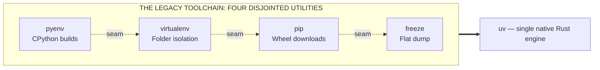
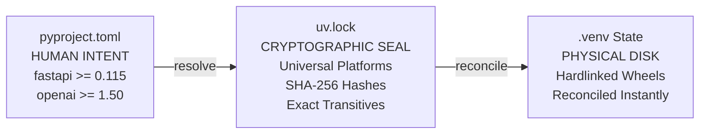
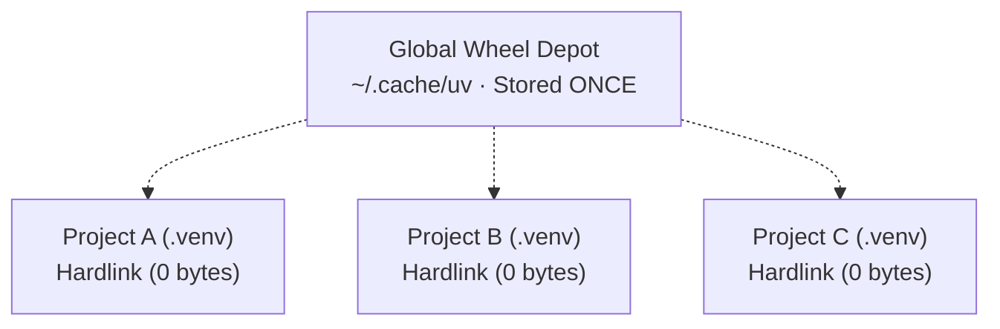

import { Callout } from 'fumadocs-ui/components/callout';

import { UvBenchmarkLab } from '@/components/developer-tools/uv-benchmark-lab';
import { UvCommandBuilder } from '@/components/developer-tools/uv-command-builder';
import { UvTerminalSimulator } from '@/components/developer-tools/uv-terminal-simulator';

# uv — The *Python* Toolchain in One Command

You have an idea. You open a terminal. In the old world, that meant pip, venv, requirements.txt, pyenv, and a prayer. In the new world, it means one unified Rust binary that owns the Python version, the environment, the dependencies, and the execution.

**Astral UV · Python 3.10–3.13 · PubGrub SAT solver · 17 parts.**

## Part 01 — Introduction: The New Project Problem

Let's say you're a Python developer. You've been one for a few years — long enough that `pip install` is muscle memory. You have an idea for a new project. You open a terminal, `cd` into a scratch folder, and start typing the commands you've typed a hundred times before:

```bash
mkdir my-new-project
cd my-new-project
python -m venv venv
source venv/bin/activate
pip install flask pandas scikit-learn
pip freeze > requirements.txt
```

That works. It's the workflow every Python tutorial taught for over a decade. And it's the workflow that, quietly and incrementally, has accumulated four distinct failure modes that waste engineering hours.

### The Four Seams Where Projects Break

1. **Speed and Backtracking Latency.** `pip install scikit-learn` on a cold machine takes two minutes. `pip install torch` can take ten. The legacy resolver operates in interpreted Python, parsing remote metadata slowly and exploring version constraints with single-threaded backtracking. You start an install, then switch to another window because you know you'll be waiting.

2. **The requirements.txt Bloat Trap.** You only installed three libraries. But `pip freeze` writes fifty lines — every transitive sub-dependency, every low-level utility, every package that any of them ever needed. You can't tell which are your core application choices and which are collateral. Removing one requires hunting through the flat dump.

3. **The Friday Night Reproducibility Bug.** Two developers on the same team, same Git commit, same `requirements.txt`, and somehow their environments drift. A loose transitive dependency releases a patch at 6:00 PM containing an undocumented change; the staging CI runner pulls it fresh, and the service crashes in production with an `AttributeError`.

4. **Interpreter Fragility.** Your project needs Python 3.13. Your system has 3.11. Now you need `pyenv`, you need local C compilers, OpenSSL development headers, and dynamic shell shims that intercept your terminal PATH and break IDE test runners.

<Callout type="info">
**Checkpoint 01 · Diagnostic reasoning.** If you had to name the single root cause behind all four of those historical pains, what would it be? Not "pip is slow" — that's a symptom; even an instant pip would still leave you bloated manifests and drift. Not "Python packaging is broken at the language level" — the PEP standards (PEP 621, wheel specs, PubGrub) are actually very solid. The correct answer: **the tooling is fragmented — no single tool owns the project as a cohesive lifecycle.** venv handles environments, pip handles packages, pyenv handles runtimes, requirements.txt handles manifests — and the seams *between* the tools are where projects break.
</Callout>



*The old toolchain is four independent utilities with zero shared state. The seams between them create version drift, compiler failures, and unpinned transitive bugs. UV consolidates them into a single static binary.*

Its name is **uv**. It is created by Astral (the team behind Ruff), written in native Rust, and designed from first principles around modern packaging standards. By the end of this lesson, you will master every workflow it replaces.

## Part 02 — Package Installation: uv as a pip Replacement

The most immediate pain point is installation speed. You need `requests` or `fastapi`. The legacy command is `pip install fastapi`. The drop-in UV command is:

```bash
uv pip install fastapi
```

`uv pip` is a 100% flag-compatible replacement for `pip`. Flags like `-r requirements.txt`, `-e .`, `--no-cache-dir`, and `--index-url` work identically. But under the hood, the entire resolution and extraction pipeline is re-engineered:

- **Native PubGrub Solver:** Replaces backtracking Python scripts with a multi-threaded SAT-based resolver in Rust.
- **Parallel Concurrent Downloads:** Wheels and metadata headers are fetched simultaneously over multiplexed HTTP/2 streams.
- **Uncompressed Wheel Fast-Path:** Bypasses zip extraction overhead by linking pre-extracted wheel contents directly.

```text
WALL-CLOCK BENCHMARK — WARM CACHE INSTALL (COLD NETWORK)
pip   ████████████████████████████████████████  ~38.4 s
uv    ▏0.31 s (123× faster)
```

*Identical packages, identical platform — orders of magnitude difference in latency. The speedup comes from Rust's parallel disk I/O and zero-copy hardlink architecture.*

<Callout type="info">
**The Bridge vs. The Destination:** `uv pip` exists so legacy scripts and Dockerfiles can be sped up without refactoring. But the modern, project-aware interface — `uv add` and `uv sync` — is the true destination.
</Callout>

## Part 03 — Interactive Benchmark Lab

How much time and cloud infrastructure cost does a 100x package manager actually save across a software engineering organization? Adjust the project scope below to model the difference.

<UvBenchmarkLab />

## Part 04 — Python Version Management: uv python

Your team's API gateway needs Python 3.12 for new type syntax. Your machine has 3.10. Traditionally, you either fight system package managers or spend ten minutes compiling CPython with `pyenv`, hoping your macOS or Linux host has the required OpenSSL development headers.

UV treats the Python interpreter as a managed asset. You don't configure system-wide Python; you ask UV to provision pre-built, optimized CPython binaries directly into a sandbox:

```bash
uv python install 3.12
uv python install 3.13
uv python list
```

**Step 1 — `uv python install 3.12`.** UV downloads a standalone, pre-built CPython distribution from verified builds. No C compilers, no missing SSL headers, no sudo permissions. The entire download and extraction finishes in two seconds:

```text
$ uv python install 3.12
Searching for Python versions matching: 3.12
Installed Python 3.12.7 in 1.84s
  cpython-3.12.7-linux-x86_64-gnu
```

**Step 2 — `uv python list`.** UV inspects your machine, displaying installed standalone runtimes alongside available downloadable builds and any system interpreters it detected:

```text
$ uv python list
cpython-3.13.1-linux-x86_64-gnu     <download available>
cpython-3.12.7-linux-x86_64-gnu     ~/.local/share/uv/python/cpython-3.12.7
cpython-3.11.9-linux-x86_64-gnu     ~/.local/share/uv/python/cpython-3.11.9
cpython-3.10.12-linux-x86_64-gnu    /usr/bin/python3 (system)
```

**Step 3 — Automatic project-level fulfilment.** When any project specifies Python 3.12 in its `.python-version` file, UV automatically binds to this runtime. Developers on different machines get the exact same minor release without touching system PATH shims.

<Callout type="info">
**Checkpoint 02 · Version pinning.** A teammate clones your repo. The repo contains a `.python-version` file containing `3.13`. Their laptop only has Python 3.10. What happens when they run `uv run hello.py`? It does not halt with a `MissingInterpreterError`, and it does not silently downgrade to system 3.10. **UV reads `.python-version`, detects that 3.13 is not present locally, downloads the standalone binary automatically, and executes the script seamlessly.**
</Callout>

## Part 05 — Project Initialization: uv init

Scaffolding Python projects by hand has historically been messy. One developer writes a bare `requirements.txt`; another creates a custom `setup.py`; another commits a 2-gigabyte `.venv/` directory to Git because they forgot a `.gitignore` file.

UV standardizes project creation in a single command:

```bash
uv init agent-service
cd agent-service
```

This generates an opinionated, production-grade project skeleton in twenty milliseconds:

| File | Purpose |
| --- | --- |
| `.gitignore` | Excludes `.venv/`, `dist/`, and `__pycache__` permanently |
| `.python-version` | Declares target runtime (e.g. 3.12) |
| `README.md` | Project overview template |
| `hello.py` | Runnable application entry point |
| `pyproject.toml` | Declarative PEP 621 specification |

*Every UV project shares the exact same shape, ensuring immediate developer onboarding — and guarding against accidental multi-gigabyte virtual environment Git commits out-of-the-box.*

Let's inspect the generated `pyproject.toml`. It adheres strictly to the modern Python packaging standard (PEP 621):

```toml
# pyproject.toml
[project]
name = "agent-service"
version = "0.1.0"
description = "High-performance inference worker"
readme = "README.md"
requires-python = ">=3.12"
dependencies = []
```

<Callout type="tip">
**Library vs. Application Mode:** When authoring reusable libraries, use `uv init --lib my-lib` to generate a `src/` layout with a build backend. For services and scripts, the default application layout is ideal.
</Callout>

## Part 06 — Virtual Environments: uv venv

Virtual environments isolate package dependencies so Project A pinning `flask==2.3` and Project B pinning `flask==3.1` don't collide. UV creates virtual environments in fractions of a second:

```bash
uv venv
source .venv/bin/activate  # or .venv\Scripts\activate on Windows
```

<Callout type="tip">
**Zero-Activation Era:** While `uv venv` creates a `.venv/` folder, in modern UV workflows you rarely need to activate it manually. Running `uv run` or `uv sync` automatically detects the project root, auto-provisions the virtual environment if missing, and executes in context.
</Callout>

## Part 07 — Dependency Management: pyproject.toml and uv add

Traditional `requirements.txt` conflates two entirely different concepts: **what you chose to install** (direct dependencies) and **what they required to run** (transitive dependencies). UV enforces a clean architectural separation:

- **Intent (pyproject.toml):** Human-readable, high-level direct packages.
- **Resolution (uv.lock):** Machine-generated, cross-platform cryptographic record of every transitive package and hash.

```bash
uv add fastapi openai pydantic
```

**The Old Way — requirements.txt** (generated by `pip freeze`):

```text
# requirements.txt generated by pip freeze
annotated-types==0.7.0
anyio==4.4.0
certifi==2024.7.4
distro==1.9.0
fastapi==0.115.0
h11==0.14.0
httpcore==1.0.5
httpx==0.27.2
idna==3.8
jiter==0.5.0
openai==1.50.1
pydantic==2.9.2
pydantic-core==2.23.4
sniffio==1.3.1
starlette==0.38.6
typing-extensions==4.12.2
# 40+ flattened lines — impossible to distinguish direct from indirect!
```

You cannot discern which three packages you chose versus which forty were pulled in transitively. Removing a package requires manual archeology.

**The UV Way — pyproject.toml + uv.lock:**

```toml
# pyproject.toml
[project]
name = "agent-service"
version = "0.1.0"
dependencies = [
    "fastapi>=0.115.0",
    "openai>=1.50.1",
    "pydantic>=2.9.2",
]

# All transitive dependencies & exact SHA-256 hashes are isolated in uv.lock
```

Your manifest remains crystal clear. Humans edit `pyproject.toml`; UV maintains `uv.lock`.

## Part 08 — Dependency Groups: Development vs Production

Your development workflow requires test runners (`pytest`), code formatters (`ruff`), and interactive notebooks (`ipykernel`). But shipping these libraries to production Docker containers bloats image sizes, slows cloud scaling, and widens vulnerability surfaces.

UV makes dependency grouping a first-class feature:

```bash
uv add --dev pytest ruff ipykernel
uv add --group docs mkdocs
```

This writes into standardized `[dependency-groups]` tables in `pyproject.toml`:

```toml
[dependency-groups]
dev = [
    "ipykernel>=6.29.5",
    "pytest>=8.3.3",
    "ruff>=0.6.8",
]
docs = [
    "mkdocs>=1.6.0",
]
```

When deploying to production, simply append `--no-dev`:

```bash
# Production container install — installs only core dependencies
uv sync --no-dev
```

<Callout type="info">
**Checkpoint 03 · Container engineering.** You are authoring a production Dockerfile. You want the smallest possible image footprint and want to guarantee the build fails if the lockfile was modified without committing. What command do you use? Plain `uv sync` installs dev dependencies by default, bloating the container; `pip install -r requirements.txt` lacks cryptographic lock enforcement and doesn't understand dependency groups. The correct answer: **`uv sync --no-dev --frozen`** — `--no-dev` excludes test and debug tooling, while `--frozen` asserts that `uv.lock` exactly matches `pyproject.toml` without modifying the lock in CI.
</Callout>

## Part 09 — Transitive Orphan Pruning: uv remove

Under traditional `pip uninstall scipy`, pip deletes the top-level package and leaves all of its transitive dependencies behind in `site-packages`. Over months, your environment turns into a graveyard of orphaned packages.

`uv remove` performs tree-aware uninstallation:

```text
$ uv remove fastapi
Resolved 21 packages in 14ms
Uninstalled 7 packages in 8ms
 - fastapi==0.115.0
 - starlette==0.38.6
 - anyio==4.4.0
```

UV recalculates the dependency graph, removes `fastapi` from `pyproject.toml`, updates `uv.lock`, and deletes any sub-dependencies that were only installed because `fastapi` needed them.

## Part 10 — Universal Locking and Reproducibility: uv sync

Why did traditional teams fear deployment day? Because `pip install -r requirements.txt` on a fresh Linux container might resolve a different transitive patch version than what ran on a developer's Mac.

`uv.lock` is a **universal, cross-platform lockfile**. It contains the exact package resolutions and cryptographic SHA-256 hashes for macOS, Linux, and Windows simultaneously.



*The 3-way reconciliation triangle: human intent resolves into a cryptographic lockfile; `uv sync` reconciles the environment so Disk == Lockfile with zero drift.*

```bash
# Setup after fresh git clone: ONE command replaces venv + pip install
uv sync
```

```text
$ uv sync
Using CPython 3.12.7
Creating virtualenv at: .venv
Resolved 28 packages in 12ms
Installed 28 packages in 45ms
```

`uv sync` is completely **idempotent**. If packages are missing, it links them. If extraneous libraries are present, it uninstalls them. Running it ten times leaves your disk in the exact same verified state.

## Part 11 — Running and Ephemeral Contexts: uv run

In the legacy world, developers had to type `source .venv/bin/activate` before every command. If they forgot, commands defaulted to system Python, resulting in missing package errors or subtle version mismatches.

`uv run` executes commands directly within the project's virtual environment:

```bash
uv run hello.py
uv run pytest
uv run ruff check .
```

You can even supply ad-hoc packages that exist only for the lifetime of that single command:

```bash
uv run --with cowsay cowsay "UV owns execution"
#   ____________________
# | UV owns execution  |
#   ====================
#                    \   ^__^
#                     \  (oo)\_______
#                        (__)\       )\/\
#                            ||----w |
#                            ||     ||
```

## Part 12 — Single-File Scripts with Inline Metadata (PEP 723)

Every developer writes standalone scripts to fetch data, back up a database, or scrape a web page. In the past, running that script on a teammate's laptop meant emailing a `requirements.txt` or writing setup instructions.

Modern Python (PEP 723) allows embedding dependencies directly inside the script itself, and UV executes it natively:

```python
# fetch_data.py
# /// script
# requires-python = ">=3.12"
# dependencies = [
#     "httpx",
#     "rich",
# ]
# ///

import httpx
from rich import print

resp = httpx.get("https://api.github.com/repos/astral-sh/uv")
print(f"[bold green]Stars:[/bold green] {resp.json()['stargazers_count']}")
```

Execute it with a single command:

```bash
uv run fetch_data.py
```

UV reads the inline comment block, provisions an isolated ephemeral environment behind the scenes, executes the script, and preserves zero junk in your working directory. It is the cleanest automation workflow in modern computing.

## Part 13 — Ad-Hoc Global Tools: uvx

Often you want to run a CLI tool without installing it into your current project or host system. Examples include formatters (`black`, `ruff`), documentation tools (`mkdocs`), or notebook servers (`marimo`).

`uvx` fetches and executes any PyPI CLI tool in an ephemeral sandbox instantaneously:

```bash
# Run ruff on the current folder without installing it
uvx ruff check .

# Run a markdown presentation tool
uvx marimo edit demo.py
```

## Part 14 — Global Cache and Filesystem Hardlinks

Why do twenty PyTorch projects use 2 GB of disk instead of 40 GB? Traditional `pip` copies package files completely into every project's `.venv/lib/python/site-packages`. If you have ten machine learning projects using PyTorch 2.4 (2 GB each), your laptop loses 20 GB of storage to duplicate files.

UV maintains a central **content-addressable wheel cache** (located at `~/.cache/uv`). When installing a package into a project, UV does not copy the files. It creates filesystem **hardlinks** (or reflinks on APFS/Btrfs).



*Ten projects sharing the same libraries consume zero extra disk space and link in under 15 milliseconds.*

Inspect or clean your cache at any time:

```bash
uv cache dir
uv cache prune
```

## Part 15 — Interactive UV Simulator

Test commands and observe virtual project state changes live — click an operation and watch both the terminal output and the virtual file tree evolve:

<UvTerminalSimulator />

The state machine behind the simulator mirrors real uv behavior: `init` scaffolds the project (`.gitignore`, `.python-version`, `hello.py`, `pyproject.toml`), `add` resolves packages and creates `uv.lock` plus `.venv/`, `add --dev` writes into `[dependency-groups.dev]`, `sync --no-dev` removes dev tooling from the physical environment, `run` executes without activation, and `uv tree` prints the resolved dependency graph.

## Part 16 — Production CI/CD & Docker Recipes

Here is the canonical GitHub Actions workflow that speeds up CI runs from eight minutes to eighteen seconds:

```yaml
# .github/workflows/ci.yml
name: CI
on: [push, pull_request]

jobs:
  test:
    runs-on: ubuntu-latest
    steps:
      - uses: actions/checkout@v4

      - name: Install uv
        uses: astral-sh/setup-uv@v5
        with:
          enable-cache: true

      - name: Set up Python
        run: uv python install

      - name: Install dependencies & test
        run: |
          uv sync --frozen
          uv run pytest
```

And here is the lean production multi-stage `Dockerfile`:

```dockerfile
# Dockerfile
FROM ghcr.io/astral-sh/uv:python3.12-bookworm-slim AS builder
WORKDIR /app
COPY pyproject.toml uv.lock ./
RUN uv sync --frozen --no-dev --no-install-project

COPY . .
RUN uv sync --frozen --no-dev

FROM python:3.12-slim-bookworm
WORKDIR /app
COPY --from=builder /app/.venv /app/.venv
COPY . /app
ENV PATH="/app/.venv/bin:$PATH"
CMD ["python", "-m", "uvicorn", "main:app", "--host", "0.0.0.0", "--port", "8000"]
```

## Part 17 — What a Modern Package Manager Really Is

You have seen UV do with one binary what used to require six fragmented utilities. That is not just convenience — it is the convergence on a proven industry pattern.

A package manager is not just a faster downloader. It is **the single reconciler of three files**:

- **`pyproject.toml`** — Human Intent (what you want).
- **`uv.lock`** — Machine Truth (cryptographically pinned exact transitive tree).
- **`.venv/`** — Physical Disk State (the materialized environment).

<Callout type="info">
**Interactive challenge · the correct sequence.** The standard chronological lifecycle of a UV project is: **1)** `uv python install 3.12` → **2)** `uv init my-project` → **3)** `uv add fastapi` → **4)** `uv sync --no-dev` → **5)** `uv run hello.py`. Runtime setup → project blueprint → dependency declaration → environment reconciliation → friction-free execution.
</Callout>

### Why This Generalizes Across the Industry

The tools change. The concepts never do. Look at every major modern programming language:

| Ecosystem | Manifest (Human Intent) | Lockfile (Cryptographic Truth) | Reconcile Command |
| --- | --- | --- | --- |
| **Python · uv** | `pyproject.toml` | `uv.lock` | `uv sync` |
| **JavaScript · npm** | `package.json` | `package-lock.json` | `npm ci` |
| **Rust · cargo** | `Cargo.toml` | `Cargo.lock` | `cargo build` |
| **Go · modules** | `go.mod` | `go.sum` | `go mod download` |
| **Ruby · bundler** | `Gemfile` | `Gemfile.lock` | `bundle install` |
| **PHP · composer** | `composer.json` | `composer.lock` | `composer install` |

<Callout type="tip">
**The takeaway.** A package manager is not a downloader. It is a contract — you declare intent in `pyproject.toml`, it locks truth in `uv.lock`, and sync guarantees that contract is byte-for-byte identical on every developer laptop and cloud server on Earth.
</Callout>

### Muscle Memory Challenge

What is the exact UV command to execute `main.py` without activating any virtual environment?

<Callout type="info">
**Answer:** `uv run main.py` — `uv run` discovers the project root and executes seamlessly, no `source .venv/bin/activate` required.
</Callout>
