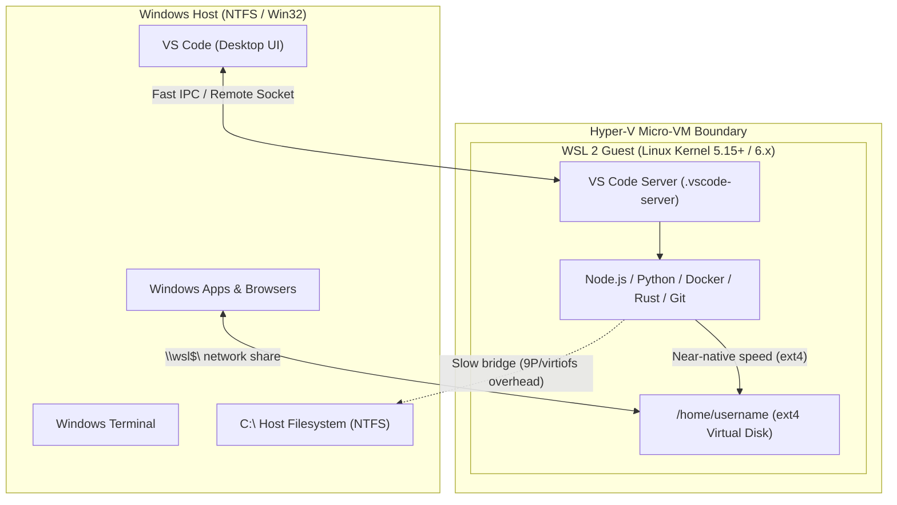
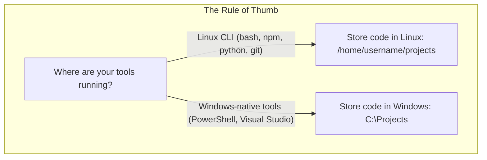
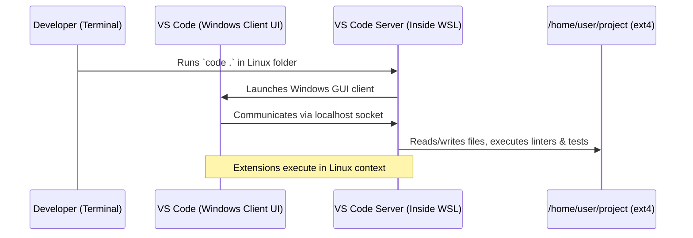

import { Callout } from 'fumadocs-ui/components/callout';
import { Tab, Tabs } from 'fumadocs-ui/components/tabs';

The **Windows Subsystem for Linux (WSL)** enables developers to run an authentic, native Linux environment directly on Windows without the overhead of a traditional dual-boot setup or bulky virtual machines.

With **WSL 2**, Microsoft replaced early system-call emulation with a real Linux kernel running inside a highly optimized, lightweight hypervisor utility VM. This architecture gives you full Linux binary compatibility, Docker support, and lightning-fast execution while retaining access to Windows desktop apps.



---

## 1. WSL 1 vs. WSL 2: Architecture

Understanding how WSL 2 operates prevents confusing performance traps:

| Feature | WSL 1 | WSL 2 (Current Standard) |
| :--- | :--- | :--- |
| **Architecture** | Emulation layer translating Linux syscalls to Windows NT APIs | Real Linux kernel running in a lightweight Hyper-V micro-VM |
| **Linux Kernel** | None (emulated) | Microsoft-managed, open-source custom Linux kernel |
| **System Call Compatibility** | Partial (syscalls had to be individually mapped) | **100% full compatibility** (systemd, eBPF, FUSE, etc.) |
| **Linux Filesystem Speed** | Moderate | **Near-native native ext4 speed** |
| **Cross-drive Access (`/mnt/c`)** | Relatively fast | **Slower** (crosses the hypervisor network boundary) |
| **Docker & Containers** | Incompatible | **Native Linux container backend** |
| **GUI Support** | Third-party X Server required | **WSLg built-in** (Wayland/X11 with GPU acceleration) |

<Callout type="info">
WSL 2 boots in under a second and dynamically allocates and releases RAM back to the Windows host.
</Callout>

---

## 2. Installation & Core Commands

Modern Windows 10 (version 2004+) and Windows 11 include a one-line installer.

### Quick Install
Run in **PowerShell as Administrator**:

```powershell
# Installs WSL 2, the virtual machine platform, and the default Ubuntu distribution
wsl --install
```

Restart your computer if prompted. After rebooting, Ubuntu will launch and ask you to create a Linux `username` and `password`.

### Daily CLI Management Commands

Run these from PowerShell or Command Prompt:

```powershell
# List installed distros and their WSL version
wsl --list --verbose
# (Shortcut: wsl -l -v)

# Check WSL kernel status and update version
wsl --status
wsl --update

# Launch default distro
wsl

# Launch a specific distro as a specific user
wsl -d Ubuntu -u root

# Terminate a running distribution
wsl --terminate Ubuntu

# Shut down the entire WSL 2 virtual machine and free all allocated RAM
wsl --shutdown

# Export a distro to a tar backup
wsl --export Ubuntu D:\backups\ubuntu-backup.tar

# Import a distro backup
wsl --import CustomUbuntu D:\wsl\custom D:\backups\ubuntu-backup.tar
```

---

## 3. The Cardinal Rule: Filesystem & Performance

The single most common mistake beginners make is **storing their project files on the Windows drive while working inside WSL**.

```
❌ SLOW:  /mnt/c/Users/alex/projects/my-app   (Windows NTFS drive accessed via WSL)
✅ FAST:  /home/alex/projects/my-app          (Native Linux ext4 virtual disk)
```

### Why `/mnt/c` Is Slow in WSL 2
- Files inside `/home/username/` live inside an optimized virtual disk (`ext4.vhdx`). Linux disk operations are executed directly against this virtual block device at native speeds.
- Files inside `/mnt/c/` reside on the Windows NTFS drive. Every single file read, write, metadata check (`stat`), or file watch must cross the Hyper-V virtual machine boundary via a network protocol (9P / virtiofs).
- Tools that touch tens of thousands of files—such as `npm install`, `git status`, `cargo build`, or Vite's hot module reload—can be **5× to 20× slower** when run on `/mnt/c`.



---

## 4. Path & Addressing Differences

Working with both operating systems requires translating file paths and address conventions:

### Path Equivalents

| Context | From Windows Side | From WSL Linux Side |
| :--- | :--- | :--- |
| **Windows User Home** | `C:\Users\alex` | `/mnt/c/Users/alex` |
| **Linux User Home** | `\\wsl$\Ubuntu\home\alex` or `\\wsl.localhost\Ubuntu\home\alex` | `/home/alex` or `~` |
| **Project Folder** | `\\wsl.localhost\Ubuntu\home\alex\repo` | `/home/alex/repo` |
| **Root Directory** | `C:\` | `/` |

<Callout type="tip">
**Browse your Linux files in Windows File Explorer:**
Inside any WSL terminal directory, run:
```bash
explorer.exe .
```
This opens Windows File Explorer directly to `\\wsl.localhost\Ubuntu\...`. You can copy, view, and inspect files visually.
</Callout>

### Slash Conventions & Path Translation

- **Windows:** Backslashes (`C:\Users\alex\project\index.js`)
- **Linux:** Forward slashes (`/home/alex/project/index.js`)

WSL provides the `wslpath` utility to convert paths automatically in bash scripts:

```bash
# Convert a Windows path to a Linux path
wslpath 'C:\Users\alex\Documents\notes.txt'
# Output: /mnt/c/Users/alex/Documents/notes.txt

# Convert a Linux path to a Windows path
wslpath -w /home/alex/project
# Output: \\wsl.localhost\Ubuntu\home\alex\project
```

---

## 5. Case Sensitivity, Line Endings & Permissions

Because Windows and Linux handle files differently, watch out for these three subtle cross-platform issues:

### 1. Case Sensitivity
- **Windows (NTFS):** Case-preserving but case-insensitive. `App.jsx` and `app.jsx` refer to the same file.
- **Linux (ext4):** Case-sensitive. `App.jsx` and `app.jsx` are two completely different files.
- **Gotcha:** If you import a module as `import Button from './button'` while the file is named `Button.tsx`, it will work in Windows, but fail in Linux or production CI/CD servers.

### 2. Line Endings (CRLF vs. LF)
- **Windows:** Carriage Return + Line Feed (`\r\n` or CRLF).
- **Linux:** Line Feed (`\n` or LF).
- **The Issue:** Bash scripts written with Windows CRLF line endings fail with errors like:
  ```text
  /bin/bash^M: bad interpreter: No such file or directory
  ```
- **The Fix:** Configure Git inside WSL to preserve LF line endings:
  ```bash
  git config --global core.autocrlf input
  ```
  Or add a `.gitattributes` file to the root of your repositories:
  ```text
  * text=auto eol=lf
  *.bat text eol=crlf
  ```

### 3. File Permissions & Executable Bits
- Linux relies on POSIX octal permissions (`chmod +x script.sh`, `chmod 600 ~/.ssh/id_ed25519`).
- If you store an SSH key or script on `/mnt/c/`, Windows ACLs might expose it as `0777`, causing OpenSSH to refuse the key (`Permissions 0777 for id_rsa are too open`).
- Store all SSH keys and secret credentials inside `~/.ssh/` on the native Linux ext4 disk.

---

## 6. Cross-OS Interoperability

One of WSL's most productive features is bidirectional tool execution:

<Tabs items={["Run Windows from Linux", "Run Linux from Windows"]}>
  <Tab value="Run Windows from Linux">
    You can invoke Windows `.exe` binaries directly from the Linux bash prompt:

    ```bash
    # Open the current Linux directory in Windows File Explorer
    explorer.exe .

    # Open VS Code connected to the current Linux folder
    code .

    # Pipe command output directly to the Windows clipboard
    cat ~/.ssh/id_ed25519.pub | clip.exe

    # Open a URL in your default Windows browser
    cmd.exe /c start https://github.com

    # Query Windows system information
    powershell.exe -Command "Get-CimInstance Win32_OperatingSystem | Select-Object Caption"
    ```
  </Tab>

  <Tab value="Run Linux from Windows">
    You can execute Linux binaries from PowerShell or CMD using `wsl`:

    ```powershell
    # Run a quick command inside Linux
    wsl uname -a

    # Process Windows text files using Linux tools (grep, sed, awk)
    Get-Content log.txt | wsl grep -i "error"

    # Pipe PowerShell output into a Linux sort/uniq pipeline
    Get-ChildItem -Name | wsl sort
    ```
  </Tab>
</Tabs>

---

## 7. The Ideal Developer Setup

### Step 1: Install Windows Terminal
Download **Windows Terminal** from the Microsoft Store or via winget:
```powershell
winget install Microsoft.WindowsTerminal
```
Windows Terminal provides hardware-accelerated text rendering, tabbed sessions, split panes, and automatic detection of your installed WSL distributions.

### Step 2: Set Up VS Code with the WSL Extension
The official Microsoft approach uses a client-server model:

1. Install [VS Code on Windows](https://code.visualstudio.com/).
2. Install the **WSL Extension** (`ms-vscode-remote.remote-wsl`).
3. Open your WSL terminal, navigate to your project on the Linux filesystem, and type:
   ```bash
   cd ~/projects/my-web-app
   code .
   ```
4. VS Code will automatically download and start the lightweight `vscode-server` inside your WSL distro.
   - The UI runs smoothly on Windows.
   - Language servers, linters, terminals, and debuggers run inside native Linux.



### Step 3: Configure Docker Desktop
If you use Docker Desktop:
1. Open Docker Desktop Settings → **General** → Ensure **Use the WSL 2 based engine** is checked.
2. Go to **Resources** → **WSL Integration** → Toggle on your Ubuntu distribution.
3. You can now run `docker` and `docker compose` directly from your bash terminal without starting a separate VM.

---

## 8. Advanced Configuration: `.wslconfig` & `/etc/wsl.conf`

Two files govern WSL behavior: one on the Windows side, and one inside each Linux distro.

### 1. Global Settings: `%USERPROFILE%\.wslconfig`
Create or edit `C:\Users\<YourUsername>\.wslconfig` to control VM resource consumption and networking:

```ini
[wsl2]
# Limit memory allocated to the WSL 2 VM (default is 50% of total host RAM)
memory=8GB

# Limit virtual processors
processors=4

# Turn off swap or point to a custom disk
swap=4GB

[experimental]
# Dynamically reclaims unused cached memory back to Windows
autoMemoryReclaim=gradual

# Automatically shrinks the virtual disk (ext4.vhdx) as files are deleted
sparseVhd=true

# Mirrors network interfaces: improves VPN compatibility & localhost binding
networkingMode=mirrored
```

<Callout type="warn">
After editing `.wslconfig`, you must restart WSL by running `wsl --shutdown` in PowerShell.
</Callout>

### 2. Distro Settings: `/etc/wsl.conf`
Create or edit `/etc/wsl.conf` inside your Linux distribution to configure distro boot options:

```ini
[boot]
# Enable systemd for managing background services (systemctl)
systemd=true

[automount]
# Automatically mount Windows drives under /mnt/
enabled=true
# Set proper Linux file permissions on mounted Windows drives
options="metadata,umask=22,fmask=11"

[network]
# Automatically generate /etc/hosts and /etc/resolv.conf
generateHosts=true
generateResolvConf=true

[interop]
# Allow launching Windows binaries from bash
enabled=true
# Append Windows PATH into Linux PATH (set to false for a clean Linux environment)
appendWindowsPath=true
```

---

## 9. Common Pitfalls & Troubleshooting

| Problem | Cause | Solution |
| :--- | :--- | :--- |
| **`npm install` is extremely slow** | Project is located in `/mnt/c/` | Move your project folder to `~/projects/` inside Linux ext4. |
| **`systemctl` / services do not start** | systemd is disabled | Add `[boot]` `systemd=true` in `/etc/wsl.conf` and run `wsl --shutdown`. |
| **`\r\n` syntax error in shell scripts** | Windows CRLF line endings | Run `dos2unix script.sh` or configure `core.autocrlf = input` in Git. |
| **SSH key rejected ("too open")** | Stored on `/mnt/c` with Windows permissions | Move keys to `~/.ssh/` inside Linux and run `chmod 600 ~/.ssh/id_rsa`. |
| **Virtual disk (`ext4.vhdx`) using too much space** | Deleted files do not auto-shrink VHDX | Set `sparseVhd=true` in `.wslconfig` or compact with PowerShell `diskpart`. |
| **Localhost server not accessible in Windows browser** | Old WSL 2 NAT networking or VPN conflict | Enable `networkingMode=mirrored` in `.wslconfig` or bind server to `0.0.0.0`. |

---

## Official Documentation & Useful Links

- [Official Microsoft WSL Documentation](https://learn.microsoft.com/en-us/windows/wsl/) — Comprehensive guides, setup instructions, and release notes.
- [WSL 2 vs WSL 1 Comparison](https://learn.microsoft.com/en-us/windows/wsl/compare-versions) — Technical architectural differences.
- [Advanced Settings in .wslconfig & wsl.conf](https://learn.microsoft.com/en-us/windows/wsl/wsl-config) — Complete configuration flag reference.
- [VS Code Remote - WSL Tutorial](https://code.visualstudio.com/docs/remote/wsl) — Guide on debugging, extensions, and workflows in VS Code with WSL.
- [WSL GitHub Repository & Releases](https://github.com/microsoft/WSL) — Issue tracker, kernel releases, and changelog updates.
