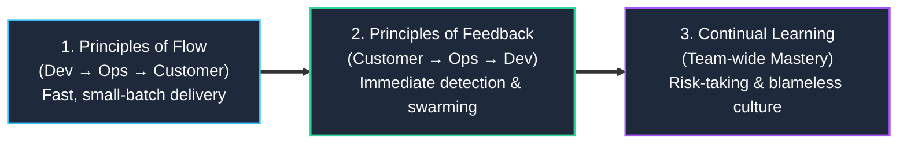

import { Callout } from 'fumadocs-ui/components/callout';
import { Steps, Step } from 'fumadocs-ui/components/steps';

<LessonIntro>
If you ask ten software professionals to define "DevOps," you will get ten conflicting answers: a Linux engineer who writes Bash scripts, a pipeline file in GitHub, a Kubernetes administrator, or a software engineer who also carries a pager. To master DevOps, you must strip away the buzzwords and understand the single operational dilemma it solved: how to release software continuously without destroying system stability.
</LessonIntro>

<Concepts items={['The Wall of Confusion', 'The First Way (Flow)', 'The Second Way (Feedback)', 'The Third Way (Continual Learning)', 'CALMS Framework', 'Batch Size Economics']} />

## The Midnight Release Nightmare

Imagine it is 2008. You work as an engineer at **OmniRetail**, an e-commerce platform.

Every three months, the engineering department holds a ritual known as **Deployment Weekend**:

<Steps>
<Step>
### The "Code Freeze" (Monday, 9:00 AM)
All developers stop writing new features. For two weeks, QA engineers manually click through a 200-page test spreadsheet in a staging environment that resembles production in name only.
</Step>

<Step>
### The Hand-off Ticket (Friday, 4:30 PM)
The development team builds a `.zip` archive containing application binaries, database scripts, and configuration files. They open an internal support ticket titled: `DEPLOY-2008-Q3: Please deploy to production by midnight`. Dev promptly leaves the office for happy hour.
</Step>

<Step>
### The Midnight Crash (Saturday, 12:15 AM)
The Operations engineer on duty begins manually executing the 40-step Word document. At step 18, a SQL script fails because the production database is running PostgreSQL 9.1 while staging was on 8.4. The application crashes.
</Step>

<Step>
### The Morning War Room (Saturday, 2:30 AM)
The phone rings. Engineers are awakened, sleep-deprived and furious:
- **Dev says**: *"It worked on my machine! Operations must have misconfigured the environment."*
- **Ops says**: *"Your code is garbage and took down our payment gateway. We are rolling back."*
- **Result**: Four days of lost revenue, emergency manual patches, and two teams that distrust each other even more.
</Step>
</Steps>

<AnalogyCard name="The Restaurant Kitchen and Waitstaff">

<strong>The Disconnected Silo:</strong>
Imagine a kitchen where chefs are judged exclusively on how many plates they cook per minute, while the waitstaff is judged solely on never dropping a single plate. Chefs throw 50 hot dishes onto the counter at once, screaming at the waitstaff to move faster. The waitstaff locks the kitchen door to protect the dining room from spills.

<strong>The DevOps Kitchen:</strong>
The chefs and waitstaff share the exact same objective: delivering hot, fresh, delicious food to customers with a consistent rhythm. Chefs observe the dining room floor, and servers collaborate on kitchen prep. Nobody says "not my job" when a plate slips.

</AnalogyCard>

---

## What DevOps Is NOT

Before defining what DevOps is, we must eliminate three ubiquitous industry misconceptions.

<LessonNote variant="myth" title="DevOps is a Job Title">
Creating a job titled "DevOps Engineer" often creates a new silo. If developers still toss code over a wall to a "DevOps Engineer" who maintains the pipeline, you haven't removed the wall — you have simply given the person standing on top of it a trendy title.
</LessonNote>

<LessonNote variant="myth" title="DevOps is an Isolated Team">
Forming a "DevOps Team" between Development and Operations creates a third silo. You now have three groups arguing during an incident instead of two.
</LessonNote>

<LessonNote variant="myth" title="DevOps is a Tool You Can Buy">
Purchasing GitHub Enterprise, Docker, or Kubernetes does not mean an organization does DevOps. A team using Kubernetes to deploy manual, untested, three-month batch releases in the middle of the night has automated their dysfunction, not adopted DevOps.
</LessonNote>

---

## What DevOps Actually Is

> **DevOps is an organizational and cultural movement that aligns software development and operations teams around shared engineering practices, automated feedback loops, and collective ownership of software across its entire lifecycle — from ideation to production monitoring.**

Under true DevOps:
1. **You build it, you run it**: Developers write code, write tests, understand how their code is packaged, and participate in production on-call rotations.
2. **Operations as software**: Operations engineers do not manually click through server dashboards; they engineer self-service platforms, automated pipelines, and declarative infrastructure code.
3. **Small batches**: Instead of shipping three months of changes in one catastrophic release, teams ship small, atomic commits multiple times a day.

---

## The Three Ways of DevOps

In *The Phoenix Project*, Gene Kim, Kevin Behr, and George Spafford synthesized the DevOps philosophy into **The Three Ways**. These are sequential: you cannot master the second without the first, nor the third without the second.

### The First Way: Principles of Flow (Left-to-Right)

The First Way focuses on the fast and smooth movement of work from Development (left) into Production Operations (right).

- **Make work visible**: Use Kanban boards to prevent hidden requests and unmanaged commitments.
- **Limit Work in Progress (WIP)**: If an engineer has 6 unfinished pull requests open, context switching destroys throughput. Finish existing work before starting new work.
- **Reduce batch sizes**: Shipping 1 line of code to production is vastly safer than shipping 10,000 lines. When 1 line breaks, you know exactly what caused the failure. When 10,000 lines break, diagnosis takes days.
- **Eliminate handoffs**: Every time work is passed from a developer to a QA analyst to an infrastructure operator, information is lost and work waits in queues.

### The Second Way: Principles of Feedback (Right-to-Left)

The Second Way focuses on creating fast, amplified feedback loops from Operations and customers back to Development.

- **Shorten the feedback loop**: If a bug is caught 5 seconds after a commit by an automated test, it costs minutes to fix. If it is caught 3 months later by an angry customer, it costs thousands of dollars and immense reputational damage.
- **Swarm on problems**: When a build breaks or production errors spike, stopping the line to fix the root cause takes precedence over writing new features (the Toyota Production System *Andon Cord*).
- **Push telemetry everywhere**: Production metrics, error logs, and performance traces should be immediately visible to the developers who wrote the feature, not hidden behind an Ops access wall.

### The Third Way: Principles of Continual Learning & Experimentation

The Third Way creates a culture that values two things: continual experimentation (taking risks and learning from failure) and understanding that repetition and practice are the prerequisites to mastery.

- **Convert local discoveries into global improvements**: When one developer fixes a tricky database connection leak in a microservice, that fix is codified into an automated lint rule or shared library so no other service makes the same mistake.
- **Allocate time for technical debt**: High-performing teams dedicate 20% of engineering cycles purely to refactoring, upgrading dependencies, and improving automation.
- **Inject faults deliberately (Chaos Engineering)**: Simulating server crashes and network partitions during regular business hours to prove our systems can heal automatically.

---

## The CALMS Framework

To assess whether an organization is truly practicing DevOps, pioneers Jez Humble, John Willis, and Damon Edwards introduced the **CALMS** framework:

| Pillar | What It Means | Real-World Application |
|---|---|---|
| **C — Culture** | Shared responsibility, high trust, and psychological safety. | Devs and Ops sit together; no finger-pointing during postmortems. |
| **A — Automation** | Eliminating repetitive, error-prone manual labor. | CI/CD pipelines, automated testing, declarative infrastructure. |
| **L — Lean** | Small batch sizes, minimizing waste, limiting WIP. | Shipping 1-day pull requests instead of 4-week feature branches. |
| **M — Measurement** | Data-driven decision making and observability. | Tracking DORA metrics, Golden Signals, and error budgets. |
| **S — Sharing** | Open communication, cross-functional empathy, and transparency. | Internal wikis, postmortem reports published company-wide. |

---

## Primary Sources & Further Study

- **Book**: *The Phoenix Project* — Gene Kim, Kevin Behr, George Spafford.
- **Book**: *Continuous Delivery* — Jez Humble & David Farley.
- **Video Tutorial**: [CI/CD Explained: The DevOps Skill That Makes You 10x More Valuable](https://www.youtube.com/watch?v=AknbizcLq4w) (in `./CI_CD Tutorials/AknbizcLq4w...`).

---

<QuickRecall title="Self-Check: DevOps Fundamentals">
1. Why does shipping in smaller batch sizes directly increase production stability?
2. A company hires a "DevOps Engineer" whose sole job is to manually deploy the code that developers commit. Does this align with the First Way of DevOps? Why or why not?
3. What is the difference between the First Way (Flow) and the Second Way (Feedback)?
</QuickRecall>
