import { Callout } from 'fumadocs-ui/components/callout';
import { Steps, Step } from 'fumadocs-ui/components/steps';

<LessonIntro>
Tools and automation fail when planted in a toxic culture. When an engineer is fired for typing `rm -rf` on the wrong terminal, everyone else learns to hide errors, work slower, and build layers of bureaucratic approval. To build resilient software, teams must transition from punitive cultures to generative ones, tame manual "toil," and treat production outages as priceless learning opportunities through blameless postmortems.
</LessonIntro>

<Concepts items={['Westrum Typology', 'Generative Culture', 'Toil vs Engineering', 'The 50% Rule', 'Blameless Postmortems', 'Second Story Thinking', 'Counterfactuals']} />

## The "Bad Apple" Fallacy: How Blame Destroys Reliability

In 2012, a junior engineer at a financial institution accidentally ran a database cleanup script against the primary production cluster instead of the testing sandbox, dropping the customer accounts table for 40 minutes.

Under traditional management, the response is swift and predictable:
1. **Fire the engineer**: Treat them as the "bad apple" who ruined an otherwise perfect system.
2. **Add more bureaucracy**: Require three manager signatures and a 24-hour review before anyone can run a database query.
3. **The hidden outcome**: Outages do not stop. Instead, engineers stop admitting when something feels wrong, issues are swept under the rug, and when the next incident hits, nobody knows who did what because everyone is terrified of being punished.

<AnalogyCard name="Aviation Safety & Cockpit Black Boxes">

<strong>The Punitive Cockpit:</strong>
If pilots were fired every time they reported a near-miss or altitude discrepancy, they would hide errors until an airplane crashed.

<strong>The Blameless System:</strong>
Aviation became the safest mode of transport because the FAA and NTSB created blameless reporting systems. Pilots report mistakes without fear of punishment so aircraft manufacturers can redesign cockpit switches and warning systems to make that error impossible.

</AnalogyCard>

---

## The Westrum Organizational Typology

Sociologist Dr. Ron Westrum studied high-risk environments (hospitals, nuclear facilities, aviation) and discovered that the way information flows through an organization predicts its safety and performance. The DORA research group later confirmed that **Generative cultures** directly correlate with elite software delivery performance.

| Dimension | Pathological (Power-Oriented) | Bureaucratic (Rule-Oriented) | Generative (Performance-Oriented) |
|---|---|---|---|
| **Cooperation** | Low / Suspicious | Modest / Territorial | High / Cross-functional |
| **Messengers** | Shot ("Don't bring me bad news!") | Neglected / Ignored | Trained & Welcomed |
| **Responsibilities** | Shirked ("Not my problem") | Compartmentalized ("Follow the policy") | Shared ("We own the service") |
| **Cross-Silo Bridging** | Discouraged | Tolerated | Actively encouraged |
| **Failure** | Leads to scapegoating and firings | Leads to justice and red tape | Leads to inquiry and systemic redesign |
| **Novelty / Ideas** | Crushed as threats | Causes bureaucratic paralysis | Welcomed and tested in small bets |

```mermaid
flowchart TD
    subgraph Pathological["Pathological (Fear)"]
        P1["Engineer discovers bug"] --> P2["Hides it to protect job"]
        P2 --> P3["Catastrophic outage months later"]
        P3 --> P4["Scapegoat fired; nothing fixed"]
    end

    subgraph Generative["Generative (Psychological Safety)"]
        G1["Engineer discovers bug"] --> G2["Immediately alerts team"]
        G2 --> G3["Team swarms & patches root cause"]
        G3 --> G4["Automated test added to CI pipeline"]
    end
    
    style Pathological fill:#450a0a,stroke:#ef4444,stroke-width:2px,color:#fecaca
    style Generative fill:#064e3b,stroke:#10b981,stroke-width:2px,color:#d1fae5
```

---

## Taming "Toil": The Google SRE 50% Rule

In *Site Reliability Engineering*, Google formalized the operational enemy of engineering velocity: **Toil**.

<Flashcard term="What is Toil?">
Toil is operational work that is manual, repetitive, automatable, tactical, devoid of enduring engineering value, and scales linearly as the system grows.
</Flashcard>

### Toil vs. Non-Toil Examples

- **Toil**: Manually provisioning an SSH user on 15 virtual machines every time someone joins the company.
- **Engineering (Not Toil)**: Writing an automated Terraform script integrated with Okta SSO so user access is provisioned declaratively in 10 seconds.
- **Toil**: Resetting a frozen database connection pool by manually SSHing into a production server at 3 AM.
- **Engineering (Not Toil)**: Diagnosing why the connection pool is leaking, tuning the timeout configuration, and writing an automated liveness probe to restart unhealthy pods.

<LessonNote variant="why" title="The 50% Toil Cap">
Google SRE rules mandate that engineers must spend **no more than 50%** of their working time on toil (tickets, manual alerts, routine on-call). The remaining 50%+ must be dedicated to pure engineering: building platforms, automating pipelines, and eliminating the very toil that interrupts their day. If toil exceeds 50%, excess operational work is redirected back to the development team that built the service.
</LessonNote>

---

## The Blameless Postmortem

When production fails, high-performing engineering teams do not ask *"Who did this?"* They ask:

> *"What systemic flaws, missing safeguards, ambiguous interfaces, or missing telemetry permitted this failure to occur — and how do we design our systems so that a human cannot trigger this failure again?"*

### The Second Story: Beyond "Human Error"

Human beings are inherently fallible. If an operational failure requires a human to type a command with 100% perfection every single time, **the system is defective, not the human**.

- **The First Story (Surface / Actor View)**: "Engineer Alice entered the wrong cluster endpoint in the CLI, causing production to wipe."
- **The Second Story (Systems View)**: 
  - Why did the CLI allow destructive commands without a confirmation prompt?
  - Why was the production cluster reachable from the developer's local laptop shell?
  - Why did development and production share identical database credentials?
  - Why was there no automated dry-run validation gate in CI?

### Structure of an Effective Postmortem

<Steps>
<Step>
### Incident Summary
A brief, factual executive summary: What broke, what was the customer impact (e.g., *14,200 checkout requests failed over 34 minutes*), and how was it mitigated?
</Step>

<Step>
### High-Resolution Timeline (UTC)
Exact timestamps of when the change was committed, when alerts fired, when on-call responded, when mitigation was applied, and when metrics recovered.
</Step>

<Step>
### Contributing Factors (The Swiss Cheese Model)
Systemic vulnerabilities that aligned to allow the failure:
- Unclear documentation.
- Missing circuit breakers in the payment gateway.
- Alert threshold misconfigured during a re-architecture.
</Step>

<Step>
### Action Items (SMART)
Specific, Measurable, Actionable, Relevant, and Time-bound tasks with assigned owners:
- *Add a linter rule in CI to block unparameterized SQL scripts (Owner: Bob, Due: Oct 12).*
- *Implement database role separation so development tokens have zero write access to production schemas (Owner: Alice, Due: Oct 18).*
</Step>
</Steps>

---

<QuickRecall title="Self-Check: Culture and Incident Management">
1. In the Westrum typology, how does a Pathological organization respond when an engineer reports a high-severity bug? How does a Generative organization respond?
2. Why does the Google SRE framework cap toil at 50%? What happens to an engineering organization when toil reaches 90%?
3. What is the fundamental difference between the "First Story" and the "Second Story" in a blameless postmortem?
</QuickRecall>
