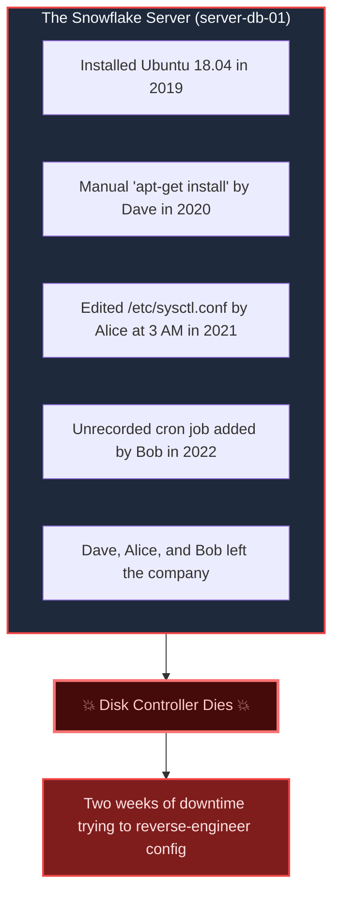
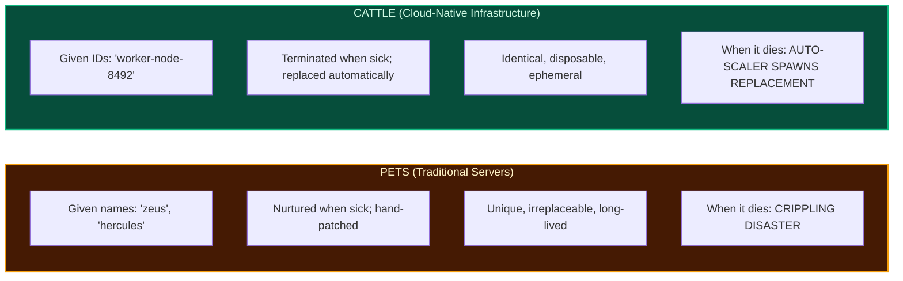
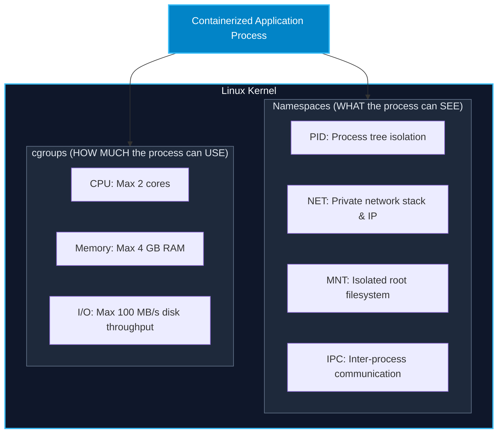

import { Callout } from 'fumadocs-ui/components/callout';
import { Steps, Step } from 'fumadocs-ui/components/steps';
import { Tabs, Tab } from 'fumadocs-ui/components/tabs';

<LessonIntro>
For decades, managing servers was an artisanal craft: an administrator logged in via SSH, hand-edited configuration files, ran manual package updates, and prayed the power supply never failed. When a server did fail, rebuilding it took weeks of guesswork. Modern DevOps replaces this fragile craft with Infrastructure as Code and Immutable Infrastructure: treating servers not as cherished pets, but as disposable, reproducible cattle defined entirely in Git.
</LessonIntro>

<Concepts items={['Snowflake Servers', 'Configuration Drift', 'Declarative vs Imperative IaC', 'Pets vs Cattle', 'Immutable Infrastructure', 'Linux Namespaces & cgroups', 'Reconciliation Loops']} />

## The "Snowflake Server" Nightmare

In legacy IT environments, production servers are unique and delicate: like snowflakes, no two are identical.



### The Inevitable Crisis: Configuration Drift

When servers are configured by hand, **configuration drift** is mathematically guaranteed:
- An engineer tests a security patch on Staging.
- Another engineer manually tweaks a NGINX timeout in Production to stop a 504 error during a Black Friday spike.
- A third engineer updates Node.js on Staging via `npm install -g`.
- **Result**: Staging and Production now have divergent runtime environments. A software change that passes all tests in Staging immediately fails in Production.

---

## Infrastructure as Code (IaC)

> **Infrastructure as Code is the practice of defining, provisioning, and managing computing infrastructure (networks, virtual machines, load balancers, database clusters) using machine-readable configuration files stored in version control, rather than manual interactive tools.**

### Declarative vs. Imperative IaC

<Tabs items={['Declarative (The Modern Standard)', 'Imperative (Step-by-Step)']}>
<Tab value="Declarative (The Modern Standard)">

You describe the **desired end state** (`WHAT`). The tooling engine inspects the current reality, calculates the diff, and takes whatever actions are needed to reach that state.

```hcl
# Terraform / OpenTofu Example
resource "aws_instance" "web_cluster" {
  count         = 3
  ami           = "ami-0c55b159cbfafe1f0"
  instance_type = "t3.medium"
  
  tags = {
    Environment = "production"
    Role        = "api-worker"
  }
}
```
*Behavior*: If 2 instances currently exist, Terraform provisions 1 more. If 3 already exist, it changes nothing. If 4 exist, it destroys 1.

</Tab>
<Tab value="Imperative (Step-by-Step)">

You specify the **exact sequence of commands** (`HOW`). You are responsible for handling failure states, ordering, and edge cases.

```bash
# Imperative Bash Script
if [ $(aws ec2 describe-instances --filters ... | jq '.length') -lt 3 ]; then
  aws ec2 run-instances --image-id ami-0c55b159cbfafe1f0 --count 1 ...
fi
```
*Problem*: If the script crashes halfway through, rerunning it may spawn redundant instances or corrupt state unless complex error handling is coded into every line.

</Tab>
</Tabs>

---

## Mental Model: Pets vs. Cattle

In 2012, Randy Bias popularized the fundamental mental model of modern systems architecture:



---

## Immutable Infrastructure

In traditional systems, upgrades are performed **in-place**: you SSH into the active server, execute `apt-get upgrade`, reload systemd services, and alter configuration files.

In **Immutable Infrastructure**, a running server is *never modified*.

<Steps>
<Step>
### Code or Config Change
An engineer updates application code or changes an NGINX configuration parameter in Git.
</Step>

<Step>
### Automated Artifact Build
The CI/CD pipeline builds a completely fresh, self-contained **immutable image** (e.g., a Docker container or an AWS AMI via Packer).
</Step>

<Step>
### Provision Fresh Instances
The deployment system provisions new virtual machines or container pods running the new image alongside the existing ones.
</Step>

<Step>
### Traffic Switch & Termination
Traffic is shifted to the new instances. Once verified, the old instances are simply terminated and deleted.
</Step>
</Steps>

<LessonNote variant="why" title="Why Immutability Eliminates Rollback Panic">
If the new release has a bug, you don't attempt to "undo" in-place patches. You simply route traffic back to the immutable previous image, which remains completely pristine and unmodified.
</LessonNote>

---

## The Technology Underlying Immutability: Containers

How do we package software so it runs identically on a developer's macOS laptop, a Linux CI runner, and an AWS Kubernetes cluster? **Linux Containers**.

A container is not a lightweight virtual machine. It is a standard Linux process isolated using two Linux kernel features:



- **Namespaces**: Provide process isolation so an application believes it is the only program running on an isolated machine with PID 1.
- **Control Groups (cgroups)**: Enforce hardware resource limits, preventing a memory leak in one service from starving the rest of the host.
- **Union Filesystem (OverlayFS)**: Allows container images to be composed of immutable, read-only layers stacked beneath a thin, writable container layer.

---

<QuickRecall title="Self-Check: Infrastructure as Code & Immutability">
1. What is the fundamental difference between declarative and imperative Infrastructure as Code?
2. If an engineer discovers a memory leak on a running production container, what does the principle of Immutable Infrastructure say they should do to fix it?
3. What are the two Linux kernel primitives that power Docker containers, and what distinct role does each play?
</QuickRecall>
