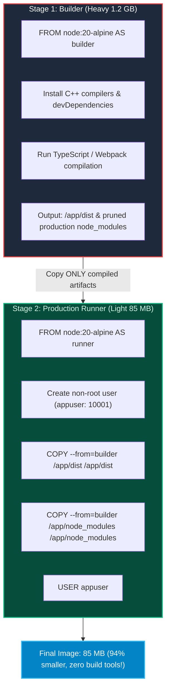

import { Callout } from 'fumadocs-ui/components/callout';
import { Steps, Step } from 'fumadocs-ui/components/steps';
import { Tabs, Tab } from 'fumadocs-ui/components/tabs';

<LessonIntro>
Anyone can write a three-line Dockerfile that works on their laptop. But in production, naive container images become massive 1.5 GB liabilities: bloated with build compilers, vulnerable to privilege escalation attacks because they run as root, and dropping live HTTP connections during deployments because they cannot handle SIGTERM signals. Here is the engineering blueprint for writing hardened, production-grade Dockerfiles.
</LessonIntro>

<Concepts items={['Multi-Stage Builds', 'Layer Cache Invalidation Economics', '.dockerignore Hygiene', 'Non-Root Principle of Least Privilege', 'PID 1 Zombie Processes & Signal Forwarding', 'tini / dumb-init']} />

## The 1.4 GB Bloated Container Disaster

Consider a common beginner Dockerfile for a Node.js or Python application:

```dockerfile
# ❌ NAIVE, BLOATED, INSECURE DOCKERFILE
FROM node:20

WORKDIR /app
COPY . .
RUN npm install
RUN npm run build

EXPOSE 3000
CMD ["npm", "start"]
```

When built, this image suffers from four critical production flaws:
1. **Size**: Weighs **1.4 GB** because it bundles full Debian Linux, C++ compilers, Python, Git, and build tools.
2. **Security**: Runs as `root` (UID 0). If an application vulnerability permits remote execution, the attacker has root privileges on the container filesystem.
3. **Broken Cache**: `COPY . .` sits *before* `npm install`. Changing a single line in a CSS file invalidates the entire cache, forcing a 4-minute re-download of all dependencies on every commit!
4. **Zombie Processes & Dropped Traffic**: `npm start` runs as PID 1. Node.js and npm do not forward Linux `SIGTERM` signals properly, meaning Kubernetes waits 30 seconds before forcibly killing the pod with `SIGKILL`, dropping in-flight user requests!

---

## The Solution: Multi-Stage Builds

> **A multi-stage build uses multiple `FROM` instructions in a single Dockerfile. You compile code in a heavy build stage, then copy ONLY the compiled production artifacts into a featherweight runtime stage.**



---

## Production Blueprint: The Hardened Dockerfile

Here is the battle-tested, production-ready template:

```dockerfile
# ==========================================
# STAGE 1: Dependency Installation & Cache
# ==========================================
FROM node:20-alpine AS deps
RUN apk add --no-cache libc6-compat
WORKDIR /app

# Copy ONLY dependency manifests to maximize Docker layer cache hits!
COPY package*.json ./
RUN npm ci --only=production

# ==========================================
# STAGE 2: Source Code Compilation
# ==========================================
FROM node:20-alpine AS builder
WORKDIR /app
COPY --from=deps /app/node_modules ./node_modules
COPY . .

# Run build (transpile TypeScript to JavaScript)
RUN npm run build
# Prune development dependencies
RUN npm prune --production

# ==========================================
# STAGE 3: Hardened Runtime Container
# ==========================================
FROM node:20-alpine AS runner
WORKDIR /app

# Install tini to handle PID 1 signal forwarding and zombie reaping
RUN apk add --no-cache tini

ENV NODE_ENV=production
ENV PORT=3000

# 1. Security: Create an unprivileged system user & group
RUN addgroup --system --gid 10001 nodejs && \
    adduser --system --uid 10001 nextjs

# 2. Copy compiled artifacts from builder with strict ownership
COPY --from=builder --chown=nextjs:nodejs /app/dist ./dist
COPY --from=builder --chown=nextjs:nodejs /app/node_modules ./node_modules
COPY --from=builder --chown=nextjs:nodejs /app/package.json ./package.json

# 3. Switch to unprivileged user (No root permissions!)
USER nextjs

EXPOSE 3000

# 4. Use tini as PID 1 to gracefully handle SIGTERM from Kubernetes
ENTRYPOINT ["/sbin/tini", "--"]
CMD ["node", "dist/server.js"]
```

---

## Why PID 1 and `tini` Matter

When Kubernetes shuts down a pod during a rolling update:
1. It sends a `SIGTERM` signal to **PID 1** inside the container.
2. The application is expected to intercept `SIGTERM`, stop accepting new connections, finish serving in-flight HTTP requests, close database pools, and exit cleanly.
3. **The problem**: If your application is invoked via a shell (`CMD npm start`), the shell becomes PID 1. Standard shells do not forward signals to child processes!
4. **The result**: Node never receives `SIGTERM`. It continues running until Kubernetes gets impatient after 30 seconds and issues `SIGKILL` — abruptly terminating connections and corrupting in-flight transactions.
5. **The fix**: Using `/sbin/tini --` as the `ENTRYPOINT` guarantees proper signal forwarding and reaps zombie child processes cleanly.

---

<QuickRecall title="Self-Check: Production Containers">
1. Why does ordering `COPY package*.json` before `COPY . .` in a Dockerfile drastically speed up local and CI builds?
2. What catastrophic security risk is avoided by adding `USER nextjs` (non-root) to a production container image?
3. Why does running an application behind a shell script (`CMD npm start`) cause Kubernetes to drop user requests during rolling deployments?
</QuickRecall>
