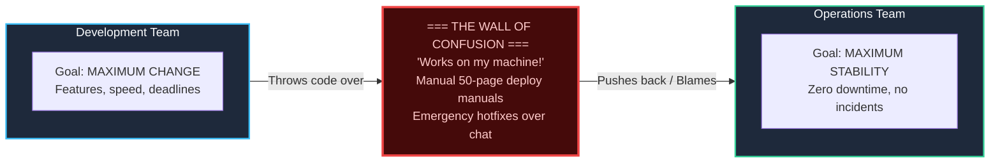

import { Callout } from 'fumadocs-ui/components/callout';
import { Cards, Card } from 'fumadocs-ui/components/card';
import { ShieldAlert, Users, Layers, Repeat } from 'lucide-react';

<LessonIntro>
DevOps is not a software tool you install with `apt-get`, nor is it a job title or an isolated team sitting between development and operations. It is an organizational and technical movement born out of a profound systemic failure: the "Wall of Confusion" that pitted software creators against system operators. In this foundation track, you will learn the mental models, architectural shifts, and cultural practices that make modern, rapid, reliable software delivery possible.
</LessonIntro>

<Concepts items={['The Wall of Confusion', 'The Three Ways', 'CALMS Framework', 'Westrum Typology', 'SRE 50% Toil Cap', 'Blameless Postmortems', 'Infrastructure as Code', 'Immutable Infrastructure']} />

## The Core Problem: Dev vs. Ops incentives

Before DevOps existed, organizations divided technology into two hostile silos:

1. **Software Development ("Dev")**: Incentivized and evaluated by **change** — how many new features, buttons, and releases they pushed to production.
2. **Operations ("Ops")**: Incentivized and evaluated by **stability** — keeping system uptime at 99.99%. Every change to a production server introduces risk, so Ops was incentivized to resist and delay deployments.

This structural misalignment produced brittle releases, month-long release freezes, 3 AM emergency war rooms, and finger-pointing. DevOps repairs this relationship by aligning both teams around a shared responsibility: **delivering value to the end user safely, continuously, and sustainably**.

## Lessons in this Track

<Cards>
  <Card
    title="01. What DevOps Is (and Isn't)"
    href="/docs/devops-cicd-performance/01-devops-foundations/01-what-is-devops"
    description="The Wall of Confusion, Gene Kim's Three Ways, and the CALMS framework."
  />
  <Card
    title="02. Culture, Toil & Incident Management"
    href="/docs/devops-cicd-performance/01-devops-foundations/02-culture-toil-and-incident-management"
    description="Westrum generative culture, Google SRE's 50% toil rule, and blameless retrospectives."
  />
  <Card
    title="03. Infrastructure as Code & Immutability"
    href="/docs/devops-cicd-performance/01-devops-foundations/03-infrastructure-as-code-and-immutability"
    description="From snowflake servers to declarative IaC, pets vs cattle, and container isolation."
  />
  <Card
    title="04. Production-Grade Dockerfiles & Hardening"
    href="/docs/devops-cicd-performance/01-devops-foundations/04-production-grade-dockerfiles"
    description="Slashing image sizes by 90%, layer caching economics, non-root users, and PID 1 signal handling."
  />
</Cards>
