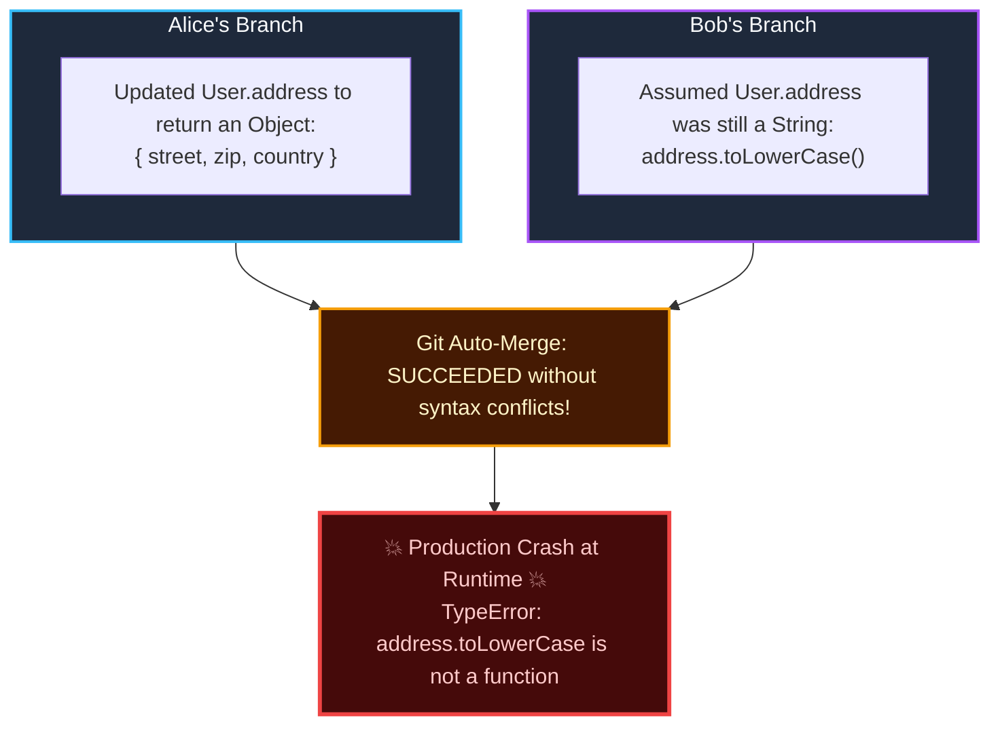
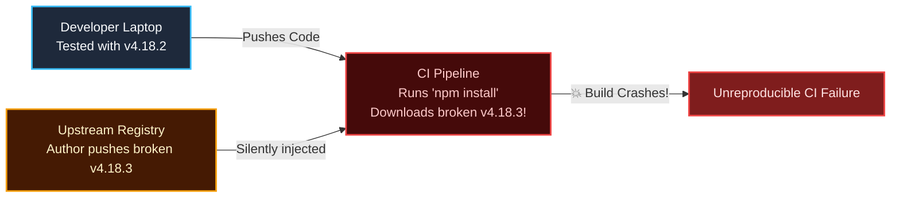

import { Callout } from 'fumadocs-ui/components/callout';
import { Steps, Step } from 'fumadocs-ui/components/steps';

<LessonIntro>
Many developers believe Continuous Integration simply means "we have a GitHub Actions YAML file that runs our tests." In reality, Continuous Integration is a software engineering discipline practiced by human beings: integrating small code changes into a shared trunk frequently — at least once per day — accompanied by automated verification on a clean-room machine. Without the discipline, the tools are useless.
</LessonIntro>

<Concepts items={['Integration Hell', 'Continuous Integration Discipline', 'Clean-Room Ephemeral Runners', 'Deterministic Lockfile Contract', 'Semantic Conflicts', 'Merge Debt']} />

## The Agony of "Merge Friday"

Consider a five-person engineering team building a payment gateway:

- **Developer Alice** branches off `main` to build Apple Pay support. Her branch lives for **28 days**, touching 42 files and 3,100 lines of code.
- **Developer Bob** branches off `main` on the same day to refactor the database ORM and user model. His branch lives for **27 days**, touching 55 files.
- On Friday afternoon, Alice merges her branch into `main`. It passes her local tests.
- Two hours later, Bob attempts to merge his branch:

```text
Auto-merging src/models/user.ts
CONFLICT (content): Merge conflict in src/models/user.ts
Auto-merging src/services/billing.ts
CONFLICT (content): Merge conflict in src/services/billing.ts
Automatic merge failed; fix conflicts and then commit the result.
```

Bob spends the next 6 hours manually picking lines inside `<<<<<<< HEAD` blocks. At 9:00 PM, the syntax conflicts are resolved and the code compiles.

**Then the real disaster strikes: Semantic Conflicts.**



Git successfully merged the file with zero syntax errors, but the **semantic assumptions** of both branches collided. Production crashed.

This nightmare is called **Integration Hell**.

<AnalogyCard name="Publishing an Encyclopedia">
<div>
<strong>Infrequent Integration (The Hell):</strong>
Imagine 20 authors each writing one volume of an encyclopedia in locked rooms for 3 years without speaking. When they assemble the books, they discover Volume 4 contradicts Volume 12, character names are spelled differently, and the indexing system is incompatible.
</div>
<div>
<strong>Continuous Integration:</strong>
The 20 authors sit in the same library. Every afternoon at 4 PM, they compare the paragraphs written that day, spot contradictions within 10 minutes, and resolve them before writing another word.
</div>
</AnalogyCard>

---

## What Continuous Integration Actually Means

> **Continuous Integration (CI) is a software engineering practice where developers merge code into a shared mainline repository multiple times per day. Each integration is verified by an automated build (including automated tests) to detect integration errors as quickly as possible.**

Notice the non-negotiable requirements:
1. **Frequent commits**: If your feature branch lives longer than 24 hours, you are doing *Batch Integration*, not Continuous Integration.
2. **Automated verification**: Human verification cannot keep pace with continuous commits. An automated system must compile, test, and lint the code on every push.
3. **Red build discipline**: When the mainline build breaks, the entire engineering team halts feature development to fix it or revert the offending commit within 10 minutes.

---

## Why "On a Clean Machine" Matters

A developer proudly exclaims: *"It compiled and all 250 tests passed on my laptop!"*

Then the CI runner attempts to build the exact same commit and crashes:
- The developer had a local, uncommitted `.env` file with database credentials.
- The developer had globally installed a library via `brew install libpq` that does not exist in Linux.
- The developer's macOS filesystem is case-insensitive (`User.ts` equals `user.ts`), but the Linux production server is case-sensitive and throws `ModuleNotFoundError`.
- The developer's `node_modules/` contained an old cached sub-dependency that was deleted upstream.

<LessonNote variant="why" title="The Ephemeral Clean-Room Guarantee">
A CI build must **always execute on a sterile, disposable virtual machine or container**. It starts from a completely blank operating system, checks out the repository, installs dependencies strictly from scratch, executes tests, and is immediately destroyed. If it passes on a clean-room machine, you have mathematical proof that the repository is self-contained.
</LessonNote>

---

## The Lockfile is Part of the Contract

When configuring automated builds, one of the most destructive mistakes engineers make is using dynamic dependency resolution:

```bash
# ❌ NEVER DO THIS IN A CI/CD PIPELINE
npm install
pip install -r requirements.txt   # without pinned hashes
bundle install
```

### The Upstream Patch Disaster

Imagine your `package.json` contains:
```json
{
  "dependencies": {
    "express": "^4.18.2"
  }
}
```

The caret (`^`) permits the package manager to download any minor or patch update up to `4.19.0`.

At 2:00 AM on a Saturday, a third-party maintainer publishes a buggy patch release (`4.18.3`). When your CI pipeline runs `npm install`, it silently fetches `4.18.3` instead of the version you tested on your laptop. Your production build fails without a single line of your own code changing!



### The Solution: Deterministic Lockfiles & Clean Installs

Always commit your lockfile (`package-lock.json`, `pnpm-lock.yaml`, `poetry.lock`, `Cargo.lock`) into version control. In CI, use the deterministic install command:

```bash
# ✅ THE DETERMINISTIC CI STANDARD
npm ci              # Node.js: wipes node_modules, reads EXACT hashes from lockfile
poetry install --no-root --sync   # Python: strict lockfile sync
cargo check --locked              # Rust: errors out if Cargo.lock would change
```

<LessonNote variant="myth" title="Lockfiles are only for local development">
The lockfile is an immutable legal contract between your repository and the external open-source ecosystem. In CI, `npm ci` strictly validates that the SHA-512 integrity hashes of downloaded tarballs match the lockfile byte-for-byte. If an external package is tampered with or replaced, the build aborts immediately.
</LessonNote>

---

<QuickRecall title="Self-Check: Continuous Integration Foundations">
1. Why does Git automatic merge fail to catch semantic conflicts between branches?
2. What is the fundamental difference between `npm install` and `npm ci` in an automated pipeline?
3. If a team uses GitHub Actions to run tests, but developers only merge their feature branches into `main` once every three weeks, are they practicing Continuous Integration? Explain why.
</QuickRecall>
