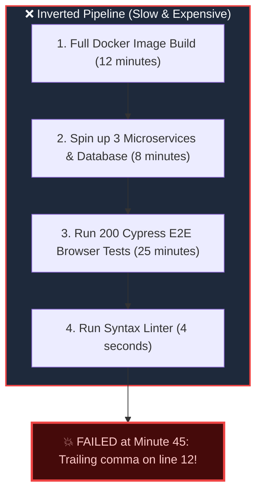
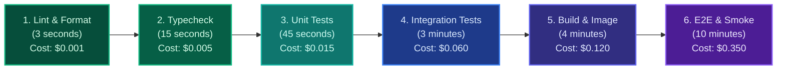
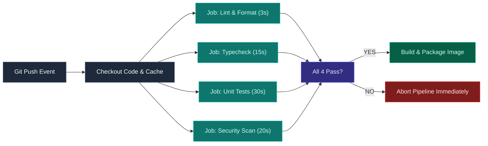

import { Callout } from 'fumadocs-ui/components/callout';
import { Steps, Step } from 'fumadocs-ui/components/steps';

<LessonIntro>
A pipeline is not a random collection of Bash commands stitched together; it is a meticulously engineered assembly line. Every stage in the pipeline exists to eliminate a specific category of risk, and the order of those stages determines whether an engineer gets feedback in 30 seconds or sits idle for 45 minutes. Here is the anatomical breakdown of how modern production pipelines work.
</LessonIntro>

<Concepts items={['Pipeline as Code', 'Fail-Fast Ordering', 'Stage-by-Stage Breakdown', 'Matrix Testing', 'Parallel Execution', 'Build as Source of Truth']} />


## The 45-Minute Disaster: Why Ordering Matters

Suppose you make a typo in a JSON configuration file on line 12: an extra trailing comma.

You push the commit and go to your CI dashboard:



You waited **45 minutes** and consumed hundreds of dollars in cloud compute credits just to find out that a linter found an invalid comma in 4 seconds!

---

## The Fail-Fast Principle

The golden rule of pipeline design is **Fail-Fast**:

> **Order your pipeline stages strictly from fastest and cheapest to slowest and most expensive.**



If the syntax is broken, the pipeline dies in 3 seconds. The engineer gets instant feedback in their terminal, fixes the comma, and recommits before they even open another browser tab.

---

## Anatomy of the Standard Stages

<Steps>
<Step>
### Stage 1: Static Analysis & Formatting (Seconds)
- **Tools**: ESLint, Biome, Prettier, Ruff, ShellCheck.
- **Goal**: Catch syntax errors, unused variables, styling violations, and anti-patterns without executing the code.
- **Rule**: If it fails formatting, do not compile.
</Step>

<Step>
### Stage 2: Type Checking & Compilation (Seconds to 1 min)
- **Tools**: TypeScript (`tsc --noEmit`), Python (`mypy`), Go (`go vet`), Rust (`cargo check`).
- **Goal**: Guarantee type safety, catch missing interface properties, invalid imports, and null-pointer hazards.
</Step>

<Step>
### Stage 3: Unit Testing (1 - 2 mins)
- **Tools**: Vitest, Jest, Pytest, Go test, JUnit.
- **Goal**: Test isolated business logic in memory using mocks for databases and external APIs.
- **Rule**: Must be 100% deterministic and require zero network access.
</Step>

<Step>
### Stage 4: Integration & Contract Testing (2 - 5 mins)
- **Tools**: Testcontainers, Supertest, Pact.
- **Goal**: Test interactions against real databases (spinning up an ephemeral PostgreSQL container), Redis caches, or partner API contracts.
</Step>

<Step>
### Stage 5: Security & Vulnerability Scanning (1 - 3 mins)
- **Tools**: Gitleaks (secrets), Trivy / Docker Scout (CVEs), Snyk / Dependabot (SCA).
- **Goal**: Ensure no API keys were committed and no dependencies contain known critical vulnerabilities.
</Step>

<Step>
### Stage 6: Build & Packaging (2 - 5 mins)
- **Tools**: Docker Buildx, npm run build, Go build.
- **Goal**: Produce the single, immutable, versioned deployable artifact (e.g., container image or binary).
</Step>

<Step>
### Stage 7: Deployment & Smoke Testing (1 - 3 mins)
- **Tools**: Helm, ArgoCD, Terraform, curl.
- **Goal**: Deploy the artifact to the target environment and verify the `/healthz` or `/readiness` HTTP endpoint returns `200 OK`.
</Step>
</Steps>

---

## Parallelism and Matrix Builds

Why run tests one by one when modern cloud runners provide virtually unlimited concurrency?

### Parallelizing Independent Jobs
Linting, type checking, and unit testing do not depend on each other. A well-architected pipeline executes them concurrently:



### Matrix Builds

If your library or service must run on multiple runtime versions and operating systems, a **Matrix Build** spawns multiple parallel jobs using combinatorial parameters:

```yaml
# GitHub Actions Matrix Example
jobs:
  test:
    runs-on: ${{ matrix.os }}
    strategy:
      matrix:
        os: [ubuntu-latest, macos-latest]
        node-version: [18.x, 20.x, 22.x]
```
This single configuration generates $2 \times 3 = 6$ parallel runner instances, guaranteeing cross-platform compatibility across all supported Node.js versions in the time it takes to run one!

---

## "The Build is the Source of Truth"

In high-performing teams, there is an absolute cultural invariant:

<LessonNote variant="why" title="The Golden Invariant">
If the pipeline is green, the code is considered shippable. If the pipeline is red, the code is broken — regardless of who wrote it, how senior they are, or how perfectly it ran on their local machine.
</LessonNote>

When a build turns red:
1. **Never commit on top of a broken build** unless your commit is specifically the fix.
2. **Revert first, investigate second**: If the fix takes longer than 10 minutes to diagnose, immediately revert the commit in Git to restore mainline green status for the rest of the engineering team.

---

<QuickRecall title="Self-Check: Pipeline Anatomy">
1. Why is running E2E browser tests before linting considered a severe pipeline anti-pattern?
2. How does running independent jobs in parallel affect total developer feedback time?
3. If a matrix strategy specifies `python-version: [3.10, 3.11, 3.12]` and `os: [ubuntu, windows]`, how many concurrent jobs will the CI engine spawn?
</QuickRecall>
