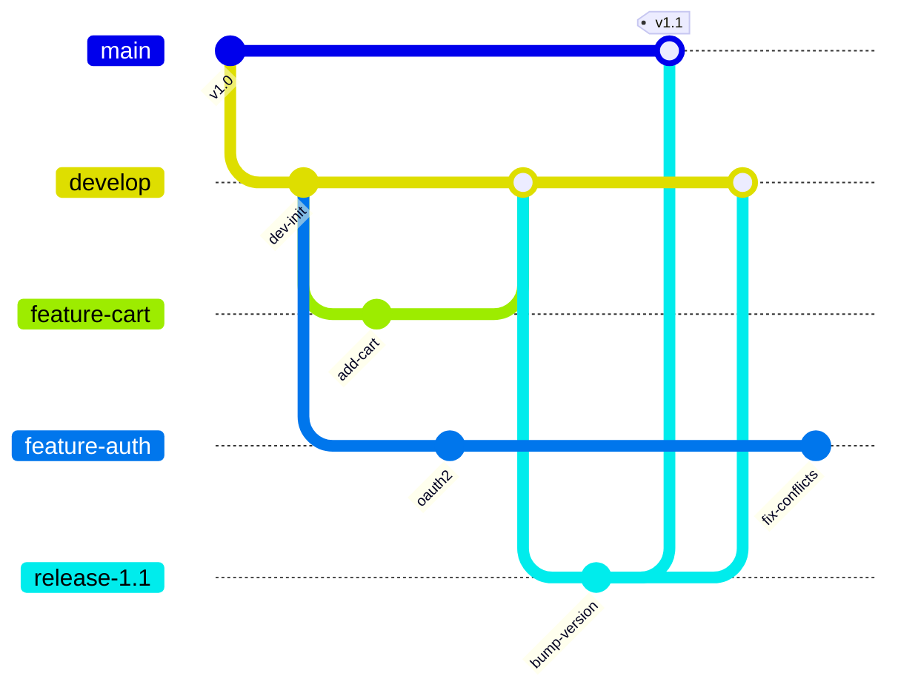
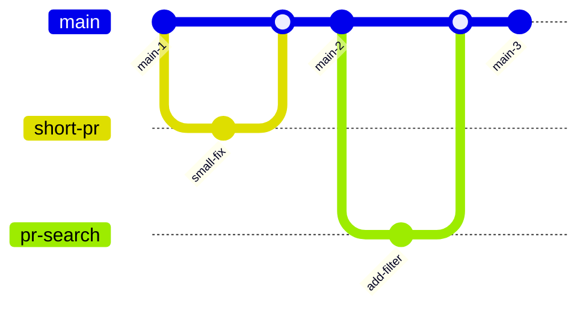
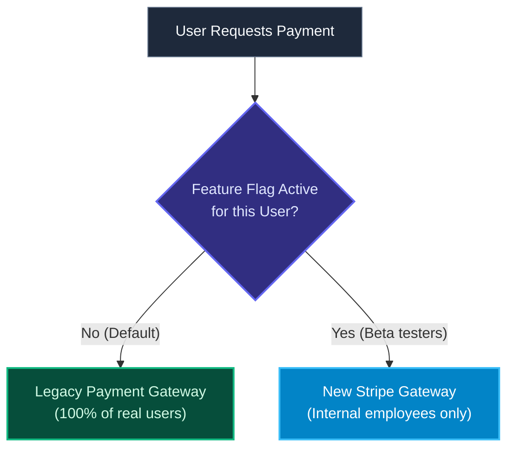

import { Callout } from 'fumadocs-ui/components/callout';
import { Steps, Step } from 'fumadocs-ui/components/steps';
import { Tabs, Tab } from 'fumadocs-ui/components/tabs';

<LessonIntro>
Your source control branching strategy is the single biggest architectural choice determining whether your team enjoys effortless continuous delivery or drowns in perpetual merge conflicts. GitFlow was designed in 2010 for boxed software with scheduled release cycles; modern cloud-native engineering relies on Trunk-Based Development paired with Feature Flags to ship code continuously without risking production stability.
</LessonIntro>

<Concepts items={['GitFlow Anti-Patterns', 'Trunk-Based Development', 'Short-Lived Branches', 'Deploy vs Release', 'Feature Flags (Toggles)', 'Kill Switches', 'Technical Debt of Dead Flags']} />

## The GitFlow Complexity Trap

In 2010, Vincent Driessen published a branching model named **GitFlow**. It introduced a rigid hierarchy of branches:



### Why GitFlow Fights Continuous Integration

GitFlow has a fundamental flaw: **it is designed around batching work**.

1. **Long-lived feature branches**: Features live on separate branches for weeks or months. During this time, they receive zero integration testing with changes made by other developers.
2. **Divergent release branches**: Bug fixes made on a `release-1.1` branch must be manually backported into `develop`. If someone forgets, regressions reappear in the next release.
3. **Delayed feedback**: Developers do not find out their code breaks a colleague's code until the "big merge" day at the end of the sprint.

<LessonNote variant="myth" title="GitFlow is the 'Industry Best Practice'">
The DORA State of DevOps research surveyed over 33,000 engineering professionals worldwide. The data conclusively demonstrated that **long-lived branches directly impair software delivery performance and stability**. High-performing teams explicitly avoid GitFlow in favor of Trunk-Based Development.
</LessonNote>

---

## Trunk-Based Development (TBD)

In **Trunk-Based Development**, all engineers commit to a single shared branch (called `trunk` or `main`).



### The Rules of Trunk-Based Development

1. **Short branch lifetimes**: If a branch is used, it should exist for a few hours — never more than 24 hours.
2. **Small pull requests**: PRs should average 100 to 300 lines of code. Small reviews are reviewed deeply; 2,000-line PRs get rubber-stamped with "looks good to me" because reviewers are overwhelmed.
3. **Direct commits to trunk**: On small, mature teams with automated CI gates, developers often push directly to `main` multiple times a day.

---

## The Great Dilemma: How to Ship Incomplete Work?

A developer protests: *"How can I merge my code into `main` every 24 hours when building the new Stripe payment gateway takes 3 weeks?"*

Under GitFlow, you would hide on a feature branch for 3 weeks until the entire feature is finished.

Under Trunk-Based Development, you use the fundamental architectural separation:

> **Deploy ≠ Release**
> - **Deploy**: Installing the compiled code on production servers. (A technical action performed by CI/CD).
> - **Release**: Making that functionality visible and active for end users. (A business action performed via configuration).

You merge incomplete code into `main` and deploy it to production every day — but you wrap it in a **Feature Flag**.

---

## Feature Flags (Feature Toggles)

A **Feature Flag** is a conditional decision point in code that allows behavior to be altered at runtime without redeploying software.

```typescript
// Minimal Feature Flag Pattern
import { isFeatureEnabled } from './featureFlags';

export async function processPayment(user: User, amount: number) {
  // Check runtime flag (backed by Redis, LaunchDarkly, or env var)
  const useNewStripeGateway = await isFeatureEnabled('stripe-v3-migration', user);

  if (useNewStripeGateway) {
    // New code paths running in production, tested only by internal staff
    return stripeService.charge(user, amount);
  } else {
    // Proven legacy code running for 99.9% of real customers
    return legacyBraintreeService.charge(user, amount);
  }
}
```



### The 4 Categories of Feature Flags

| Flag Type | Lifetime | Purpose | Example |
|---|---|---|---|
| **Release Flag** | Days to weeks | Hide incomplete features during trunk development; flip to 100% when launched. | `new-dashboard-redesign` |
| **Ops / Kill Switch** | Months to permanent | Instantly disable resource-heavy features if database load exceeds 90%. | `enable-recommendation-engine` |
| **Experimentation Flag** | Weeks | A/B testing variations for statistical conversion metrics. | `checkout-button-color-green` |
| **Permission Flag** | Permanent | Restrict features to premium subscribers or internal admins. | `enterprise-sso-login` |

---

## Guardrail: The Danger of Dead Feature Flags

Feature flags introduce technical debt: every flag adds an `if/else` branch, doubling the testing matrix.

<LessonNote variant="why" title="The $440 Million Disaster (Knight Capital)">
In 2012, financial trading firm Knight Capital reused an old, defunct feature flag from an unused 8-year-old test harness. During deployment, the flag unexpectedly evaluated to true on 7 of 8 servers, triggering a runaway high-frequency trading loop that bought and sold billions of shares uncontrollably. Knight lost **$440 million in 45 minutes** and went bankrupt.
</LessonNote>

### Best Practice for Flag Hygiene
Treat release flags as temporary debt. The moment a feature is rolled out to 100% of users and validated for 7 days, open an immediate pull request to **delete the flag and the obsolete dead code branch**.

---

<QuickRecall title="Self-Check: Branching & Feature Flags">
1. Why does GitFlow's use of long-lived feature branches inevitably produce semantic merge conflicts?
2. What is the difference between "deploying" software and "releasing" software?
3. How do feature flags allow an engineer to practice Trunk-Based Development even when building a complex feature that takes several weeks to complete?
</QuickRecall>
