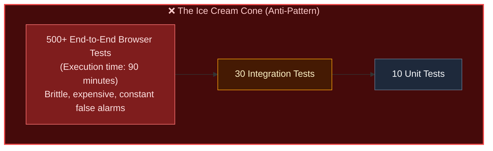
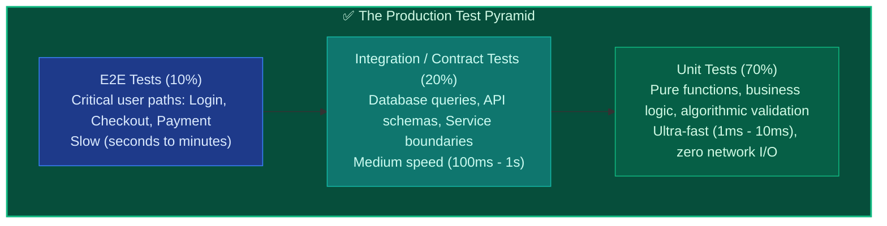
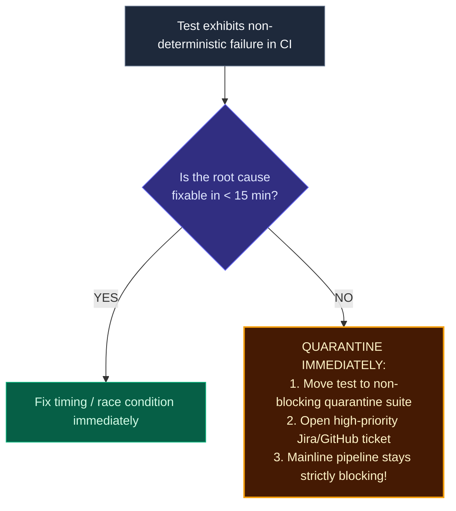

import { Callout } from 'fumadocs-ui/components/callout';
import { Steps, Step } from 'fumadocs-ui/components/steps';

<LessonIntro>
A CI pipeline is only as trustworthy as the tests running inside it. When a team builds an "ice cream cone" test suite composed of hundreds of slow, brittle UI tests, developers spend hours re-running failing jobs instead of writing code. By mastering the Test Pyramid, contract testing, and aggressive flaky-test quarantines, you transform your test suite from an agonizing bottleneck into an ironclad safety net.
</LessonIntro>

<Concepts items={['The Test Pyramid', 'The Ice Cream Cone Anti-Pattern', 'Flaky Tests', 'Test Quarantine', 'Consumer-Driven Contract Testing (Pact)', 'Test Data Isolation', 'Quality Gates']} />

## The "Ice Cream Cone" Disaster

Many teams new to automated testing start by hiring QA consultants who automate the manual testing they used to do. They write 600 Selenium or Cypress browser scripts that click buttons, wait for animations, and assert CSS styles.

The result is the dreaded **Testing Ice Cream Cone**:



### Why the Ice Cream Cone Kills Engineering
1. **Extremely slow**: Running hundreds of browser sessions takes 45 to 90 minutes.
2. **Brittle to UI changes**: Renaming a CSS class or delaying a modal animation by 50ms breaks 40 unrelated tests.
3. **Imprecise error localization**: When `test_checkout_flow` fails on line 84, you have no idea whether the bug is in the React state, the GraphQL gateway, the database transaction, or third-party Stripe downtime.

---

## Mike Cohn's Test Pyramid

To achieve rapid, dependable CI feedback, high-performing teams invert the ice cream cone into **The Test Pyramid**:



| Layer | What It Tests | Execution Speed | Cost & Maintenance | Example |
|---|---|---|---|---|
| **Unit** | Isolated functions, classes, business algorithms. No disk, no DB, no network. | **Milliseconds** (thousands run in 5 seconds) | Extremely cheap; rarely break unless logic changes. | `calculateTax(subtotal, stateCode)` |
| **Integration** | Service boundaries, real database queries via Testcontainers, Redis cache hits. | **Seconds** | Moderate; requires ephemeral dependencies. | `userRepository.findByEmail(email)` |
| **Contract** | JSON API interfaces between microservices (Pact). | **Milliseconds to seconds** | High return on investment; eliminates integration surprises. | `GET /v1/orders/42` matches consumer schema |
| **E2E** | End-to-end user journeys running against a live browser and staging backend. | **Minutes** | Expensive; reserved strictly for business-critical core paths. | User registers, adds item to cart, and enters credit card |

---

## Flaky Tests: Worse Than Missing Tests

<Flashcard term="What is a Flaky Test?">
A flaky test is a test that exhibits both a passing and a failing result with identical code, caused by non-deterministic timing, race conditions, unseeded random numbers, or external network dependencies.
</Flashcard>

<LessonNote variant="why" title="The Psychological Poison of Flakiness">
When tests fail randomly, developers stop treating a red pipeline as an alarm. Instead of investigating failures, they click **"Re-run workflow"** repeatedly until the job happens to pass. The moment developers ignore red builds, the entire CI pipeline becomes theater — real bugs slip through undetected into production under the guise of "flaky noise."
</LessonNote>

### The Quarantine Strategy

Never tolerate a flaky test in a blocking pipeline:



---

## Microservice Contracts: Consumer-Driven Contract Testing

In a microservice architecture, Service A (Order Service) queries Service B (Inventory Service).

If Inventory Service updates its JSON key from `inStock` to `is_in_stock`:
- Inventory Service's unit tests pass (it returns its new schema).
- Order Service's unit tests pass (its mocks still use `inStock`).
- When deployed together in staging, **the system crashes**.

### The Solution: Pact Contract Testing
Rather than maintaining an expensive full-blown staging cluster, consumer-driven contract testing (using tools like **Pact**) allows consumers to publish their expectations as JSON contracts.

```json
// Pact Consumer Contract: Order Service expects Inventory API to respond
{
  "consumer": { "name": "OrderService" },
  "provider": { "name": "InventoryService" },
  "interactions": [
    {
      "description": "A request for item 42 inventory",
      "request": { "method": "GET", "path": "/items/42" },
      "response": {
        "status": 200,
        "body": {
          "id": 42,
          "inStock": true
        }
      }
    }
  ]
}
```

The Inventory Service's CI pipeline runs this contract against its real endpoints *before* merging. If it renamed `inStock`, the contract test fails immediately in CI before any code reaches a shared cluster!

---

<QuickRecall title="Self-Check: Test Pyramids & Quality Gates">
1. Why does an "Ice Cream Cone" test suite result in developers ignoring CI failures?
2. If a unit test makes an HTTP network call to a live external payment gateway, is it a true unit test? Why or why not?
3. What is the immediate procedural action an engineering team should take when a test in the blocking CI suite is identified as flaky?
</QuickRecall>
