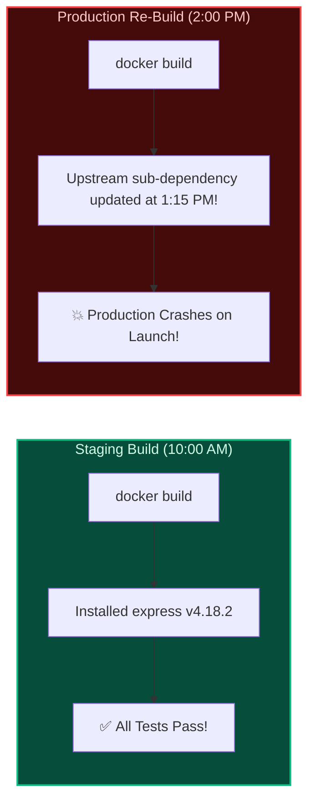
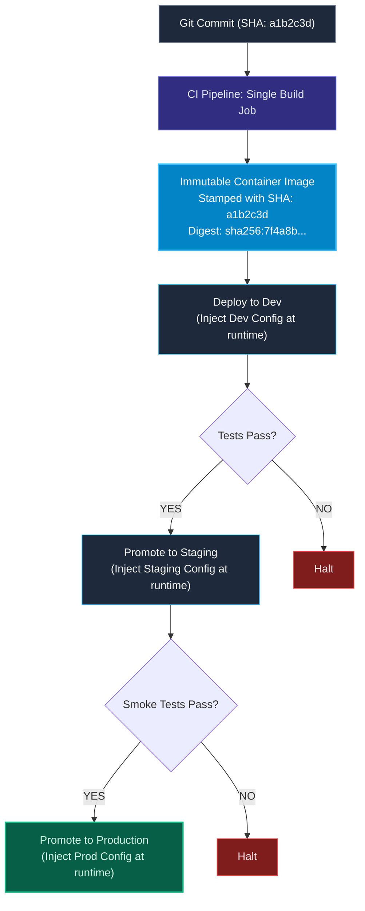
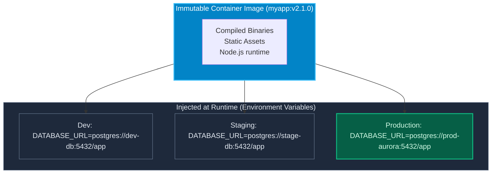

import { Callout } from 'fumadocs-ui/components/callout';
import { Steps, Step } from 'fumadocs-ui/components/steps';

<LessonIntro>
One of the most insidious bugs in software delivery occurs when an artifact tested in staging behaves differently in production. If your deployment process rebuilds the binary or container image for each target environment, you are not testing what you deploy. Production reliability requires a strict invariant: build your artifact once, stamp it with a cryptographic digest, and promote that identical byte sequence through every stage of your delivery pipeline.
</LessonIntro>

<Concepts items={['The Build Once Invariant', 'Artifact Promotion', 'Twelve-Factor Config Separation', 'Content-Addressable Storage', 'SHA-256 Digests vs Mutable Tags', 'Registry Hygiene']} />

## The "Rebuild in Production" Disaster

A team configures their CI/CD pipeline with two separate build jobs:

1. **Job 1 (Staging)**: Runs `docker build --build-arg ENV=staging -t myapp:staging` and deploys to the Staging cluster. The QA team runs automated smoke tests for 4 hours; everything is green.
2. **Job 2 (Production)**: When approved, the pipeline runs `docker build --build-arg ENV=production -t myapp:prod` and deploys to Production.

**Within 60 seconds, Production crashes.**



Because the team rebuilt the image for Production four hours later, an upstream sub-dependency was updated in the npm registry between the two builds. **The code running in production was literally not the code tested in staging.**

---

## The Rule: Build Once, Deploy Everywhere

> **An artifact must be compiled and packaged exactly once in the CI pipeline. The exact same binary or container image must be promoted through every subsequent environment without recompilation.**



---

## Separating Configuration from Code

How do you run the exact same container image in Staging (pointing to a test database) and Production (pointing to a multi-region PostgreSQL cluster)?

By adhering to **Factor III of The Twelve-Factor App**:

> **Store configuration in the environment, never in the artifact.**



### What Belongs in the Artifact vs. Runtime

| In the Immutable Artifact (Bake In) | In the Runtime Environment (Inject In) |
|---|---|
| Compiled machine code / bytecode | Database hostnames, ports, and usernames |
| Production dependency libraries (`node_modules`) | Database passwords, API tokens, secret keys |
| HTML, CSS, client-side JavaScript bundles | Log level configuration (`LOG_LEVEL=debug` vs `info`) |
| Web server routing configuration | Feature flag service endpoints |

---

## Content-Addressable Storage: Why `:latest` is Banned in Production

In Docker, image tags are **mutable pointers**:

```bash
# ❌ NEVER DEPLOY THIS TO PRODUCTION
docker pull mycompany/auth-service:latest
```

When you deploy `:latest`:
- You do not know what commit that image was built from.
- If two servers pull `:latest` 10 minutes apart, Server 1 may get commit `A` and Server 2 may get commit `B`.
- Even a tag like `:v1.2.0` can be overwritten if a developer mistakenly forces a push to the registry.

### The Production Standard: Deploy by SHA-256 Digest

Modern container orchestrators (like Kubernetes) support pinning images to their cryptographic hash:

```yaml
# ✅ IMMUTABLE PRODUCTION SPECIFICATION
apiVersion: apps/v1
kind: Deployment
metadata:
  name: payment-service
spec:
  template:
    spec:
      containers:
      - name: payment
        image: ghcr.io/myorg/payment@sha256:4b91f0f08e56165e381014e6616428c0b396a84f3abeb22fbd0f5c13b5bf57c8
```

The SHA-256 digest is calculated over the raw bytes of the image layers. It is mathematically impossible to change a single byte of code inside that image without producing a completely different hash.

---

<QuickRecall title="Self-Check: Artifact Immutability">
1. Why does rebuilding a container image separately for staging and production violate the core principles of Continuous Delivery?
2. If an application needs different database connection strings in staging and production, where should those connection strings be defined?
3. Why should production Kubernetes manifests pin container images by their SHA-256 digest rather than the `:latest` tag?
</QuickRecall>
