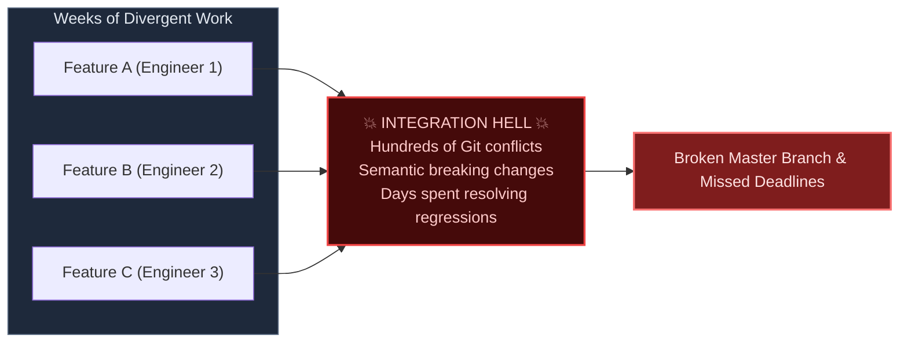

import { Callout } from 'fumadocs-ui/components/callout';
import { Cards, Card } from 'fumadocs-ui/components/card';

<LessonIntro>
Continuous Integration and Continuous Delivery (CI/CD) form the beating heart of modern software engineering. It is the automated feedback engine that transforms raw source code into verified, battle-tested, and shippable production software. In this track, you will dissect the architecture of automated pipelines from the ground up: eliminating merge conflicts, ordering stages for maximum efficiency, managing test pyramids, and ensuring artifacts are built once and deployed everywhere.
</LessonIntro>

<Concepts items={['Integration Hell', 'Clean-Room Ephemeral Builds', 'Lockfile Contracts', 'Fail-Fast Ordering', 'Matrix Builds', 'Trunk-Based Development', 'Feature Flags', 'The Test Pyramid', 'Artifact Immutability']} />

## The Core Problem: The Exponential Cost of Late Integration

When engineers build features in isolation on long-lived branches for weeks, the cost of merging their changes does not grow linearly — it grows **exponentially** with the number of contributors and time elapsed.

Continuous Integration eliminates this crisis by requiring developers to merge small, atomic units of code into a single shared mainline multiple times per day. Every commit triggers an automated pipeline that builds, tests, and verifies the application on a clean, isolated runner.

## Lessons in this Track

<Cards>
  <Card
    title="01. Integration Hell to Continuous Integration"
    href="/docs/devops-cicd-performance/02-cicd-foundations/01-integration-hell-and-the-ci-solution"
    description="The agony of long-lived branches, clean-room runner environments, and lockfiles as contracts."
  />
  <Card
    title="02. Anatomy of a Modern Pipeline"
    href="/docs/devops-cicd-performance/02-cicd-foundations/02-pipeline-anatomy-and-design"
    description="Pipeline as code, stage-by-stage execution, fail-fast ordering, parallelism, and matrix builds."
  />
  <Card
    title="03. Branching Strategies & Feature Flags"
    href="/docs/devops-cicd-performance/02-cicd-foundations/03-branching-strategies-and-feature-flags"
    description="Why GitFlow fights CI, how Trunk-Based Development thrives, and decoupling deploy from release."
  />
  <Card
    title="04. The Test Pyramid & Quality Gates"
    href="/docs/devops-cicd-performance/02-cicd-foundations/04-the-test-pyramid-and-quality-gates"
    description="Unit vs. integration vs. E2E tests, avoiding the ice cream cone, and quarantining flaky tests."
  />
  <Card
    title="05. Build Once, Deploy Everywhere"
    href="/docs/devops-cicd-performance/02-cicd-foundations/05-build-once-deploy-everywhere"
    description="Content-addressed storage, container registries, SHA-256 digests, and separating config from code."
  />
</Cards>
