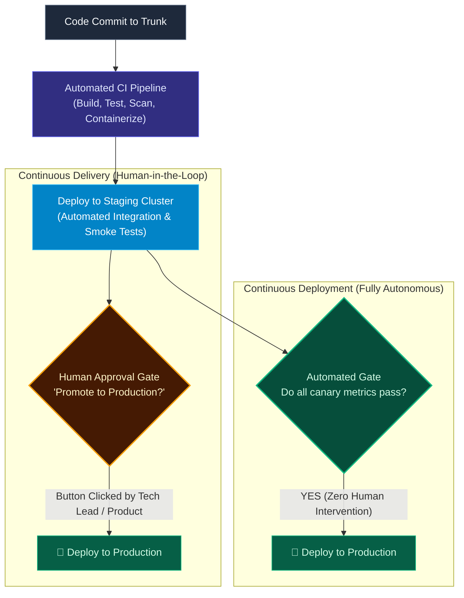

import { Callout } from 'fumadocs-ui/components/callout';
import { Steps, Step } from 'fumadocs-ui/components/steps';

<LessonIntro>
In software discussions, the abbreviation "CD" is frequently thrown around as if it represents a single concept. In reality, Continuous Delivery and Continuous Deployment represent two fundamentally different levels of organizational trust and automation maturity. Understanding the distinction determines how your team constructs approvals, environment gates, and release safety valves.
</LessonIntro>

<Concepts items={['Continuous Delivery (Human Gate)', 'Continuous Deployment (Autonomous)', 'The Dependency Gate', 'Prerequisites for Continuous Deployment', 'Automated Health Probes']} />

## The Two Paths of CD

Both approaches begin identically: every code commit triggers automated compilation, linting, unit testing, security scanning, and staging deployment. The fork in the road occurs at the threshold of the production environment:

---

## Comparative Breakdown

| Attribute | Continuous Delivery | Continuous Deployment |
|---|---|---|
| **Production Trigger** | **Manual button click** by an authorized engineer or product manager. | **Fully automated** triggered immediately by passing tests. |
| **Release Frequency** | On demand (daily, weekly, or upon business readiness). | Continuously (dozens to hundreds of times per day). |
| **Trust Model** | Trust automated tests for staging; trust human judgment for production timing. | Trust automated verification and observability entirely. |
| **Typical Use Case** | Regulated industries (banking, medical), retail timing (waiting for marketing campaigns). | Web-scale SaaS, developer tooling, high-velocity consumer apps (Netflix, GitHub, Etsy). |

<LessonNote variant="myth" title="Continuous Delivery is 'Inferior' to Continuous Deployment">
Continuous Delivery is not a "failed" or incomplete version of Continuous Deployment. For many businesses, holding a release behind a button is a deliberate commercial choice. For example, an e-commerce platform may freeze customer-facing releases at 8:00 AM on Black Friday, even though their software pipeline is capable of deploying every 5 minutes.
</LessonNote>

---

## The Readiness Checklist: Are You Ready for Continuous Deployment?

Deploying straight to production without human review sounds terrifying to most organizations. To do it safely, an engineering organization must satisfy four non-negotiable architectural prerequisites:

<Steps>
<Step>
### 1. Ironclad Automated Test Coverage
If your test suite does not catch 99.9% of regressions, humans are serving as your manual safety net. You cannot remove the human gate until your automated test pyramid is trustworthy.
</Step>

<Step>
### 2. Decoupled Deployments via Feature Flags
Can you deploy code that is only 50% finished without end users seeing it? If the answer is no, you cannot practice continuous deployment.
</Step>

<Step>
### 3. Automated Rollback Mechanisms
If an anomaly occurs, the deployment system must detect error rate spikes and automatically revert traffic to the previous version within 30 seconds without an engineer logging in.
</Step>

<Step>
### 4. Zero-Downtime Database Migrations
Every database schema change must be forward and backward compatible so that running instances of both version $N$ and version $N+1$ can coexist simultaneously.
</Step>
</Steps>

---

<QuickRecall title="Self-Check: Delivery vs. Deployment">
1. What is the single architectural difference between Continuous Delivery and Continuous Deployment?
2. Why might a banking or healthcare application deliberately choose Continuous Delivery over Continuous Deployment even if their automation is flawless?
3. If an engineer cannot deploy unfinished code to production behind a feature flag, why does that prevent them from adopting Continuous Deployment?
</QuickRecall>
