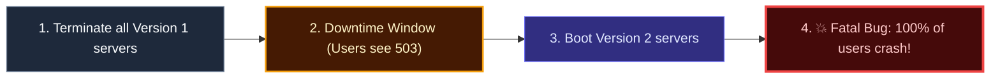
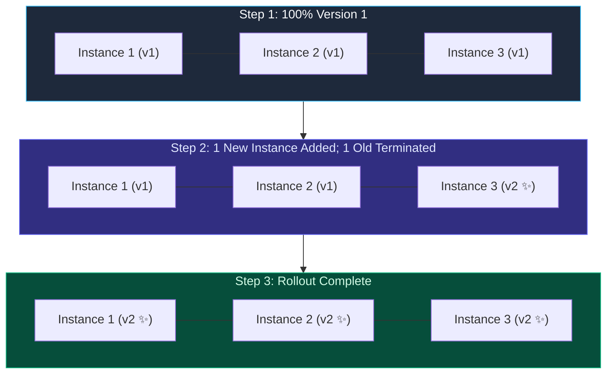
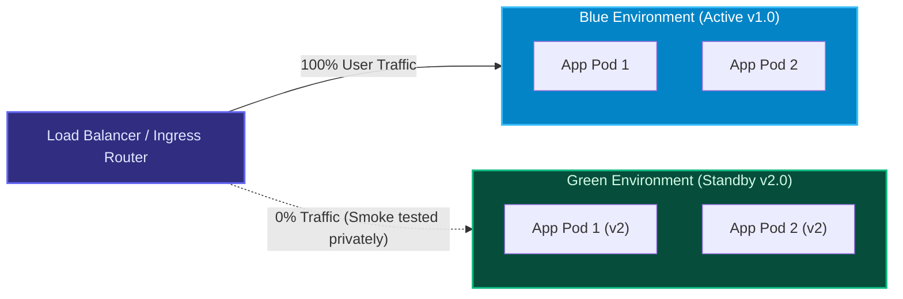
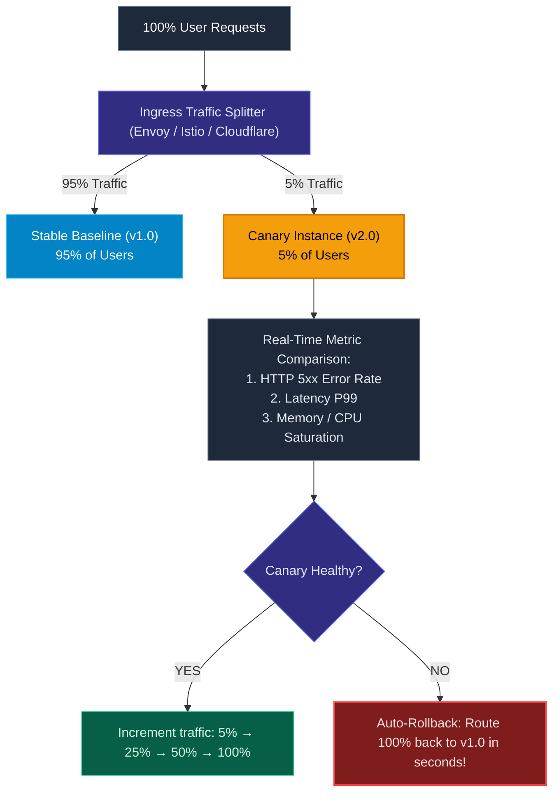
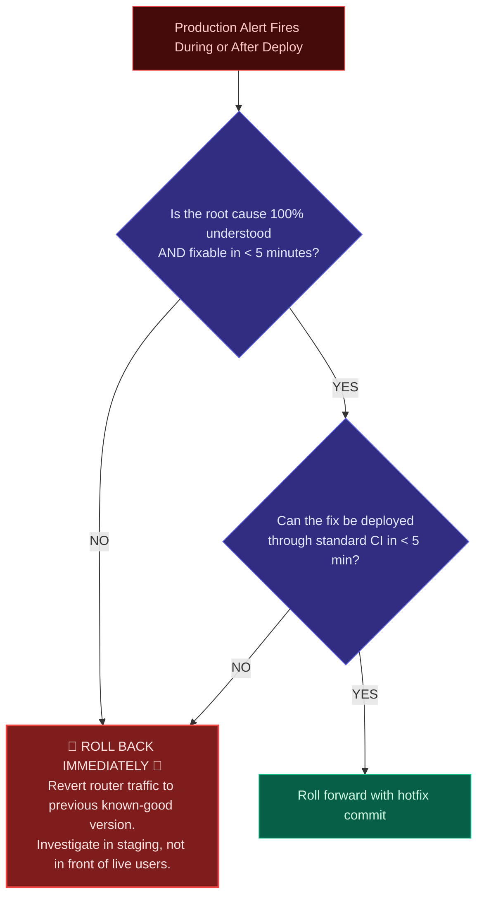

import { Callout } from 'fumadocs-ui/components/callout';
import { Steps, Step } from 'fumadocs-ui/components/steps';
import { Tabs, Tab } from 'fumadocs-ui/components/tabs';

<LessonIntro>
The most dangerous moment in an application's lifecycle is the transition between software versions. If you replace all servers simultaneously, a subtle bug immediately infects 100% of your users. Progressive Delivery replaces "big bang" updates with scientific, incremental rollouts: testing software against real production traffic while minimizing the blast radius of unexpected failures.
</LessonIntro>

<Concepts items={['Recreate Anti-Pattern', 'Rolling Updates', 'Blue/Green Deployments', 'Canary Releases', 'Traffic Splitting', 'Readiness vs Liveness Probes', 'Rollback Decision Tree']} />

## The "Big Bang" (Recreate) Disaster

In early web computing, systems used the **Recreate** strategy:



Every user experiences downtime, and if Version 2 contains an unhandled exception, 100% of your user base is impacted instantly.

---

## The Three Zero-Downtime Deployment Patterns

Modern infrastructure uses three primary progressive deployment strategies, each balancing resource cost against rollback speed:

### 1. Rolling Update

In a **Rolling Update**, old instances are gradually replaced by new instances one by one (or in small batches) behind the load balancer.



- **Pros**: Zero additional server cost (you don't need a second duplicate cluster).
- **Cons**: Version 1 and Version 2 coexist simultaneously for several minutes; rollback is slow because you must roll back instance by instance.

### 2. Blue / Green Deployment

In a **Blue/Green Deployment**, two identical production environments exist:
- **Blue**: Currently active environment handling 100% of user traffic.
- **Green**: Idle standby environment.



When deploying Version 2:
1. Deploy Version 2 to **Green**.
2. Run internal smoke tests against Green using private internal endpoints.
3. Once verified, update the router configuration: **instantly switch 100% of user traffic from Blue to Green**.
4. **Instant Rollback**: If an issue is detected, flip the router back to Blue in 500 milliseconds.

### 3. Canary Release

Named after the canary birds miners took into coal mines to detect toxic gas, a **Canary Release** routes a tiny slice of real production traffic to the new version before general availability:



---

## Health Checks: Readiness vs. Liveness Probes

To execute zero-downtime deployments, your orchestrator (Kubernetes, AWS ECS) must know when a new container is ready to receive traffic.

<Tabs items={['Readiness Probe (Can it receive traffic?)', 'Liveness Probe (Is it alive?)']}>
<Tab value="Readiness Probe (Can it receive traffic?)">

Tells the load balancer whether the container has finished its startup tasks (connecting to database, loading cache, compiling JIT code).
- **If failing**: The container is NOT killed; it is simply removed from the load balancer pool so users never receive an error.

```yaml
readinessProbe:
  httpGet:
    path: /health/ready
    port: 8080
  initialDelaySeconds: 5
  periodSeconds: 3
```

</Tab>
<Tab value="Liveness Probe (Is it alive?)">

Tells the orchestrator if the application has deadlocked, frozen in an infinite loop, or crashed.
- **If failing**: The orchestrator immediately kills and restarts the container.

```yaml
livenessProbe:
  httpGet:
    path: /health/live
    port: 8080
  initialDelaySeconds: 15
  periodSeconds: 10
```

</Tab>
</Tabs>

---

## The Rollback Decision Tree

When production alerts trigger during a release, engineers often panic: *"Should we push a quick hotfix or roll back?"*

High-performing teams follow a strict algorithmic decision tree:



<LessonNote variant="why" title="The Golden Rule of Rollbacks">
**Restore customer service first; analyze root cause second.** Never debug an unknown failure in production while live customers are experiencing errors. Revert immediately to the previous immutable release, return metrics to baseline, and investigate in peace.
</LessonNote>

---

<QuickRecall title="Self-Check: Deployment Patterns">
1. Why does a Blue/Green deployment require roughly double the infrastructure capacity during the deployment window compared to a Rolling update?
2. What is the fundamental difference between a Kubernetes `readinessProbe` and a `livenessProbe`?
3. How does a Canary release protect 95% of users from a catastrophic bug introduced in a new version?
</QuickRecall>
