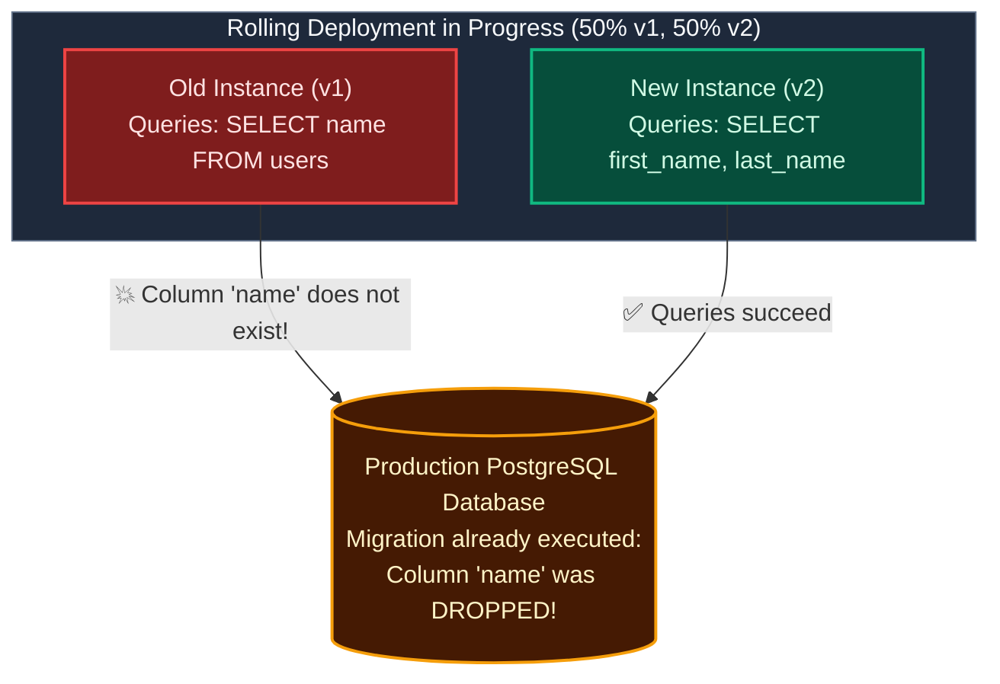
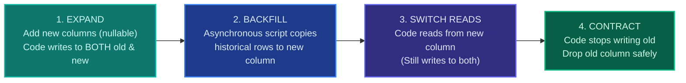

import { Callout } from 'fumadocs-ui/components/callout';
import { Steps, Step } from 'fumadocs-ui/components/steps';

<LessonIntro>
Code is ephemeral and stateless: if a container is defective, you can terminate it and restart an older version in seconds. Databases are stateful, persistent, and shared by all running instances. If you execute a naive schema migration that renames a column or adds a strict table lock, you will crash running instances during a rolling deployment and make automated rollback impossible. Here is how elite teams evolve schemas with zero downtime.
</LessonIntro>

<Concepts items={['Stateful vs Stateless Deployments', 'The Simultaneous Version Problem', 'The Expand / Contract Pattern', 'Dual-Writing', 'Background Data Backfills', 'Non-Blocking Index Creation', 'Lock Timeouts']} />

## The "Rename Column" Catastrophe

Suppose your application stores user names in a single database column named `name`.

You decide to modernize the schema by splitting it into `first_name` and `last_name`. You write a SQL migration:

```sql
-- ❌ NAIVE MIGRATION (CRASHES PRODUCTION)
ALTER TABLE users ADD COLUMN first_name VARCHAR(100);
ALTER TABLE users ADD COLUMN last_name VARCHAR(100);
ALTER TABLE users DROP COLUMN name;
```

You trigger a rolling deployment of your new application code.

### Why This Destroys Your System



1. During a rolling deployment, **instances of both the old code (v1) and the new code (v2) run concurrently**.
2. Old instances still need the old `name` column. When the migration drops it, all traffic routed to old instances immediately returns **HTTP 500 Internal Server Error**.
3. You panic and hit **Rollback** to v1.
4. **The rollback also crashes**: v1 requires the `name` column, which you just permanently destroyed in the database!

---

## The Solution: The Expand / Contract Pattern

To change a database schema without downtime, every migration must be split across multiple sequential deployments following the **Expand / Contract (Parallel Run)** pattern:



### Walkthrough: Renaming a Column across 4 Deployments

<Steps>
<Step>
### Step 1: Expand (Deploy 1)
- **Database**: Add `first_name` and `last_name` as **nullable** columns.
- **Application Code**:
  - Read from `name` (old).
  - Write to **both** `name` (old) AND `first_name`/`last_name` (new).
- *Safety*: Both v1 and v2 can run simultaneously. If v2 crashes, rollback to v1 is 100% safe.
</Step>

<Step>
### Step 2: Historical Backfill (Zero Code Deploy)
- Run an asynchronous background script (or database batch worker) that migrates existing historical rows in small batches:
```sql
UPDATE users 
SET first_name = split_part(name, ' ', 1),
    last_name = split_part(name, ' ', 2)
WHERE first_name IS NULL
LIMIT 5000;
```
- *Safety*: Running in batches of 5,000 prevents long-lived table locks and CPU spikes.
</Step>

<Step>
### Step 3: Switch Reads (Deploy 2)
- **Application Code**:
  - Switch reads to `first_name` and `last_name` (new).
  - Continue dual-writing to both old and new columns.
- *Safety*: If a subtle bug is detected in the split logic, you can safely revert back to Step 1 without data loss.
</Step>

<Step>
### Step 4: Contract (Deploy 3)
- **Application Code**: Stop writing to the old `name` column completely.
- **Database**: Once all instances of Deploy 2 are terminated, execute the contraction migration:
```sql
ALTER TABLE users DROP COLUMN name;
```
</Step>
</Steps>

---

## The 4 Golden Rules of Safe Database Migrations

<LessonNote variant="why" title="Rule 1: Never add a NOT NULL column without a default in one step">
In PostgreSQL and MySQL, adding a column with `NOT NULL` without a default value requires checking every row in the table, acquiring an exclusive `ACCESS EXCLUSIVE` table lock that blocks all incoming reads and writes. Always add the column as nullable first, backfill values, and add the constraint in a separate step.
</LessonNote>

### Rule 2: Create Indexes Concurrently
In PostgreSQL, a standard `CREATE INDEX` locks the entire table against writes for the duration of the index build (which could take hours on large tables). Always use:
```sql
CREATE INDEX CONCURRENTLY idx_users_email ON users(email);
```

### Rule 3: Always Set Lock Timeouts
If your migration waits for an active transaction to finish, it creates a queue behind it, blocking all subsequent user queries and causing a cascading outage. Always set explicit timeouts:
```sql
SET lock_timeout = '3s';
SET statement_timeout = '10s';
ALTER TABLE users ADD COLUMN phone VARCHAR(20);
```

### Rule 4: Decouple Migration Execution from Application Boot
Never let an application container run migrations automatically on boot (`npm run typeorm:migration:run` inside the Docker entrypoint). If Kubernetes spawns 20 pods simultaneously during a scaling event, all 20 pods will attempt to run migrations concurrently, causing deadlock and database lock contention. Run migrations as a dedicated, single-run Kubernetes `Job` *before* the deployment rolls out.

---

<QuickRecall title="Self-Check: Database Migrations">
1. Why does executing `ALTER TABLE users DROP COLUMN name` during a rolling deployment cause production errors for active users?
2. What are the four stages of the Expand/Contract pattern?
3. Why should containerized applications avoid running database migrations inside their standard Docker container startup script?
</QuickRecall>
