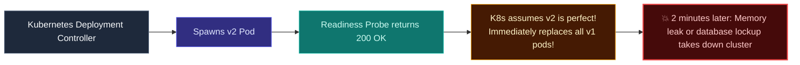
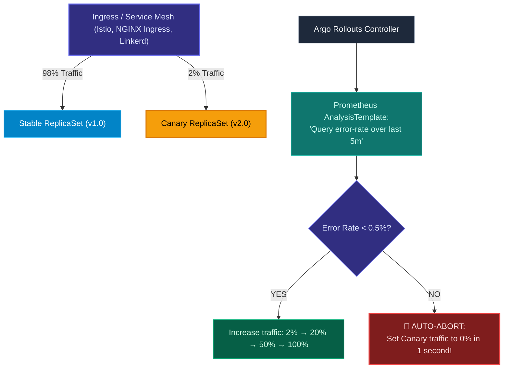

import { Callout } from 'fumadocs-ui/components/callout';
import { Steps, Step } from 'fumadocs-ui/components/steps';
import { Tabs, Tab } from 'fumadocs-ui/components/tabs';

<LessonIntro>
Standard Kubernetes Deployments support only basic rolling updates: they cannot route 2% of user traffic to a new version, nor can they query Prometheus to check whether error rates spiked before replacing all pods. Argo Rollouts extends Kubernetes with advanced deployment controllers, executing progressive canary rollouts driven by real-time automated metric analysis.
</LessonIntro>

<Concepts items={['Limitations of Native K8s Deployments', 'Argo Rollouts Controller', 'The Rollout CRD', 'Traffic Routers (Istio / NGINX / AWS ALB)', 'Automated AnalysisTemplates', 'Prometheus Metric Queries', 'Automated Abort & Rollback']} />

## The Blind Spot of Native Kubernetes Deployments

When you update a standard Kubernetes `Deployment`:



A Kubernetes `readinessProbe` only proves that the container booted up and responded to a local health check. It does **not** know whether real customers are receiving checkout errors or if database latency just quadrupled.

---

## The Argo Rollouts Solution

Argo Rollouts replaces the native Kubernetes `Deployment` object with a custom resource: the **Rollout**.



---

## Production Blueprint: The `Rollout` & `AnalysisTemplate`

### 1. The Metric-Driven AnalysisTemplate
Define what "healthy" means using standard Prometheus queries:

```yaml
apiVersion: argoproj.io/v1alpha1
kind: AnalysisTemplate
metadata:
  name: success-rate-check
spec:
  metrics:
  - name: success-rate
    interval: 60s
    successCondition: result[0] >= 0.995 # Must maintain >= 99.5% success!
    failureLimit: 2 # Abort rollout after 2 consecutive failures
    provider:
      prometheus:
        address: http://prometheus-server.monitoring:9090
        query: |
          sum(rate(http_requests_total{status!~"5.*",app="billing"}[2m]))
          /
          sum(rate(http_requests_total{app="billing"}[2m]))
```

### 2. The Rollout Specification
Reference the analysis template directly inside the deployment steps:

```yaml
apiVersion: argoproj.io/v1alpha1
kind: Rollout
metadata:
  name: billing-service
spec:
  replicas: 10
  strategy:
    canary:
      canaryService: billing-canary
      stableService: billing-stable
      trafficRouting:
        nginx:
          stableIngress: billing-ingress
      steps:
      - setWeight: 5 # Route 5% of traffic to Canary
      - pause: { duration: 10m } # Wait 10 minutes to collect real traffic metrics
      - analysis:
          templates:
          - templateName: success-rate-check
      - setWeight: 20
      - pause: { duration: 15m }
      - analysis:
          templates:
          - templateName: success-rate-check
      - setWeight: 100 # Fully promote to 100%
```

If at minute 6 the Prometheus query detects that the error rate exceeded 0.5%, Argo Rollouts **instantly aborts the rollout, restores 100% traffic to stable v1 pods, and scales the canary to 0**. No engineer ever had to log into the cluster!

---

<QuickRecall title="Self-Check: Argo Rollouts">
1. Why is a standard Kubernetes readiness probe insufficient for detecting complex application errors during a release?
2. How does an Argo Rollouts `AnalysisTemplate` automate the rollback decision?
3. What happens to the canary traffic when an AnalysisTemplate query breaches its failure threshold?
</QuickRecall>
