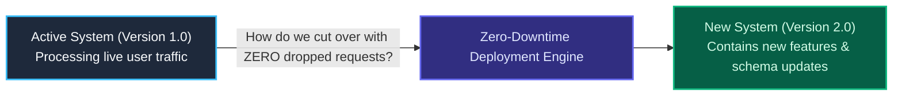

import { Callout } from 'fumadocs-ui/components/callout';
import { Cards, Card } from 'fumadocs-ui/components/card';

<LessonIntro>
The true test of a software delivery system is what happens at the moment of release. In the legacy world, deploying code meant taking servers offline, displaying "Under Maintenance" banners to angry users, and bracing for an all-night firefighting session. In modern cloud architecture, releases happen continuously throughout the business day with zero user downtime and instantaneous rollback capabilities.
</LessonIntro>

<Concepts items={['Continuous Delivery vs Continuous Deployment', 'The Human Approval Gate', 'Rolling Updates', 'Blue/Green Deployments', 'Canary Releases', 'Traffic Splitting', 'Automated Health Probes', 'The Expand/Contract Database Migration Pattern']} />

## The Core Problem: Upgrading a Plane Mid-Flight

Deploying an update to an active web application is the software engineering equivalent of replacing an aircraft engine while cruising at 35,000 feet:
- Live users are in the middle of completing credit card transactions.
- Active WebSocket connections are streaming live data.
- The database schema is being actively queried by running background jobs.

If you shut down the old version before the new version is healthy, requests drop. If you deploy a database migration that removes a column while old instances are still running, the application crashes with SQL errors.

## Lessons in this Track

<Cards>
  <Card
    title="01. Continuous Delivery vs. Deployment"
    href="/docs/devops-cicd-performance/03-deployment-strategies/01-continuous-delivery-vs-deployment"
    description="The dependency gate: when to use human approvals vs fully automated continuous deployments."
  />
  <Card
    title="02. Progressive Delivery: Rolling, Blue/Green & Canary"
    href="/docs/devops-cicd-performance/03-deployment-strategies/02-zero-downtime-deployment-patterns"
    description="Traffic splitting, health and readiness probes, and designing instant rollback decision trees."
  />
  <Card
    title="03. Zero-Downtime Database Migrations"
    href="/docs/devops-cicd-performance/03-deployment-strategies/03-zero-downtime-database-migrations"
    description="The Expand/Contract pattern: non-blocking schema evolution and parallel-run data backfills."
  />
  <Card
    title="04. Automated Canary Analysis with Argo Rollouts"
    href="/docs/devops-cicd-performance/03-deployment-strategies/04-automated-canary-analysis-argo-rollouts"
    description="Traffic routing with Istio/NGINX, Prometheus AnalysisTemplates, and self-aborting rollouts."
  />
</Cards>
