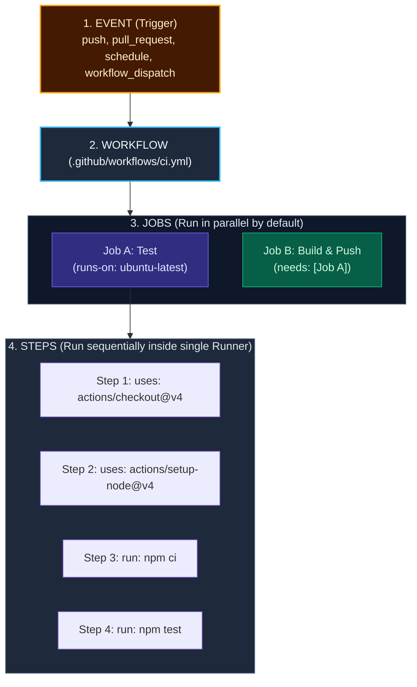

import { Callout } from 'fumadocs-ui/components/callout';
import { Steps, Step } from 'fumadocs-ui/components/steps';
import { Tabs, Tab } from 'fumadocs-ui/components/tabs';

<LessonIntro>
GitHub Actions is the default automation engine for modern open-source and commercial software engineering. Unlike standalone CI servers that require dedicated maintenance, GitHub Actions lives directly inside your repository, triggering workflows on any Git event — from pull requests and releases to cron schedules and issue assignments.
</LessonIntro>

<Concepts items={['Workflows & Triggers', 'Jobs & Concurrency', 'Steps & Shell Runners', 'Actions Marketplace', 'Repository Secrets & Contexts', 'Docker Buildx & Registry Push']} />

## Architecture of GitHub Actions

GitHub Actions organizes automation into five hierarchical components:



- **Event**: A specific activity that triggers a workflow (e.g. someone pushes a commit to `main`, opens a pull request, or a cron trigger fires).
- **Workflow**: A configurable automated process defined in a YAML file inside `.github/workflows/`.
- **Job**: A set of steps executed on the same runner instance. Jobs run **in parallel** by default unless ordered with `needs`.
- **Runner**: The virtual machine (Ubuntu, Windows, macOS) hosted by GitHub or self-hosted in your cloud.
- **Step**: An individual task that can run commands (`run: npm test`) or execute a reusable action (`uses: actions/checkout@v4`).

---

## Production Hands-On: Complete Docker CI/CD Pipeline

Here is an end-to-end production workflow: checking out code, running automated tests, logging into Docker Hub with encrypted secrets, and building an immutable, multi-platform Docker container image.

Create `.github/workflows/build-and-deploy.yml`:

```yaml
name: CI/CD Production Pipeline

# Trigger only on pushes to main and pull requests
on:
  push:
    branches: [main]
  pull_request:
    branches: [main]

# Set minimal default permissions (Least Privilege)
permissions:
  contents: read

jobs:
  test:
    name: Lint & Unit Tests
    runs-on: ubuntu-latest
    steps:
      - name: Checkout Source Code
        uses: actions/checkout@v4

      - name: Setup Node.js Runtime
        uses: actions/setup-node@v4
        with:
          node-version: 20
          cache: 'npm'

      - name: Install Dependencies (Deterministic)
        run: npm ci

      - name: Run Linter
        run: npm run lint

      - name: Execute Test Suite
        run: npm test -- --coverage

  build-and-push:
    name: Build & Push Docker Image
    needs: [test] # Gate: only runs if test job passes!
    if: github.ref == 'refs/heads/main' && github.event_name == 'push'
    runs-on: ubuntu-latest
    steps:
      - name: Checkout Code
        uses: actions/checkout@v4

      - name: Set up Docker Buildx
        uses: docker/setup-buildx-action@v3

      - name: Log in to Docker Hub
        uses: docker/login-action@v3
        with:
          username: ${{ secrets.DOCKERHUB_USERNAME }}
          password: ${{ secrets.DOCKERHUB_TOKEN }}

      - name: Extract Metadata (Tags, Labels)
        id: meta
        uses: docker/metadata-action@v5
        with:
          images: ${{ secrets.DOCKERHUB_USERNAME }}/demo-app
          tags: |
            type=sha,format=short,prefix=sha-
            type=raw,value=latest

      - name: Build and Push Image
        uses: docker/build-push-action@v5
        with:
          context: .
          push: true
          tags: ${{ steps.meta.outputs.tags }}
          labels: ${{ steps.meta.outputs.labels }}
          cache-from: type=gha
          cache-to: type=gha,mode=max
```

---

## Key Directives Explained

### 1. The `needs` Dependency Gate
By default, GitHub Actions runs all jobs concurrently. By specifying `needs: [test]`, the `build-and-push` job will not start until `test` exits with code `0`. If any unit test fails, the build job is skipped completely, preventing broken images from polluting your Docker registry.

### 2. Secrets Management
Never put plain-text passwords or API tokens in YAML files. In your GitHub repository:
- Go to **Settings > Secrets and variables > Actions > New repository secret**.
- Add `DOCKERHUB_USERNAME` and `DOCKERHUB_TOKEN`.
- Reference them securely using the context syntax: `${{ secrets.DOCKERHUB_TOKEN }}`.
- GitHub automatically masks these secrets, preventing them from printing in public runner logs.

### 3. Buildx Layer Caching (`type=gha`)
Notice the lines:
```yaml
cache-from: type=gha
cache-to: type=gha,mode=max
```
This instructs Docker Buildx to persist cached intermediate image layers directly inside GitHub Actions' internal cache cache storage. Subsequent pipeline runs only rebuild the layers that actually changed, reducing build times from 5 minutes to 25 seconds!

---

<QuickRecall title="Self-Check: GitHub Actions">
1. In GitHub Actions, what is the default execution behavior when multiple jobs are defined in a workflow file: parallel or sequential?
2. How do you prevent a deploy job from running if the testing job fails?
3. Why should you generate a Docker Hub Personal Access Token (PAT) instead of using your primary Docker account password in GitHub Secrets?
</QuickRecall>
