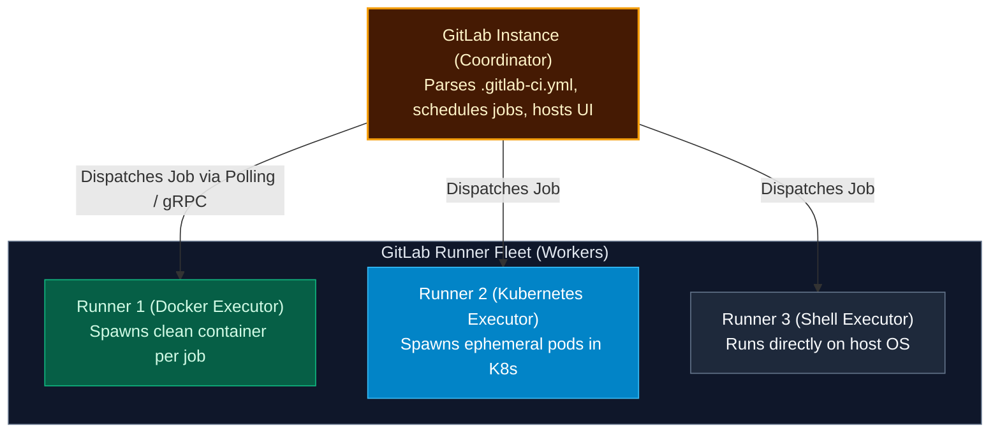
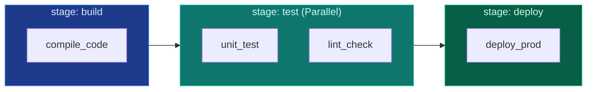

import { Callout } from 'fumadocs-ui/components/callout';
import { Steps, Step } from 'fumadocs-ui/components/steps';
import { Tabs, Tab } from 'fumadocs-ui/components/tabs';

<LessonIntro>
GitLab was one of the earliest platforms to integrate a first-class CI/CD engine directly alongside source code management. Driven by the declarative `.gitlab-ci.yml` file and powered by a distributed fleet of GitLab Runners, GitLab CI/CD offers powerful stage orchestration, ephemeral review apps, and strict artifact tracking.
</LessonIntro>

<Concepts items={['GitLab Runner Executors', '.gitlab-ci.yml Schema', 'Stages vs Jobs', 'Artifacts vs Cache', 'Docker-in-Docker (DinD)', 'Rules & Manual Gates']} />

## The GitLab CI Architecture

GitLab CI/CD separates the coordinator from the execution engine:



- **GitLab Instance**: The central web application and API that stores Git repos, monitors commits, interprets pipeline configs, and serves the UI.
- **GitLab Runner**: An open-source Go binary installed on an external machine (cloud VM, bare-metal server, or Kubernetes cluster) that registers with GitLab and executes dispatched jobs.

---

## Stages vs. Jobs

In `.gitlab-ci.yml`, the execution order is governed by **stages**:



- **Stages** run **sequentially**. If any job in `stage: test` fails, the pipeline halts and `stage: deploy` never runs.
- **Jobs** within the same stage run **in parallel** across available runners.

---

## The Great Confusion: `artifacts` vs. `cache`

One of the most frequent beginner mistakes in GitLab CI is mixing up artifacts and cache:

| Feature | `cache` | `artifacts` |
|---|---|---|
| **Primary Goal** | **Speed up execution** by storing project dependencies across builds. | **Pass generated outputs** from one stage to subsequent stages. |
| **Typical Contents** | `node_modules/`, `.m2/repository`, `venv/`. | Compiled `dist/`, `.jar`, `.apk`, test coverage XMLs. |
| **Availability Guarantee** | **Best-effort**. May be evicted if disk space is low; your build must still pass if cache is missed! | **Guaranteed**. Uploaded to GitLab server; next stages will fail if missing. |
| **Downloadable in UI?** | No. Internal to runner storage. | Yes. Downloadable as a `.zip` from the GitLab web dashboard. |

---

## Hands-On: Production `.gitlab-ci.yml` with Docker-in-Docker

Here is a complete, production-ready pipeline using Node.js and Docker-in-Docker (DinD):

```yaml
# Define pipeline stages in strict sequential order
stages:
  - test
  - build
  - deploy

# Global default Docker image
default:
  image: node:20-alpine

# Cache node_modules across pipeline runs using package-lock.json as key
cache:
  key:
    files:
      - package-lock.json
  paths:
    - .npm/

# --- STAGE 1: TEST ---
lint_and_unit_test:
  stage: test
  script:
    - npm ci --cache .npm --prefer-offline
    - npm run lint
    - npm test
  artifacts:
    when: always
    reports:
      junit: junit-report.xml
    paths:
      - coverage/
    expire_in: 7 days

# --- STAGE 2: BUILD CONTAINER ---
build_docker_image:
  stage: build
  image: docker:24.0.5
  services:
    - docker:24.0.5-dind # Enable Docker daemon inside container
  variables:
    DOCKER_TLS_CERTDIR: "/certs"
  before_script:
    # Use GitLab's built-in container registry credentials
    - docker login -u $CI_REGISTRY_USER -p $CI_REGISTRY_PASSWORD $CI_REGISTRY
  script:
    - docker build -t $CI_REGISTRY_IMAGE:$CI_COMMIT_SHORT_SHA -t $CI_REGISTRY_IMAGE:latest .
    - docker push $CI_REGISTRY_IMAGE:$CI_COMMIT_SHORT_SHA
    - docker push $CI_REGISTRY_IMAGE:latest
  rules:
    - if: '$CI_COMMIT_BRANCH == "main"'

# --- STAGE 3: DEPLOY TO PRODUCTION ---
deploy_production:
  stage: deploy
  image: alpine:latest
  environment:
    name: production
    url: https://app.example.com
  before_script:
    - apk add --no-cache curl
  script:
    # Trigger rolling deployment on target cluster
    - echo "Deploying image $CI_REGISTRY_IMAGE:$CI_COMMIT_SHORT_SHA to Production..."
    - curl -X POST $K8S_WEBHOOK_URL
  rules:
    - if: '$CI_COMMIT_BRANCH == "main"'
      when: manual # Creates a human approval button in the GitLab UI!
```

---

<QuickRecall title="Self-Check: GitLab CI">
1. If your job needs to pass a compiled `.jar` file from the `build` stage to the `deploy` stage, should you configure `cache` or `artifacts`? Why?
2. What does `services: [docker:dind]` provide when running inside a Docker-based GitLab Runner executor?
3. How do you transform a job into a manual human approval gate in `.gitlab-ci.yml`?
</QuickRecall>
