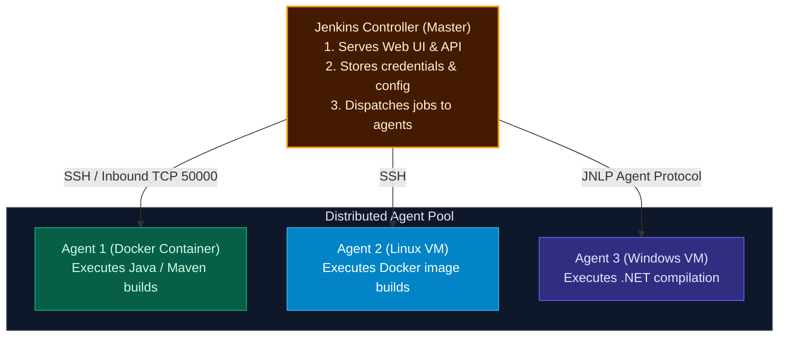
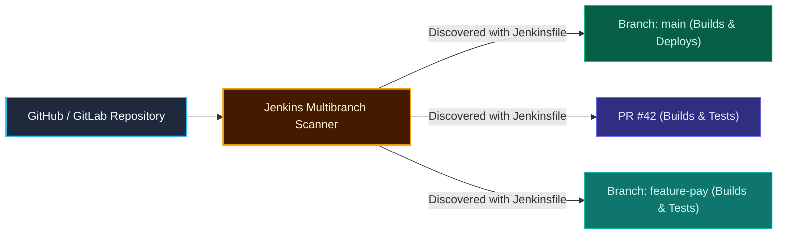

import { Callout } from 'fumadocs-ui/components/callout';
import { Steps, Step } from 'fumadocs-ui/components/steps';
import { Tabs, Tab } from 'fumadocs-ui/components/tabs';

<LessonIntro>
Jenkins is the battle-tested workhorse of enterprise CI/CD. While modern SaaS platforms manage runners in the cloud, thousands of organizations rely on Jenkins for total control over their on-premise infrastructure, custom security compliance, and complex multi-machine build farms. Modern Jenkins development leaves behind manual UI jobs in favor of the Declarative Jenkinsfile and Multibranch Pipelines.
</LessonIntro>

<Concepts items={['Controller-Agent Architecture', 'Running Jenkins in Docker', 'Declarative vs Scripted Pipelines', 'Jenkinsfile Directives', 'Credentials Binding', 'Multibranch Pipelines', 'GitHub Webhooks']} />

## The Controller-Agent Architecture

The golden rule of enterprise Jenkins administration is: **Never execute build workloads on the Controller.**



- **Controller**: Manages scheduling, hosts plugins, monitors agents, and securely stores secrets. Running builds on the controller risks crashing the UI or allowing malicious code to access Jenkins configuration files.
- **Agents**: Ephemeral or dedicated worker machines running small Java agent processes that receive instructions, execute shell scripts, and stream logs back to the controller.

---

## Running Jenkins in Docker

To spin up a local Jenkins controller with persistent storage:

```bash
docker run -d \
  --name jenkins \
  --restart=always \
  -p 8080:8080 \
  -p 50000:50000 \
  -v jenkins_home:/var/jenkins_home \
  jenkins/jenkins:lts-jdk17
```

- Port `8080`: Accesses the web dashboard.
- Port `50000`: Used by external inbound Jenkins agents to communicate with the controller.
- Volume `jenkins_home`: Persists installed plugins, credentials, job configurations, and build logs across container restarts.

---

## Declarative vs. Scripted Pipelines

Historically, Jenkins pipelines were written in **Scripted syntax** (freeform Groovy code), which frequently became unmaintainable spaghetti scripts. Today, **Declarative Pipelines** are the industry standard: a structured, strict schema with built-in error handling and linting.

```groovy
// The Declarative Jenkinsfile Standard
pipeline {
    // Run on any available worker agent
    agent any

    // Define environment variables accessible across all stages
    environment {
        APP_NAME    = 'billing-service'
        REGISTRY    = 'registry.hub.docker.com'
        DOCKER_CRED = credentials('docker-hub-credentials') // Injected securely!
    }

    stages {
        stage('Checkout Code') {
            steps {
                checkout scm
            }
        }

        stage('Build & Test') {
            steps {
                echo "Compiling ${env.APP_NAME}..."
                sh 'npm ci'
                sh 'npm test'
            }
        }

        stage('Docker Package & Push') {
            steps {
                echo "Building container image..."
                sh """
                    docker login -u ${DOCKER_CRED_USR} -p ${DOCKER_CRED_PSW} ${REGISTRY}
                    docker build -t ${REGISTRY}/myorg/${APP_NAME}:${BUILD_NUMBER} .
                    docker push ${REGISTRY}/myorg/${APP_NAME}:${BUILD_NUMBER}
                """
            }
        }
    }

    // Post-actions execute based on overall pipeline status
    post {
        always {
            cleanWs() // Clean workspace to prevent disk bloat
        }
        success {
            echo "Pipeline succeeded! Ready for release."
        }
        failure {
            echo "Pipeline failed! Sending Slack notification..."
            // slackSend channel: '#dev-alerts', color: 'danger', message: "Build ${BUILD_NUMBER} failed!"
        }
    }
}
```

---

## Multibranch Pipelines: Automated Branch Discovery

In traditional Jenkins, an administrator had to click `New Item > Freestyle Project` in the web UI for every single Git branch.

In a **Multibranch Pipeline**:



1. You point Jenkins to your Git repository URL once.
2. Jenkins scans the repo branches and open Pull Requests.
3. For every branch that contains a `Jenkinsfile`, Jenkins **automatically provisions a dedicated build pipeline**.
4. When a branch is merged and deleted in GitHub, Jenkins automatically archives and cleans up the job!

---

## Automated Triggers via Webhooks

Instead of having Jenkins constantly poll GitHub every 60 seconds (which consumes API rate limits), configure a **GitHub Webhook**:

1. In GitHub repo: **Settings > Webhooks > Add webhook**.
2. **Payload URL**: `http://<YOUR_JENKINS_URL>:8080/github-webhook/`
3. **Content type**: `application/json`
4. **Events**: Select `Just the push event` and `Pull requests`.

Now, the millisecond a developer pushes a commit, GitHub sends an HTTP POST event to Jenkins, starting the pipeline in under 500 milliseconds.

---

<QuickRecall title="Self-Check: Jenkins">
1. Why is running build commands on the Jenkins Controller considered a critical operational and security vulnerability?
2. What is the advantage of using a Multibranch Pipeline over manually creating jobs in the Jenkins web UI?
3. How does `credentials('credential-id')` prevent passwords from leaking into version control in a Declarative Jenkinsfile?
</QuickRecall>
