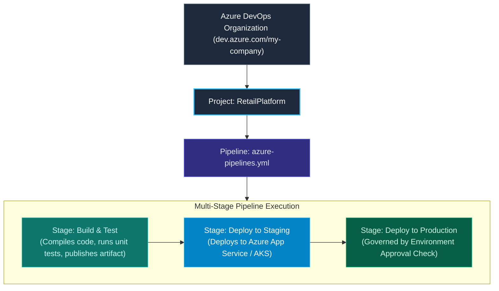

import { Callout } from 'fumadocs-ui/components/callout';
import { Steps, Step } from 'fumadocs-ui/components/steps';
import { Tabs, Tab } from 'fumadocs-ui/components/tabs';

<LessonIntro>
Azure Pipelines is Microsoft's enterprise-grade CI/CD solution, deeply integrated with the Azure cloud and the wider Azure DevOps suite (Boards, Repos, Artifacts). It provides cross-platform cloud runners, powerful multi-stage YAML pipelines, and strict environment governance with manual approvals and automated health checks.
</LessonIntro>

<Concepts items={['Azure DevOps Organization & Projects', 'Microsoft-Hosted vs Self-Hosted Agent Pools', 'Service Connections (ARM)', 'azure-pipelines.yml Schema', 'Multi-Stage Workflows', 'Environment Approvals & Checks']} />

## The Azure Pipelines Architecture

Azure Pipelines operates on a multi-tier hierarchy:



---

## Agent Pools: Hosted vs. Self-Hosted

When running pipeline jobs, you choose between two execution environments:

| Feature | Microsoft-Hosted Agents | Self-Hosted Agents |
|---|---|---|
| **Maintenance** | **Zero**. Microsoft provisions, patches, and destroys VMs automatically. | **High**. You must provision VMs, maintain OS patches, and manage disks. |
| **Clean-Room State** | **Pristine**. Fresh ephemeral VM for every single job run. | **Persistent**. Workspaces can retain cached files across builds unless cleaned. |
| **Network Access** | Public cloud only. Cannot reach on-prem private networks without VPN/ExpressRoute. | Can reside directly inside private VPCs, behind firewalls, or on physical hardware. |
| **Hardware Specs** | Standard CPU/RAM tiers. | Customizable: GPU instances, high-memory servers, specialized mobile build hardware. |

---

## Service Connections: Secure Cloud Authorization

How does Azure Pipelines authenticate to your cloud resources (AWS, GCP, or Azure) without embedding long-lived passwords in YAML?

Through **Service Connections**:
- An administrator navigates to **Project Settings > Service Connections**.
- Creates an **Azure Resource Manager (ARM)** connection.
- Uses **Workload Identity Federation** (OIDC) or a Service Principal with strict Role-Based Access Control (RBAC).
- Pipelines reference the connection name in YAML: `azureSubscription: 'Production-ARM-Connection'`.

---

## Hands-On: Production Multi-Stage `azure-pipelines.yml`

Here is a full multi-stage pipeline demonstrating artifact publishing, environment targeting, and deployment:

```yaml
trigger:
  branches:
    include:
      - main

pool:
  vmImage: 'ubuntu-latest'

variables:
  buildConfiguration: 'Release'
  imageName: 'my-org/api-service'

stages:
  # ==========================================
  # STAGE 1: BUILD, TEST & PUBLISH ARTIFACT
  # ==========================================
  - stage: BuildAndTest
    displayName: 'Build & Unit Test'
    jobs:
      - job: BuildJob
        displayName: 'Compile & Package'
        steps:
          - task: NodeTool@0
            inputs:
              versionSpec: '20.x'
            displayName: 'Install Node.js 20'

          - script: |
              npm ci
              npm run lint
              npm test
            displayName: 'Run Tests & Coverage'

          - task: Docker@2
            displayName: 'Build and Push Docker Image'
            inputs:
              containerRegistry: 'MyDockerRegistryServiceConnection'
              repository: '$(imageName)'
              command: 'buildAndPush'
              Dockerfile: '**/Dockerfile'
              tags: |
                $(Build.BuildId)
                latest

  # ==========================================
  # STAGE 2: DEPLOY TO PRODUCTION ENVIRONMENT
  # ==========================================
  - stage: DeployProduction
    displayName: 'Deploy to Production'
    dependsOn: BuildAndTest
    condition: succeeded()
    jobs:
      - deployment: DeployWeb
        displayName: 'Deploy Web Container'
        environment: 'production-cloud' # Bound to approval checks in Azure UI!
        strategy:
          runOnce:
            deploy:
              steps:
                - task: AzureWebAppContainer@1
                  displayName: 'Deploy Container to Azure App Service'
                  inputs:
                    azureSubscription: 'Azure-Production-Subscription'
                    appName: 'prod-api-eastus'
                    imageName: '$(imageName):$(Build.BuildId)'
```

---

<QuickRecall title="Self-Check: Azure Pipelines">
1. What is the key security benefit of using an Azure DevOps "Service Connection" instead of manually storing cloud credentials as raw pipeline variables?
2. If you need a pipeline to access an on-premise Oracle database inside an air-gapped private corporate network, should you use Microsoft-Hosted or Self-Hosted agents?
3. How does the `environment: 'production-cloud'` directive enable compliance approvals in Azure Pipelines?
</QuickRecall>
