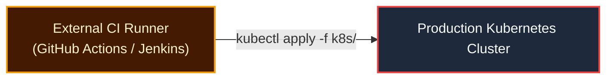
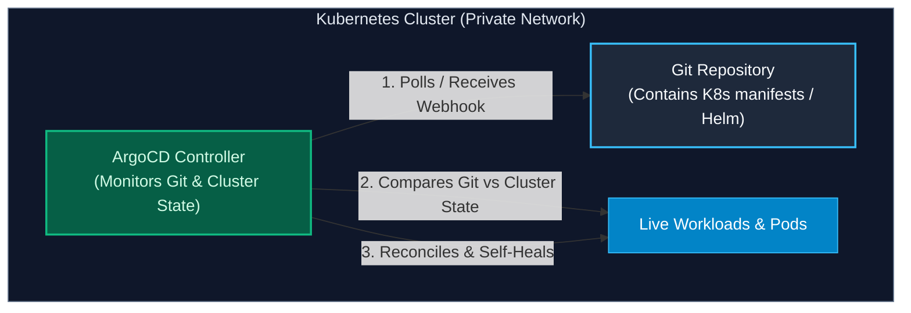

import { Callout } from 'fumadocs-ui/components/callout';
import { Steps, Step } from 'fumadocs-ui/components/steps';

<LessonIntro>
Traditional CI/CD engines operate on a "push" model: an external runner is given administrative credentials to your production Kubernetes cluster and executes `kubectl apply`. This creates a massive security attack surface and invites configuration drift. GitOps inverts this paradigm entirely: an intelligent controller running inside the cluster continuously monitors Git as the single source of truth, pulling updates and self-healing discrepancies automatically.
</LessonIntro>

<Concepts items={['Push vs Pull Deployment Models', 'The 4 Principles of GitOps', 'ArgoCD Architecture', 'The Application CRD', 'Target State vs Live State', 'Continuous Drift Detection', 'Automated Self-Healing']} />

## The Flaws of Push-Based Kubernetes Deployments

In a traditional push-based deployment:



1. **Security Vulnerability**: The external CI runner must possess `cluster-admin` access tokens or kubeconfig files. If a third-party dependency compromises your CI runner, attackers have root access to your entire infrastructure.
2. **Configuration Drift**: If an engineer manually executes `kubectl edit deployment` or `kubectl scale --replicas=5` during an outage, the cluster's reality drifts away from Git. Next time the pipeline runs, changes are overwritten unexpectedly.

---

## What is GitOps?

Coined by Weaveworks in 2017, **GitOps** is an operational model that adheres to four core principles:

1. **Declarative State**: The entire desired system state (deployments, ingresses, secrets, network policies) is described declaratively in Git (via YAML, Kustomize, or Helm).
2. **Versioned & Immutable**: Git serves as the single source of truth and audit log. Every change is an immutable commit.
3. **Pulled Automatically**: Software agents running *inside* the target environment pull state from Git; no external system is granted inbound cluster access.
4. **Continuously Reconciled**: The agent detects any deviation between the **Desired State** (in Git) and the **Live State** (in the cluster) and automatically eliminates the difference.

---

## ArgoCD Architecture

ArgoCD is the CNCF-graduated GitOps controller for Kubernetes:



### The `Application` Custom Resource Definition (CRD)

In ArgoCD, an application is defined as a native Kubernetes custom resource:

```yaml
apiVersion: argoproj.io/v1alpha1
kind: Application
metadata:
  name: payment-microservice
  namespace: argocd
spec:
  project: default
  source:
    repoURL: 'https://github.com/myorg/gitops-manifests.git'
    targetRevision: HEAD
    path: 'apps/payment/production' # Folder containing K8s YAML / Kustomize
  destination:
    server: 'https://kubernetes.default.svc' # Local in-cluster API
    namespace: payment-prod
  syncPolicy:
    automated:
      prune: true     # Deletes K8s objects removed from Git!
      selfHeal: true  # Reverts manual 'kubectl' edits within seconds!
```

---

## Live State vs. Target State: Self-Healing in Action

Notice the two powerful flags in the sync policy:

### 1. `prune: true`
If an engineer deletes `redis-cache.yaml` from the Git repository, ArgoCD automatically deletes the corresponding Redis Deployment and Service from the Kubernetes cluster. In traditional CI/CD, deleted files are left orphaned indefinitely.

### 2. `selfHeal: true`
Imagine an engineer opens a terminal and manually runs:
```bash
kubectl scale deployment payment-service --replicas=0
```
Within 5 seconds, ArgoCD's reconciliation loop detects that the **Live State** (0 replicas) does not match the **Target State** in Git (3 replicas). 

ArgoCD instantly issues an update to Kubernetes, scaling the deployment back to 3 replicas! **Manual tampering is impossible; Git always wins.**

---

<QuickRecall title="Self-Check: GitOps & ArgoCD">
1. Why does the pull-based GitOps model offer superior network security compared to traditional push-based deployment from a CI runner?
2. If an engineer manually deletes a production pod using `kubectl delete pod`, what will ArgoCD do if `selfHeal` is enabled?
3. What is the role of the `prune: true` setting in an ArgoCD Application manifest?
</QuickRecall>
