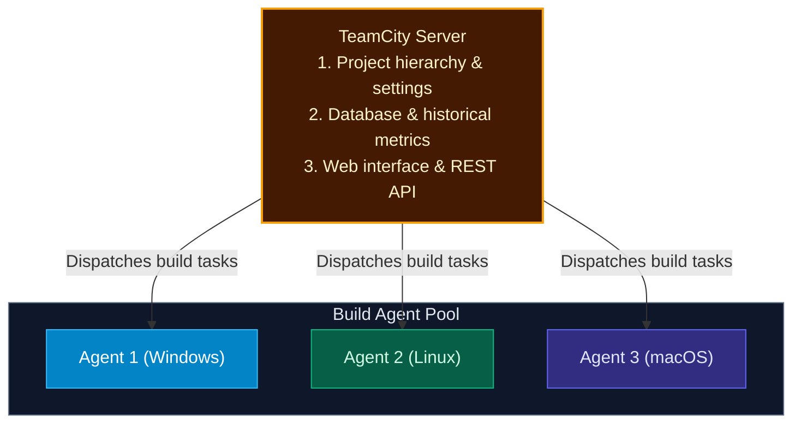
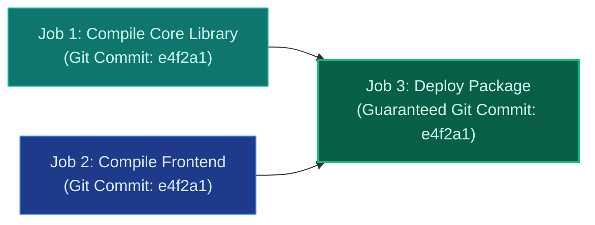

import { Callout } from 'fumadocs-ui/components/callout';
import { Steps, Step } from 'fumadocs-ui/components/steps';

<LessonIntro>
JetBrains TeamCity is an enterprise CI/CD server renowned for its deep compiler integration, intelligent build parallelization, and sophisticated dependency resolution. While many CI engines struggle with large monorepos and multi-step artifact dependencies, TeamCity's "Build Chains" and "Snapshot Dependencies" ensure that complex multi-project builds always execute against an immutable revision of your codebase.
</LessonIntro>

<Concepts items={['TeamCity Server vs Build Agents', 'VCS Roots', 'Build Configurations', 'Build Chains', 'Snapshot Dependencies', 'Kotlin DSL']} />

## The TeamCity Architecture

TeamCity utilizes a distributed server-agent model:



- **VCS Root**: A reusable connection to a version control system (Git, Mercurial, Perforce) defining repository URL, credentials, and branch specifications (`+:refs/heads/*`).
- **Build Configuration**: A single automation unit (e.g. "Compile Backend", "Run Cypress Tests") composed of build steps, triggers, and failure conditions.

---

## The Secret Weapon: Build Chains & Snapshot Dependencies

In basic CI tools, if Job C triggers after Job A finishes, a developer pushing a new commit in between can cause Job C to pull a different Git commit than Job A tested!

TeamCity solves this with **Snapshot Dependencies**:



<LessonNote variant="why" title="The Snapshot Guarantee">
A Snapshot Dependency guarantees that every linked build configuration in the chain **operates on the exact same snapshot of the repository sources**. Even if 20 developers push new commits while Job 1 is running, downstream jobs will check out the exact revision that initiated the chain.
</LessonNote>

---

## Configuration as Code: Kotlin DSL

While TeamCity offers an intuitive web UI, production configurations are versioned in Git using **Kotlin DSL** (`.teamcity/settings.kts`):

```kotlin
// Example TeamCity Kotlin DSL
import jetbrains.buildServer.configs.kotlin.*
import jetbrains.buildServer.configs.kotlin.buildSteps.script

version = "2024.03"

project {
    description = "Enterprise Core Banking API"

    buildType(BuildAndTest)
}

object BuildAndTest : BuildType({
    name = "Build & Test"

    vcs {
        root(DslContext.settingsRoot)
    }

    steps {
        script {
            name = "Run Tests"
            scriptContent = """
                npm ci
                npm test
            """.trimIndent()
        }
    }

    triggers {
        vcs {
            branchFilter = "+:refs/heads/main"
        }
    }
})
```

---

<QuickRecall title="Self-Check: TeamCity">
1. What critical problem do Snapshot Dependencies eliminate when executing multi-job build chains?
2. What language does JetBrains TeamCity use to define configuration as code?
3. What is a VCS Root in TeamCity?
</QuickRecall>
