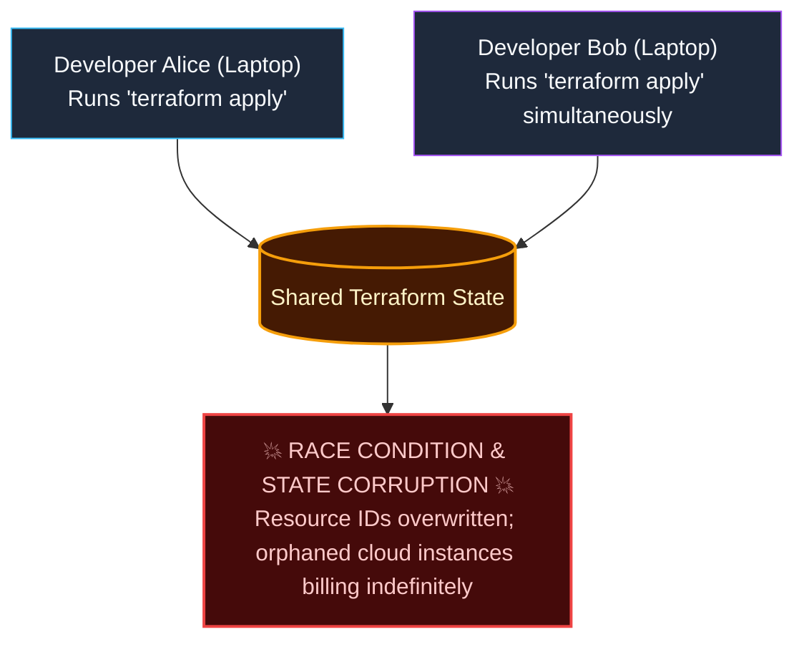
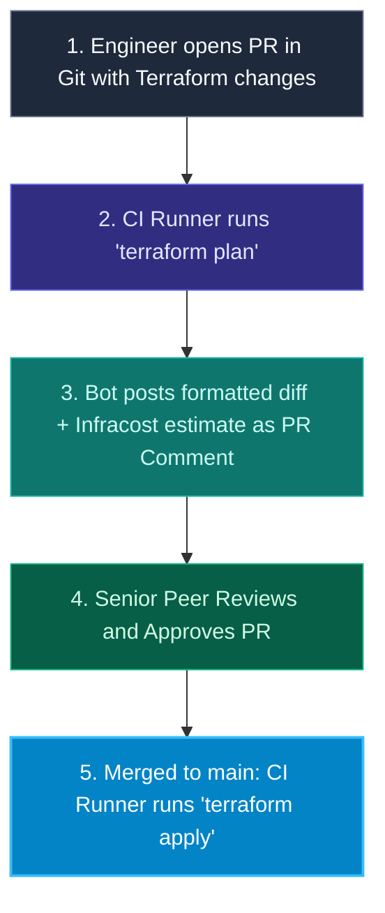

import { Callout } from 'fumadocs-ui/components/callout';
import { Steps, Step } from 'fumadocs-ui/components/steps';
import { Tabs, Tab } from 'fumadocs-ui/components/tabs';

<LessonIntro>
Provisioning cloud infrastructure from a developer's local laptop using `terraform apply` is an operational hazard: state files get corrupted, audit trails vanish, and every engineer must be granted broad cloud administrative credentials. In modern DevOps, Infrastructure as Code is managed through automated CI/CD pipelines with remote state locking, peer-reviewed pull requests, and automated drift detection.
</LessonIntro>

<Concepts items={['Remote State & DynamoDB Locking', 'The "Apply on Laptop" Anti-Pattern', 'Automated PR Plan & Infracost', 'Atlantis GitOps for Terraform', 'Policy-as-Code (Checkov / OPA)', 'Scheduled Drift Detection']} />

## The "Local Apply" Disaster

When engineers run Terraform locally:



- **State Corruption**: Concurrent executions overwrite the state file.
- **Unreviewed Destructive Changes**: A typo in a CIDR block can destroy a production VPC before anyone reviews the plan.
- **Security Vulnerability**: Every engineer's laptop holds persistent cloud administrative credentials.

---

## The Production Standard: Remote State & State Locking

In production, Terraform state is stored in a remote backend with distributed mutex locking:

```hcl
# backend.tf
terraform {
  backend "s3" {
    bucket         = "myorg-production-terraform-state"
    key            = "core-infra/terraform.tfstate"
    region         = "us-east-1"
    dynamodb_table = "terraform-state-locks" # Enforces mutex lock!
    encrypt        = true
  }
}
```

When any pipeline or engineer initiates a plan or apply, Terraform acquires an exclusive lock in DynamoDB. Any concurrent execution fails with an immediate error: `Error: Error acquiring the state lock`.

---

## The GitOps Terraform Pipeline (Atlantis / GitHub Actions)

In a GitOps workflow, changes to infrastructure follow a strict peer-reviewed lifecycle:



### GitHub Actions Workflow: Plan on PR, Apply on Merge

```yaml
name: Terraform CI/CD

on:
  pull_request:
    branches: [main]
    paths: ['terraform/**']
  push:
    branches: [main]
    paths: ['terraform/**']

permissions:
  id-token: write
  contents: read
  pull-requests: write

jobs:
  terraform:
    runs-on: ubuntu-latest
    defaults:
      run:
        working-directory: ./terraform
    steps:
      - uses: actions/checkout@v4

      - name: Authenticate via AWS OIDC
        uses: aws-actions/configure-aws-credentials@v4
        with:
          role-to-assume: arn:aws:iam::123456789012:role/TerraformDeployerRole
          aws-region: us-east-1

      - uses: hashicorp/setup-terraform@v3

      - name: Terraform Init
        run: terraform init

      - name: Terraform Format & Validate
        run: |
          terraform fmt -check
          terraform validate

      # Run Security Policy-as-Code
      - name: Run Checkov Security Scan
        uses: bridgecrewio/checkov-action@master
        with:
          directory: ./terraform
          framework: terraform
          soft_fail: false

      # On Pull Request: Generate Plan & Post to PR Comment
      - name: Terraform Plan
        id: plan
        if: github.event_name == 'pull_request'
        run: |
          terraform plan -no-color -out=tfplan
          terraform show -no-color tfplan > plan_output.txt

      - name: Post Plan to Pull Request
        if: github.event_name == 'pull_request'
        uses: actions/github-script@v7
        with:
          script: |
            const fs = require('fs');
            const plan = fs.readFileSync('terraform/plan_output.txt', 'utf8');
            const output = `#### Terraform Plan: \`Success\`
            <details><summary>Show Plan</summary>

            \`\`\`hcl
            ${plan.slice(0, 60000)}
            \`\`\`

            </details>`;
            github.rest.issues.createComment({
              issue_number: context.issue.number,
              owner: context.repo.owner,
              repo: context.repo.repo,
              body: output
            });

      # On Push to Main: Execute Apply!
      - name: Terraform Apply
        if: github.ref == 'refs/heads/main' && github.event_name == 'push'
        run: terraform apply -auto-approve
```

---

## Continuous Drift Detection: Catching Manual Edits

What happens if an administrator logs into the AWS Console at 2:00 AM and manually opens port 22 (SSH) to `0.0.0.0/0` on a production security group?

Your Git repository still thinks port 22 is closed!

<LessonNote variant="why" title="The Scheduled Drift Cron">
High-performing organizations run a scheduled daily cron job in CI:
```yaml
on:
  schedule:
    - cron: '0 4 * * *' # Runs daily at 4:00 AM UTC
jobs:
  drift-check:
    steps:
      - run: terraform plan -detailed-exitcode
```
The `-detailed-exitcode` flag returns exit code `2` if a diff is detected between the cloud and Git. The pipeline fires an immediate P1 alert to Slack, catching unauthorized console edits within 24 hours.
</LessonNote>

---

<QuickRecall title="Self-Check: IaC Pipelines">
1. Why is running `terraform apply` directly from a developer's laptop dangerous in an engineering organization?
2. What role does DynamoDB play when using Amazon S3 as a remote Terraform backend?
3. How does a scheduled `terraform plan -detailed-exitcode` pipeline detect configuration drift caused by manual cloud console edits?
</QuickRecall>
