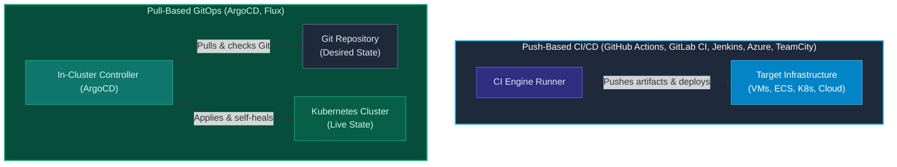

import { Callout } from 'fumadocs-ui/components/callout';
import { Cards, Card } from 'fumadocs-ui/components/card';

<LessonIntro>
Principles and patterns are universal, but software engineers execute their craft inside real tools. Every major CI/CD engine has its own architecture, syntax grammar, runner model, and integration hooks. In this track, you will learn the practical implementation details of the industry's six leading pipeline platforms — from developer workflow automation in GitHub Actions to enterprise Jenkins clusters and cloud-native GitOps reconciliation with ArgoCD.
</LessonIntro>

<Concepts items={['GitHub Actions Workflows', 'GitLab CI Runners & DinD', 'Jenkins Declarative Pipelines', 'Multibranch Pipelines', 'Azure DevOps YAML', 'GitOps Pull Model', 'ArgoCD Reconciliation', 'TeamCity Build Chains']} />

## The Ecosystem Landscape

Modern CI/CD tools generally fall into two architectural paradigms:

## Lessons in this Track

<Cards>
  <Card
    title="01. GitHub Actions in Depth"
    href="/docs/devops-cicd-performance/04-ci-cd-engines/01-github-actions"
    description="Workflows, triggers, matrix jobs, runners, secrets, and building/pushing Docker containers to Docker Hub."
  />
  <Card
    title="02. GitLab CI/CD & Runner Architecture"
    href="/docs/devops-cicd-performance/04-ci-cd-engines/02-gitlab-ci"
    description=".gitlab-ci.yml, stages, artifacts vs. cache, runner executors, environments, and Docker-in-Docker."
  />
  <Card
    title="03. Jenkins & The Declarative Jenkinsfile"
    href="/docs/devops-cicd-performance/04-ci-cd-engines/03-jenkins-and-jenkinsfile"
    description="Controller-agent topology, Docker agents, multibranch pipelines, and automated GitHub webhook triggers."
  />
  <Card
    title="04. Azure DevOps & Azure Pipelines"
    href="/docs/devops-cicd-performance/04-ci-cd-engines/04-azure-pipelines"
    description="YAML pipeline schema, hosted vs. self-hosted agents, service connections, stages, and approvals."
  />
  <Card
    title="05. GitOps Continuous Delivery with ArgoCD"
    href="/docs/devops-cicd-performance/04-ci-cd-engines/05-gitops-with-argocd"
    description="Pull-based CD for Kubernetes, the Application CRD, continuous drift detection, and automated self-healing."
  />
  <Card
    title="06. JetBrains TeamCity"
    href="/docs/devops-cicd-performance/04-ci-cd-engines/06-teamcity"
    description="VCS roots, build configurations, build chains, snapshot dependencies, and distributed agent pools."
  />
  <Card
    title="07. Infrastructure as Code CI/CD: Terraform & Atlantis"
    href="/docs/devops-cicd-performance/04-ci-cd-engines/07-iac-pipelines-terraform-gitops"
    description="Remote state locking, automated plan in PR comments, policy-as-code, and scheduled drift detection."
  />
</Cards>
