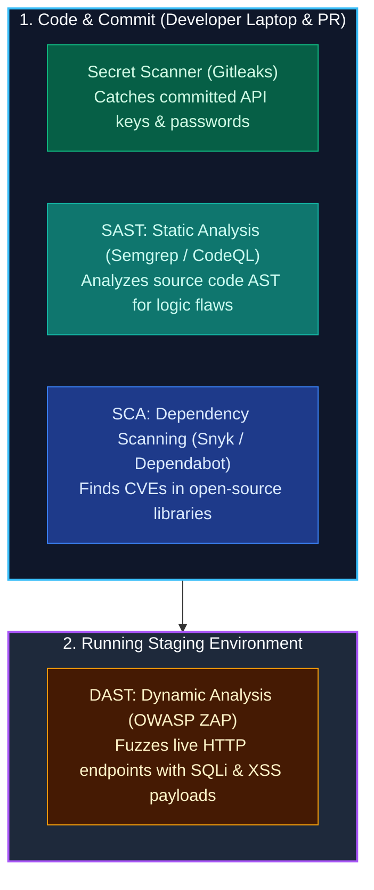

import { Callout } from 'fumadocs-ui/components/callout';
import { Steps, Step } from 'fumadocs-ui/components/steps';

<LessonIntro>
For years, security was seen as the "Department of No": a bureaucratic roadblock that slowed developers down right before production launch. In modern agile teams, security cannot be an afterthought. DevSecOps means integrating automated security tooling into every step of the developer workflow — catching vulnerabilities on local laptops and pull requests long before code ever touches a production server.
</LessonIntro>

<Concepts items={['Shift-Left Philosophy', 'Secret Leak Prevention', 'SAST (Static Testing)', 'DAST (Dynamic Testing)', 'SCA (Dependency Scanning)', 'Pre-Commit Hooks']} />

## The DevSecOps Taxonomy

Modern automated security testing evaluates software across four complementary dimensions:



---

## 1. Secret Scanning: Why "Git History is Forever"

One of the most catastrophic developer mistakes is accidentally committing an AWS root key or OpenAI API token:

```bash
git add .env
git commit -m "Add Stripe secret key"
git push origin main
```

A developer realizes the error 60 seconds later and runs:
```bash
git rm .env
git commit -m "Remove secret key"
git push origin main
```

<LessonNote variant="why" title="The False Sense of Security">
**Deleting a secret in a subsequent commit does NOT remove it from Git.** The secret remains permanently recorded in the raw object database of `.git/objects/`. Automated malicious botnets scan the public GitHub event firehose 24/7; public keys are routinely scraped and exploited within **90 seconds** of being pushed.
</LessonNote>

### The Pre-Commit Defense: Gitleaks

To prevent secrets from ever leaving the developer's laptop, use pre-commit hooks:

```yaml
# .pre-commit-config.yaml
repos:
  - repo: https://github.com/gitleaks/gitleaks
    rev: v8.18.2
    hooks:
      - id: gitleaks
```
Whenever an engineer runs `git commit`, Gitleaks evaluates the staged diff against known entropy patterns (RSA keys, AWS access tokens, GitHub PATs). If a secret is detected, the commit is aborted immediately on the developer's machine.

---

## 2. SAST vs. DAST vs. SCA

| Category | What it inspects | When it runs | Primary Tools | Example Finding |
|---|---|---|---|---|
| **SAST (Static)** | Source code and Abstract Syntax Trees (AST) without executing. | During pull request CI build. | Semgrep, SonarQube, GitHub CodeQL. | *"Raw user input interpolated directly into SQL query on line 42 (SQL Injection hazard)."* |
| **SCA (Composition)** | Manifest files (`package-lock.json`, `poetry.lock`). | On pull request and background schedule. | Snyk, Dependabot, Trivy. | *"Express package is using lodash v4.17.20 which contains Critical Prototype Pollution (CVE-2021-23337)."* |
| **DAST (Dynamic)** | Running application via network requests from the outside. | In Staging after deployment. | OWASP ZAP, StackHawk. | *"HTTP response headers missing Content-Security-Policy and X-Frame-Options."* |

---

<QuickRecall title="Self-Check: Shifting Security Left">
1. Why does running `git rm .env` fail to secure an API key that was committed to a GitHub repository?
2. What is the fundamental difference between Static Application Security Testing (SAST) and Dynamic Application Security Testing (DAST)?
3. Why should Software Composition Analysis (SCA) run on a scheduled cron job even if no new code has been committed to the repository in months?
</QuickRecall>
