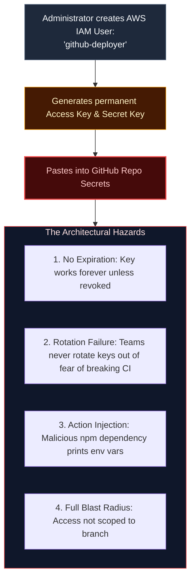
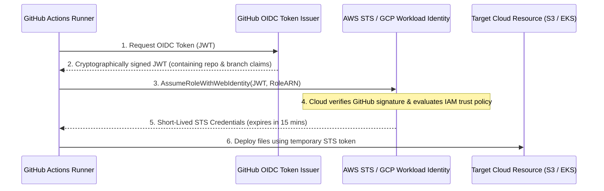

import { Callout } from 'fumadocs-ui/components/callout';
import { Steps, Step } from 'fumadocs-ui/components/steps';

<LessonIntro>
For years, the standard way to deploy from CI/CD to AWS, GCP, or Azure was to create an IAM user, generate a permanent `ACCESS_KEY_ID` and `SECRET_ACCESS_KEY`, and paste them into repository settings. If an attacker breached the repository or exploited an unvetted third-party Action, they possessed permanent, unrestricted access to your entire cloud. Modern pipelines eliminate static secrets entirely using OpenID Connect (OIDC) federation.
</LessonIntro>

<Concepts items={['Static Secrets Liability', 'OpenID Connect (OIDC)', 'Cryptographic JWT Tokens', 'Cloud Identity Federation', 'Short-Lived Temporary Credentials', 'Branch-Level IAM Scoping']} />

## The Static Credential Time Bomb

When you generate long-lived static credentials for your CI pipeline:



---

## How OIDC Federation Works: The Secretless Pipeline

Under **OpenID Connect (OIDC)**, you store **zero passwords or keys** inside GitHub. Instead, GitHub and your cloud provider establish a cryptographic trust relationship:



---

## Step-by-Step: AWS OIDC Integration

### 1. The AWS IAM Trust Policy
In AWS, you create an IAM Role. The trust policy permits *only* your specific repository and `main` branch to assume the role:

```json
{
  "Version": "2012-10-17",
  "Statement": [
    {
      "Effect": "Allow",
      "Principal": {
        "Federated": "arn:aws:iam::123456789012:oidc-provider/token.actions.githubusercontent.com"
      },
      "Action": "sts:AssumeRoleWithWebIdentity",
      "Condition": {
        "StringEquals": {
          "token.actions.githubusercontent.com:aud": "sts.amazonaws.com"
        },
        "StringLike": {
          "token.actions.githubusercontent.com:sub": "repo:myorg/production-api:ref:refs/heads/main"
        }
      }
    }
  ]
}
```

<LessonNote variant="why" title="The Security Superpower of 'sub' Claims">
Notice the `sub` (subject) string: `repo:myorg/production-api:ref:refs/heads/main`.
This guarantees that **only code running on the main branch of your exact repository** can assume this role. A pull request opened by an untrusted contributor on a fork cannot assume this role, even if they run the same workflow!
</LessonNote>

### 2. The GitHub Actions Workflow
In your repository, you only need to provide the Role ARN:

```yaml
name: Deploy via AWS OIDC

on:
  push:
    branches: [main]

# Required to request the GitHub OIDC JWT token
permissions:
  id-token: write # Essential for OIDC!
  contents: read

jobs:
  deploy:
    runs-on: ubuntu-latest
    steps:
      - name: Checkout Code
        uses: actions/checkout@v4

      # Exchange GitHub OIDC JWT for temporary AWS credentials
      - name: Configure AWS Credentials
        uses: aws-actions/configure-aws-credentials@v4
        with:
          role-to-assume: arn:aws:iam::123456789012:role/GitHubActionsProductionDeployer
          aws-region: us-east-1

      # Now all AWS CLI and SDK commands work seamlessly!
      - name: Sync Static Assets to S3
        run: |
          aws s3 sync ./dist s3://my-prod-website-bucket --delete
```

---

<QuickRecall title="Self-Check: Secrets & OIDC">
1. Why does using OpenID Connect completely eliminate the risk of an engineer accidentally leaking long-lived AWS keys in public logs?
2. What role does the `permissions: id-token: write` directive play in GitHub Actions?
3. How does the OIDC `sub` claim prevent a malicious fork from stealing your cloud deployment permissions?
</QuickRecall>
