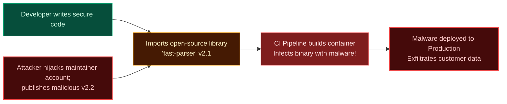
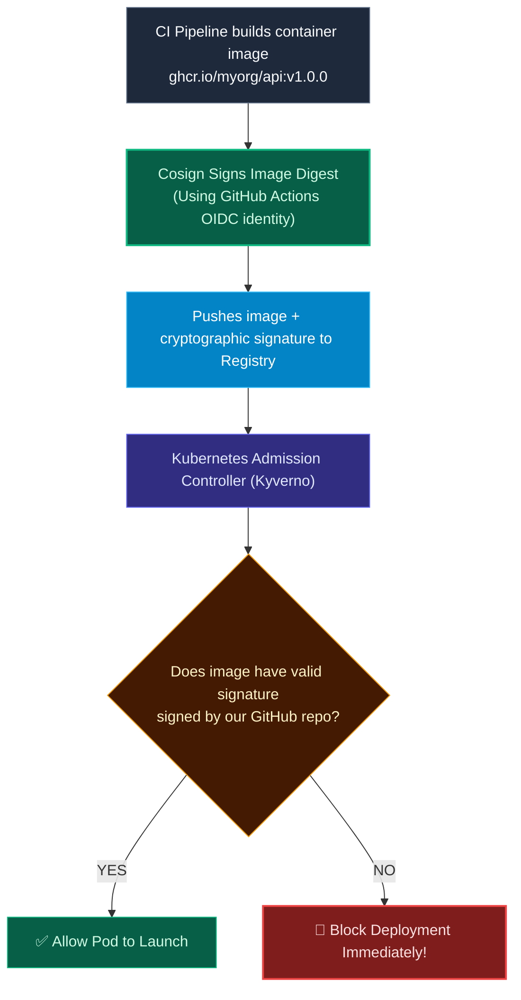

import { Callout } from 'fumadocs-ui/components/callout';
import { Steps, Step } from 'fumadocs-ui/components/steps';

<LessonIntro>
The most devastating cyberattacks of recent years — SolarWinds, Log4j, Codecov, and the xz-utils backdoor — did not exploit zero-day bugs in internal application code. Instead, attackers compromised the upstream supply chain: injecting malware into third-party libraries, build scripts, or container registries. To defend modern applications, engineering teams must generate Software Bills of Materials (SBOMs) and cryptographically sign production artifacts.
</LessonIntro>

<Concepts items={['Supply Chain Attack Vectors', 'Software Bill of Materials (SBOM)', 'CycloneDX & SPDX Standards', 'Syft Generation', 'Sigstore & Cosign Keyless Signing', 'Admission Controllers (Kyverno)']} />

## Anatomy of a Supply Chain Attack

In a software supply chain attack, attackers bypass your firewall and code reviews by compromising the software you trust:



---

## 1. The Software Bill of Materials (SBOM)

<Flashcard term="What is an SBOM?">
An SBOM is a structured, machine-readable inventory of all software components, third-party libraries, transitive dependencies, compiler versions, and licenses bundled into an application or container image.
</Flashcard>

Think of an SBOM as the **nutritional label and ingredient list** on a box of cereal. When a zero-day vulnerability (like Log4Shell) is disclosed, an organization with an SBOM database can query across 50,000 running containers in 3 seconds to answer: *"Are we using vulnerable version 2.14.1 anywhere in our infrastructure?"*

### Generating an SBOM in CI with Anchore Syft

In your CI pipeline, generate an SBOM directly from the built Docker image:

```bash
# Generate CycloneDX JSON SBOM
syft mycompany/api:v1.2.0 -o cyclonedx-json=sbom.json
```

```json
// Sample CycloneDX SBOM Output
{
  "bomFormat": "CycloneDX",
  "specVersion": "1.5",
  "metadata": {
    "component": { "name": "api-service", "version": "1.2.0" }
  },
  "components": [
    {
      "name": "express",
      "version": "4.19.2",
      "purl": "pkg:npm/express@4.19.2",
      "licenses": [{ "license": { "id": "MIT" } }]
    },
    {
      "name": "libssl3",
      "version": "3.0.13-0ubuntu3.1",
      "purl": "pkg:deb/ubuntu/libssl3@3.0.13-0ubuntu3.1"
    }
  ]
}
```

---

## 2. Cryptographic Artifact Signing with Sigstore Cosign

How does your production Kubernetes cluster know that a container image in Docker Hub was actually built by your authenticated GitHub Actions pipeline, rather than pushed by a compromised employee account or an external adversary?

By signing the image using **Sigstore Cosign**:



### Keyless Signing in GitHub Actions

With Cosign's keyless signing, you don't even manage private PGP keys. Cosign uses your GitHub Actions OIDC identity token to sign the image:

```yaml
- name: Install Cosign
  uses: sigstore/cosign-installer@v3

- name: Sign Container Image
  run: |
    cosign sign --yes ghcr.io/${{ github.repository }}@${{ steps.build.outputs.digest }}
```

---

<QuickRecall title="Self-Check: Supply Chain Security">
1. When a critical zero-day vulnerability is announced in an open-source library, how does having an SBOM allow an enterprise to respond in seconds?
2. What role does Sigstore Cosign play in preventing untrusted container images from running in production?
3. How does keyless signing with Cosign verify the identity of the build pipeline?
</QuickRecall>
