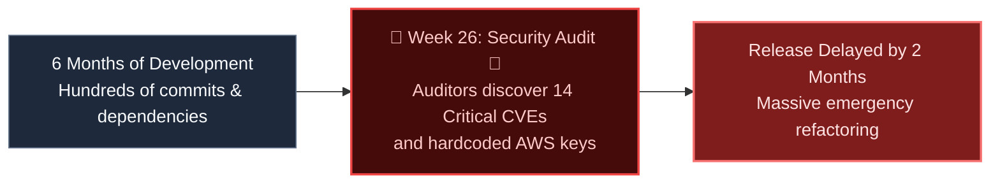

import { Callout } from 'fumadocs-ui/components/callout';
import { Cards, Card } from 'fumadocs-ui/components/card';

<LessonIntro>
In traditional software development, security was an external audit performed by an outside team weeks after development ended. This created friction, delayed releases, and left critical vulnerabilities undetected until software was already in production. DevSecOps embeds security directly into the developer workflow: scanning every pull request for secrets, checking container layers for CVEs, authenticating via temporary OIDC tokens, and cryptographically signing production artifacts.
</LessonIntro>

<Concepts items={['Shift-Left Security', 'SAST vs DAST vs SCA', 'Secret Scanning (Gitleaks)', 'Container Scanning (Docker Scout)', 'OIDC Cloud Federation', 'SBOM (Software Bill of Materials)', 'Artifact Signing (Cosign)']} />

## The Core Problem: The Late Security Audit Bottleneck

When security is a final gate at the end of the lifecycle, fixing a fundamental vulnerability requires massive rewrites of architecture and dependencies. DevSecOps shifts these checks left — directly into the developer's pull request.

## Lessons in this Track

<Cards>
  <Card
    title="01. Shifting Security Left"
    href="/docs/devops-cicd-performance/05-devsecops-and-security/01-shifting-security-left"
    description="The DevSecOps philosophy: SAST, DAST, SCA dependency scanning, and secret leak prevention."
  />
  <Card
    title="02. Container Scanning with Docker Scout"
    href="/docs/devops-cicd-performance/05-devsecops-and-security/02-container-vulnerability-scanning"
    description="Analyzing image layers, CVE severity thresholds, and gatekeeping vulnerable containers in CI."
  />
  <Card
    title="03. Secretless Pipelines with OIDC"
    href="/docs/devops-cicd-performance/05-devsecops-and-security/03-secrets-management-and-oidc"
    description="Eliminating long-lived cloud credentials using OpenID Connect (OIDC) identity federation."
  />
  <Card
    title="04. Supply Chain Security & SBOMs"
    href="/docs/devops-cicd-performance/05-devsecops-and-security/04-supply-chain-security-and-sbom"
    description="Software Bill of Materials (Syft/CycloneDX), SLSA provenance, and signing images with Cosign."
  />
</Cards>
