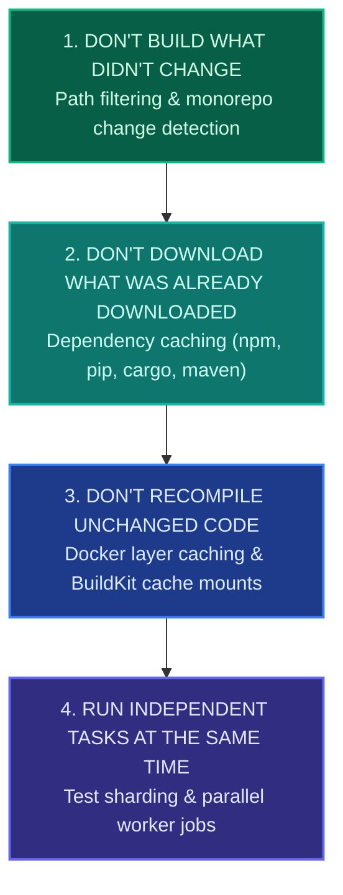
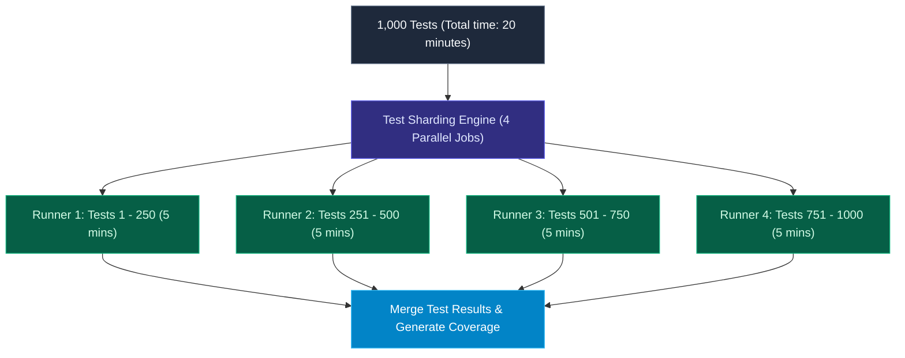

import { Callout } from 'fumadocs-ui/components/callout';
import { Steps, Step } from 'fumadocs-ui/components/steps';
import { Tabs, Tab } from 'fumadocs-ui/components/tabs';

<LessonIntro>
The difference between a 3-minute pipeline and a 45-minute pipeline is not better hardware; it is architectural discipline. When pipeline builds take more than 10 minutes, developers stop waiting: they check social media, switch to other tasks, and batch their commits into dangerous monster releases. By implementing smart caching, path filtering, and test sharding, you can reduce pipeline execution time by up to 90%.
</LessonIntro>

<Concepts items={['The 10-Minute Rule', 'Dependency Caching (actions/cache)', 'Docker BuildKit Cache Mounts', 'Monorepo Path Filtering', 'Test Sharding & Parallelization']} />

## The 4 Performance Levers

To accelerate a pipeline, apply optimizations in order of leverage:



---

## 1. Path Filtering in Monorepos

If your repository contains a `frontend` and a `backend`, an engineer fixing a button color in `frontend/` should never trigger a 15-minute Java compilation of `backend/`:

```yaml
# GitHub Actions Path Filtering
name: Frontend CI

on:
  push:
    branches: [main]
    paths:
      - 'frontend/**'
      - 'package.json'
      - 'package-lock.json'
```
If the commit only touches files inside `backend/` or `docs/`, GitHub Actions skips the workflow entirely, consuming **0 seconds and $0.00**.

---

## 2. Docker BuildKit Cache Mounts

Standard Docker builds re-download packages every time `package.json` changes. With **Docker BuildKit Cache Mounts**, the package manager cache persists across builds on the runner host:

```dockerfile
# Syntax directive enabling BuildKit features
# syntax=docker/dockerfile:1.4

FROM node:20-alpine AS builder
WORKDIR /app

COPY package*.json ./

# Mount persistent npm cache across builds!
RUN --mount=type=cache,target=/root/.npm \
    npm ci --prefer-offline

COPY . .
RUN npm run build
```

The `--mount=type=cache` directive mounts a dedicated cache volume to `/root/.npm`. Even if you change a single package in `package.json`, npm reuses 99% of the downloaded `.tgz` archives from disk, slashing install times from 90 seconds to 4 seconds.

---

## 3. Test Sharding Across Parallel Runners

If you have 1,000 integration tests that take 20 minutes to run sequentially on a single runner, running them on 4 parallel runners reduces wall-clock time to **5 minutes**:



### GitHub Actions Test Sharding Matrix

```yaml
jobs:
  test:
    runs-on: ubuntu-latest
    strategy:
      matrix:
        shard: [1/4, 2/4, 3/4, 4/4]
    steps:
      - uses: actions/checkout@v4
      - uses: actions/setup-node@v4
        with:
          node-version: 20
          cache: 'npm'
      - run: npm ci
      # Vitest / Playwright / Jest native sharding flag
      - run: npx vitest run --shard=${{ matrix.shard }}
```

---

<QuickRecall title="Self-Check: Pipeline Performance">
1. Why is path filtering particularly crucial for large monorepos containing multiple microservices?
2. How does a Docker BuildKit `--mount=type=cache` differ from standard Docker layer caching?
3. If an E2E test suite takes 30 minutes on one runner, what is the theoretical execution time when sharded across 6 parallel runners?
</QuickRecall>
