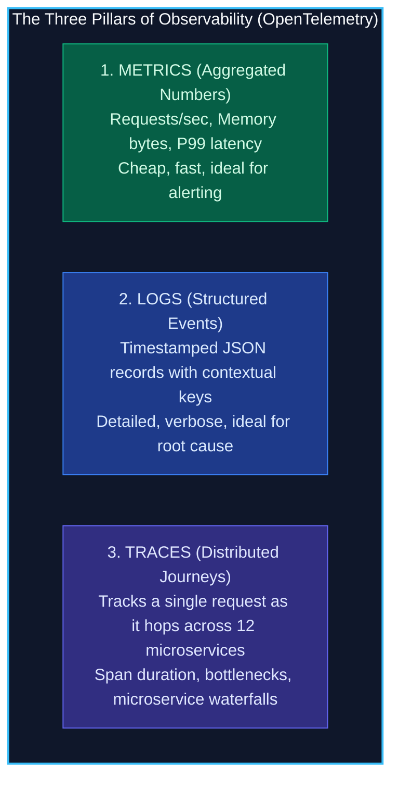
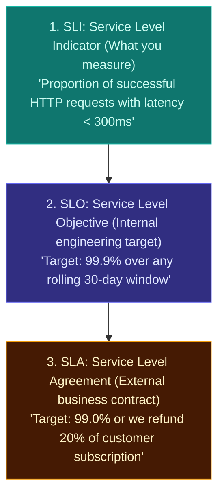

import { Callout } from 'fumadocs-ui/components/callout';
import { Steps, Step } from 'fumadocs-ui/components/steps';

<LessonIntro>
Deploying code is not the final step of software delivery; closing the feedback loop with production telemetry is. If your deployment pipeline reports green, but users cannot complete checkout, your deployment has failed. To operate reliable distributed systems, you must instrument your software using the Three Pillars of Observability, monitor Google SRE's Four Golden Signals, and govern releases using Error Budgets.
</LessonIntro>

<Concepts items={['Monitoring vs Observability', 'The Three Pillars (Metrics, Logs, Traces)', 'The Four Golden Signals (Latency, Traffic, Errors, Saturation)', 'Percentiles (P95, P99) vs Averages', 'SLI vs SLO vs SLA', 'Error Budget Policy']} />

## Monitoring vs. Observability

- **Monitoring**: Answers *"Is the system working?"* (e.g. a dashboard showing CPU is at 75% or an alert firing because ping failed).
- **Observability**: Answers *"Why is the system failing?"* by inferring internal system states based on external telemetry (e.g. *"Why did latency spike for European users whose cart had more than 10 items after the 2:00 PM release?"*).

---

## Google SRE's Four Golden Signals

In *Site Reliability Engineering*, Google codified the four essential metrics for measuring user-facing applications:

| Signal | Definition | What to Measure | Why It Matters |
|---|---|---|---|
| **1. Latency** | Time taken to service a request. | P95 and P99 percentiles (never averages!). Separate success latency from error latency. | Fast errors (500 in 2ms) can artificially drag down average latency, hiding that successful users wait 12 seconds. |
| **2. Traffic** | Demand placed on the system. | HTTP requests per second (RPS), concurrent WebSocket connections, network I/O. | Helps differentiate between an internal bug and a legitimate traffic surge. |
| **3. Errors** | The rate of requests that fail. | HTTP 5xx codes, unhandled exceptions, and semantic errors (e.g. 200 OK with empty body). | Direct indicator of customer pain and broken functionality. |
| **4. Saturation** | How full the service is. | CPU utilization, memory pressure, database connection pool usage, disk IOPS queue. | Leading indicator of impending collapse: latency spikes when saturation crosses 85%. |

<LessonNote variant="why" title="The Flaw of Averages">
If 99 users experience a response time of **10ms**, and 1 user experiences **10,000ms (10 seconds)**, the average latency is **109ms**. The average looks acceptable, yet 1 out of every 100 high-value customers experienced a completely broken, frozen experience. Always alert on **P95 and P99 percentiles** to catch tail latency!
</LessonNote>

---

## The SLI / SLO / SLA Hierarchy

Engineering teams must have precise vocabulary when defining reliability commitments:

---

## The Error Budget: Balancing Velocity and Stability

How do development teams (who want to move fast) and operations teams (who want stability) agree on when to ship code?

With an **Error Budget**:

$$\text{Error Budget} = 100\% - \text{SLO}$$

If your SLO is **99.9%** availability per month:
- Your allowed failure budget is **0.1%** ($43.8\text{ minutes}$ of downtime per month).
- **If Error Budget is > 0**: The team has budget to spend! Deploy features rapidly, take calculated risks, and experiment with progressive canary releases.
- **If Error Budget is Exhausted (0%)**: Feature deployments are **immediately frozen**. The entire engineering team halts feature work and dedicates 100% of sprint capacity to refactoring, fixing bugs, and improving pipeline tests until the budget recovers!

---

<QuickRecall title="Self-Check: Observability & Golden Signals">
1. Why does reporting average latency mask severe performance degradation experienced by end users?
2. What are the Four Golden Signals of Google SRE?
3. How does an "Error Budget" resolve the historical conflict between developers wanting to release new features and operators wanting zero outages?
</QuickRecall>
