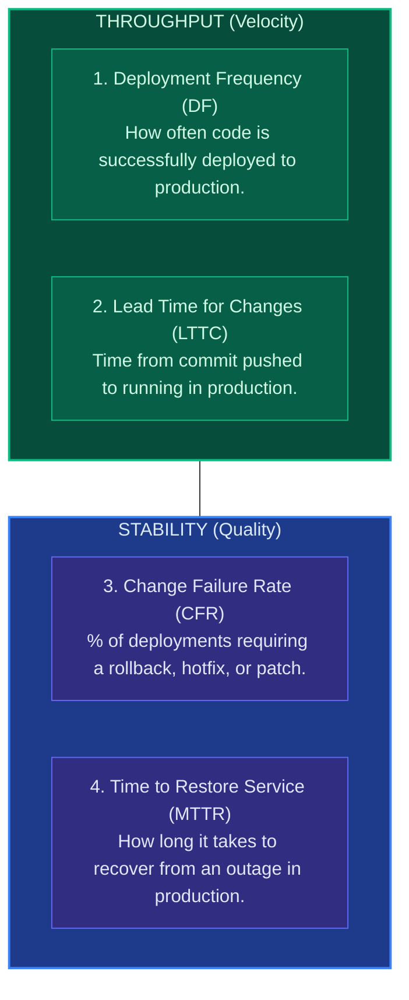
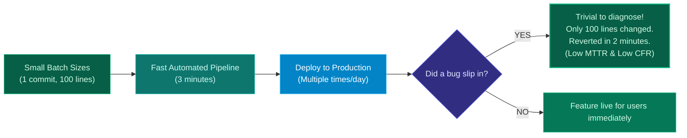

import { Callout } from 'fumadocs-ui/components/callout';
import { Steps, Step } from 'fumadocs-ui/components/steps';

<LessonIntro>
How do you prove that adopting CI/CD, trunk-based development, and automated testing actually made your engineering organization better? For decades, management measured vanity metrics like lines of code or story points. The DevOps Research and Assessment (DORA) team surveyed over 33,000 engineering professionals to discover the four metrics that scientifically correlate with commercial success, engineering happiness, and organizational agility.
</LessonIntro>

<Concepts items={['The Flaw of Vanity Metrics', 'The 4 DORA Metrics', 'Deployment Frequency (DF)', 'Lead Time for Changes (LTTC)', 'Change Failure Rate (CFR)', 'Time to Restore Service (MTTR)', 'Elite vs Low Performer Benchmarks']} />

## The Failure of Vanity Metrics

When engineering leadership attempts to measure productivity with naive metrics, developers naturally game the system:

- **Lines of Code (LOC)**: Encourages verbose, copy-pasted, unmaintainable architectures.
- **Story Points Completed**: Teams simply inflate estimates (a 2-point bug is re-estimated as an 8-point ticket).
- **Number of Commits**: Encourages developers to commit every whitespace edit.

---

## The Four DORA Metrics

DORA discovered that high-performing organizations achieve **both velocity AND stability simultaneously**. Speed does not sacrifice quality; speed *creates* quality.

---

## Performance Benchmarks: Elite vs. Low

Every year, the DORA report categorizes technology organizations into performance tiers:

| Metric | Elite Performers | High Performers | Medium Performers | Low Performers |
|---|---|---|---|---|
| **Deployment Frequency** | **Multiple deploys per day** | Once per week to once per month | Once per month to once every 6 months | Fewer than once every 6 months |
| **Lead Time for Changes** | **Less than 1 hour** | 1 day to 1 week | 1 month to 6 months | More than 6 months |
| **Time to Restore (MTTR)** | **Less than 1 hour** | Less than 1 day | 1 day to 1 week | More than 6 months |
| **Change Failure Rate** | **0% - 15%** | 0% - 15% | 16% - 30% | 46% - 60% |

---

## The Virtuous Cycle of Small Batches

Why are Elite performers both **faster** and **more stable** than Low performers?

When you deploy once every 6 months with 100,000 changed lines, finding the root cause of an outage takes weeks. When you deploy every 30 minutes with 50 lines changed, the offending line is obvious, and the rollback is instantaneous.

---

<QuickRecall title="Self-Check: DORA Metrics">
1. What are the four DORA metrics, and which two measure velocity versus stability?
2. Why is the myth that "moving fast breaks things" debunked by DORA empirical research?
3. How does reducing deployment batch size simultaneously improve both Lead Time for Changes and Time to Restore Service?
</QuickRecall>
