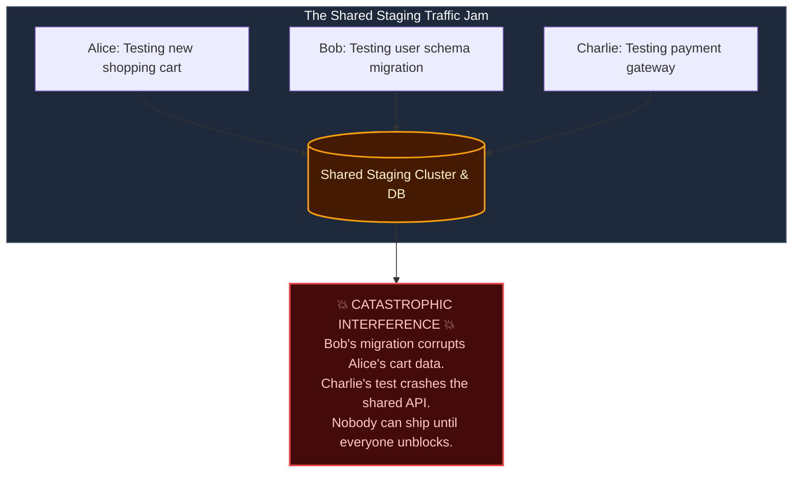
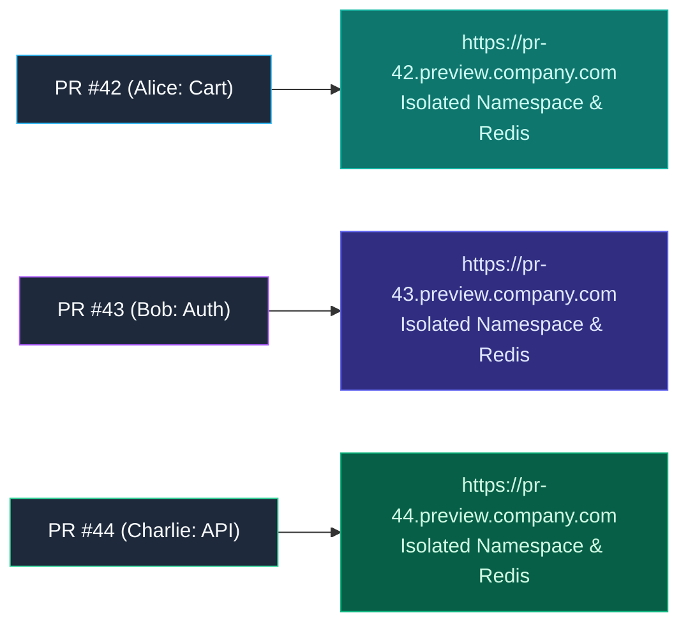

import { Callout } from 'fumadocs-ui/components/callout';
import { Steps, Step } from 'fumadocs-ui/components/steps';
import { Tabs, Tab } from 'fumadocs-ui/components/tabs';

<LessonIntro>
In traditional engineering organizations, the shared "Staging" environment is a notorious bottleneck: engineers wait in line for their turn to test, conflicting features corrupt the shared database, and unfinished experiments block upcoming releases. Ephemeral Preview Environments eliminate this friction by automatically provisioning a disposable, production-like environment for every open pull request — and tearing it down the moment the PR is merged.
</LessonIntro>

<Concepts items={['The Staging Queue Bottleneck', 'Ephemeral / Preview Environments', 'Dynamic Ingress Subdomains', 'Kubernetes Namespaces & vcluster', 'Automated Teardown Lifecycles', 'Seed Data & Database Branching']} />

## The "Shared Staging" Gridlock

Consider what happens when a 20-person engineering team shares a single Staging cluster:



Engineers spend half their sprint coordinating in Slack: *"Is anyone using Staging right now? Can I deploy for 20 minutes?"*

---

## The Paradigm: Environments as Disposable Cattle

> **An Ephemeral Environment is a fully functional, isolated copy of your application stack provisioned automatically upon opening a Pull Request and destroyed automatically upon merging.**



Product managers, UX designers, and QA engineers can click the live preview URL directly inside the GitHub PR comment, interact with the feature on their phone or browser, and approve it without ever touching a command line.

---

## The Automated Lifecycle

<Steps>
<Step>
### 1. Pull Request Opened
A developer opens a pull request in GitHub:
- CI builds container images tagged with the PR number (`myapp:pr-42`).
- CI creates a dedicated Kubernetes namespace: `kubectl create namespace pr-42`.
- Seeds an ephemeral SQLite or PostgreSQL database with realistic fixture data.
</Step>

<Step>
### 2. Dynamic Routing & DNS
The ingress controller provisions a dynamic route:
```text
https://pr-42.preview.mycompany.com
```
A GitHub Actions bot posts a comment to the PR:
> *"🚀 Preview environment ready! View your live changes at: `https://pr-42.preview.mycompany.com`"*
</Step>

<Step>
### 3. Automated Teardown on Merge
When the PR is merged or closed, GitHub Actions triggers the cleanup workflow:
```bash
kubectl delete namespace pr-42
```
Kubernetes immediately terminates all pods, services, and volumes associated with PR #42, reclaiming 100% of memory and CPU. **No orphaned cloud resources, no surprise cloud bills.**
</Step>
</Steps>

---

## GitHub Actions Preview Environment Workflow

```yaml
name: Preview Environment Lifecycle

on:
  pull_request:
    types: [opened, synchronize, reopened, closed]

jobs:
  deploy-preview:
    if: github.event.action != 'closed'
    runs-on: ubuntu-latest
    steps:
      - uses: actions/checkout@v4
      
      - name: Deploy Ephemeral Helm Release
        run: |
          helm upgrade --install pr-${{ github.event.number }} ./charts/app \
            --namespace pr-${{ github.event.number }} \
            --create-namespace \
            --set image.tag=pr-${{ github.event.number }} \
            --set ingress.host=pr-${{ github.event.number }}.preview.mycompany.com

      - name: Comment Preview URL on PR
        uses: actions/github-script@v7
        with:
          script: |
            github.rest.issues.createComment({
              issue_number: context.issue.number,
              owner: context.repo.owner,
              repo: context.repo.repo,
              body: `### 🌐 Preview Environment Ready!\n\nYour changes are live at: [https://pr-${context.issue.number}.preview.mycompany.com](https://pr-${context.issue.number}.preview.mycompany.com)`
            });

  teardown-preview:
    if: github.event.action == 'closed'
    runs-on: ubuntu-latest
    steps:
      - name: Teardown Namespace & Reclaim Resources
        run: |
          kubectl delete namespace pr-${{ github.event.number }} --ignore-not-found
```

---

<QuickRecall title="Self-Check: Ephemeral Environments">
1. Why does sharing a single static staging environment create an engineering delivery bottleneck?
2. What are the three stages of an ephemeral preview environment's automated lifecycle?
3. How does automatic teardown upon PR closure prevent cloud resource bloat and unexpected infrastructure costs?
</QuickRecall>
