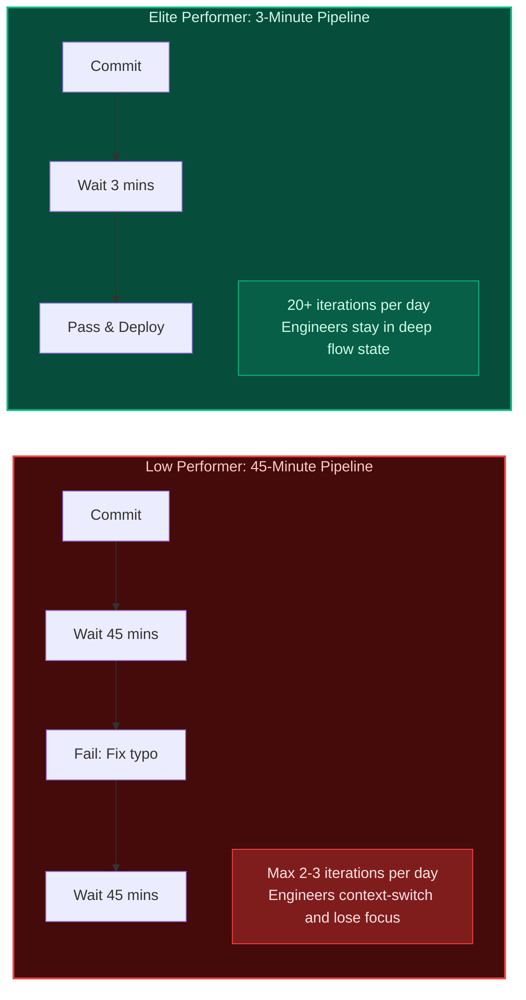

import { Callout } from 'fumadocs-ui/components/callout';
import { Cards, Card } from 'fumadocs-ui/components/card';

<LessonIntro>
Building a working pipeline is only half the battle; maintaining a fast, observable, and measurable delivery system is what separates elite engineering teams from stagnant ones. A pipeline that takes 45 minutes destroys developer flow and encourages batch releases. An application deployed without observability leaves engineers blind during outages. In this final track, you will learn the techniques to accelerate pipelines, instrument production with Google SRE Golden Signals, and measure organizational agility with the four DORA metrics.
</LessonIntro>

<Concepts items={['Layer Caching', 'Docker BuildKit Cache Mounts', 'Test Sharding', 'Monorepo Path Filtering', 'The Four Golden Signals', 'SLI, SLO & SLA', 'Error Budgets', 'The 4 DORA Metrics']} />

## The Feedback Loop Economics

The speed of your CI/CD pipeline directly dictates how many experiments and fixes your team can execute per day:

## Lessons in this Track

<Cards>
  <Card
    title="01. Pipeline Performance Optimization"
    href="/docs/devops-cicd-performance/06-performance-observability-dora/01-pipeline-performance-optimization"
    description="Layer caching, Docker BuildKit cache mounts, monorepo path filtering, and distributed test sharding."
  />
  <Card
    title="02. Observability & The Four Golden Signals"
    href="/docs/devops-cicd-performance/06-performance-observability-dora/02-observability-and-golden-signals"
    description="Metrics, logs, traces, Latency, Traffic, Errors, Saturation, SLI/SLO/SLA, and error budgets."
  />
  <Card
    title="03. DORA Metrics & Continuous Improvement"
    href="/docs/devops-cicd-performance/06-performance-observability-dora/03-dora-metrics-and-continuous-improvement"
    description="Deployment Frequency, Lead Time for Changes, Change Failure Rate, Time to Restore (MTTR), and elite benchmarks."
  />
  <Card
    title="04. Ephemeral Preview Environments per Pull Request"
    href="/docs/devops-cicd-performance/06-performance-observability-dora/04-ephemeral-preview-environments"
    description="Eliminating the staging bottleneck with dynamic ingress URLs and automated teardown lifecycles."
  />
</Cards>
