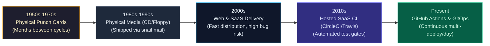
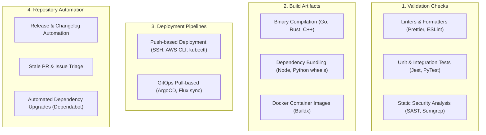
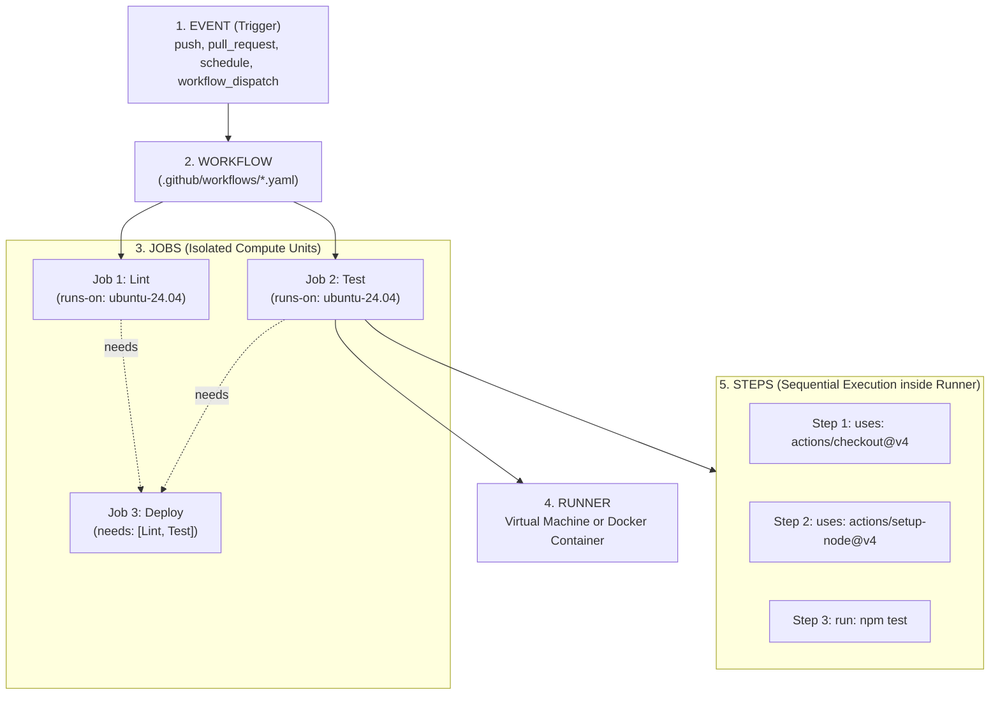

import { Callout } from 'fumadocs-ui/components/callout';
import { Steps, Step } from 'fumadocs-ui/components/steps';
import { Tabs, Tab } from 'fumadocs-ui/components/tabs';

<LessonIntro>
To understand why GitHub Actions is designed the way it is, we must look at how software delivery evolved over the past fifty years. Continuous Integration went from a radical experimental idea in 1997 into the fundamental backbone of modern engineering teams shipping code dozens of times every day.
</LessonIntro>

<Concepts items={[
  'Evolution of Software Delivery',
  'Tinderbox, Jenkins & SaaS CI',
  'The 5 Architectural Pillars',
  'Directed Acyclic Graphs (DAG)',
  'Step Execution Shells',
  'Workflow Dispatch & Hello World'
]} />


---

## The Evolution of Software Delivery

Before exploring YAML configuration, understanding the historical pressure that produced CI/CD illuminates why certain design choices exist today.



### 1. The Era of Physical Constraints (1950s – 1990s)
* **Punch Cards:** In early computing, programs were encoded onto stiff paper punch cards fed into mainframe machines. The authors and consumers were the same specialized operators. Development feedback loops lasted days or weeks.
* **Physical Discs & Snail Mail:** Software was compiled onto floppy disks, compact discs, or DVDs and distributed via postal mail to end customers. Because the physical cost and latency of shipping an update was exorbitant, releases happened once every 6 to 24 months. Bugs discovered post-release were catastrophic.

### 2. The Dotcom Boom & The Birth of Automated Integration (1997 – 2005)
With the rise of the internet in the late 1990s, web delivery meant software could be updated remotely without distributing physical disks. However, developers still built and tested code manually on their personal workstations, often leading to "integration hell" when merging hundreds of divergent changes right before a release.

* **Tinderbox (1997):** Developed by Netscape (and later Mozilla), Tinderbox is widely recognized as the earliest automated continuous integration tool. It watched version control commits, automatically kicked off builds across multiple target platforms, and rendered a dashboard showing whether the build was "red" (broken) or "green" (healthy).
* **CruiseControl (2001):** Created by ThoughtWorks for Java projects, CruiseControl brought automated continuous builds and notification emails to enterprise development teams.
* **Hudson & Jenkins (2005 / 2011):** Sun Microsystems created Hudson, which gained massive adoption thanks to its rich web UI and modular plugin architecture. When Oracle acquired Sun, the community forked Hudson into **Jenkins** in 2011. Jenkins became the dominant enterprise CI server for over a decade.

### 3. Cloud SaaS CI & Version-Control Integration (2010 – Present)
Maintaining self-hosted Jenkins servers (handling operating system upgrades, plugin vulnerabilities, and scaling worker fleets) became a heavy operational burden.

* **SaaS CI (2010s):** Platforms like Travis CI and CircleCI popularized the model of cloud-hosted ephemeral runners managed entirely by a third party. CircleCI pioneered developer-centric conveniences like SSH debugging into failed build containers.
* **Integrated VCS Automation (2018):** GitLab integrated CI/CD directly into its platform, and in late 2018, **GitHub launched GitHub Actions**. Because GitHub is the de facto home of open-source and private Git repositories worldwide, having workflows run natively alongside pull requests and issues revolutionized CI adoption.

---

## CI/CD Tool Comparison Matrix

According to Cloud Native Computing Foundation (CNCF) and JetBrains developer surveys, the industry has crystallized around three main paradigms:

| Criterion | GitHub Actions | Jenkins | GitLab CI/CD | CircleCI |
| :--- | :--- | :--- | :--- | :--- |
| **Hosting Model** | Cloud-hosted by GitHub or self-hosted | Primarily self-hosted (JVM) | Cloud SaaS or Self-hosted | Cloud SaaS (self-hosted option) |
| **Setup Friction** | **Zero:** Just add `.github/workflows/*.yml` | **High:** Requires dedicated server & plugin setup | **Low:** Tied to GitLab repos | **Medium:** OAuth integration |
| **Configuration Syntax** | Standard YAML | Groovy / Jenkinsfile DSL | Standard YAML (`.gitlab-ci.yml`) | Standard YAML |
| **Ecosystem Size** | **20,000+ Actions** in Marketplace | Thousands of legacy plugins | Small curated component catalog | Orbs registry (moderate size) |
| **Maintenance Burden** | Minimal (GitHub patches runner OS) | High (plugin deprecations & security CVEs) | Low for SaaS, High for Omnibus | Low |
| **Primary Sweet Spot** | Any project hosted on GitHub | Legacy enterprises with existing infrastructure | Teams fully committed to GitLab suite | Projects on Bitbucket or custom Git servers |

---

## The 4 Core Workflow Categories

Every workflow you author in GitHub Actions fits into one of four primary functional categories:



---

## The 5 Architectural Pillars of GitHub Actions

GitHub Actions models all automation through five interconnected hierarchy levels:




### 1. Event (The Trigger)
An event is a specific activity that initiates workflow execution. This can be:
- Code activities: `push`, `pull_request`, `release`
- Issue activities: `issues.opened`, `issue_comment`
- Temporal schedules: `schedule: - cron: '0 0 * * *'`
- Manual triggers: `workflow_dispatch`

### 2. Workflow (The Orchestrator)
A top-level automated process defined in a YAML file stored in your repository under `.github/workflows/`. A repository can contain dozens of workflows (e.g., `ci.yml`, `security.yml`, `nightly.yml`, `release.yml`).

### 3. Job (The Independent Compute Unit)
A workflow contains one or more jobs. By default, **jobs execute in parallel**. Each job runs in a completely separate, clean virtual machine or container environment. You enforce execution ordering by defining dependencies using the `needs:` directive, turning your workflow into a **Directed Acyclic Graph (DAG)**.

### 4. Runner (The Execution Environment)
The underlying virtual machine or container that executes your job. Runners can be:
- **GitHub-hosted:** Ubuntu 24.04 / 22.04, Windows Server, macOS (Intel & Apple Silicon M-series)
- **Self-hosted:** Machines you run on premises or in your cloud using Kubernetes and the Actions Runner Controller (ARC)

### 5. Step (The Sequential Task)
A step is an individual task executed sequentially inside a job. Because all steps in a single job run on the **same runner**, they share the runner's local filesystem and temporary storage. A step can either run a shell command (`run:`) or invoke a reusable action (`uses:`).

---

## Real GitHub Interface: Directed Acyclic Graph (DAG)

When you specify dependencies with `needs:`, GitHub Actions automatically renders a visual DAG graph of your jobs in the web interface:


Jobs without dependencies start immediately in parallel. Downstream jobs remain in a queued state until all required upstream jobs succeed.

---

## Step Execution Shells: Bash, Python & Actions

Within any job, steps can execute tasks through three distinct mechanisms:

```yaml
jobs:
  step-types-demo:
    runs-on: ubuntu-24.04
    steps:
      # Step 1: Default Inline Bash Shell
      - name: Inline Bash Command
        run: |
          echo "Current user: $(whoami)"
          uname -a

      # Step 2: Inline Python Script (Zero Setup Required!)
      - name: Inline Python Execution
        shell: python
        run: |
          import platform, sys
          print(f"Executing Python {sys.version} on {platform.system()}")

      # Step 3: External Marketplace Action
      - name: Checkout Source Code
        uses: actions/checkout@v4
```

<Callout type="tip" title="Built-in Python Runtime">
The official GitHub-hosted Ubuntu runners come pre-installed with dozens of developer toolchains, including Python, Node.js, Go, Docker, AWS CLI, and Git. You do not need an `actions/setup-python` step just to run a quick inline Python script!
</Callout>

---

## Hands-On: Authoring Your First Workflow

Let's author the foundational workflow demonstrated in Module 3 of the course repository.

Create `.github/workflows/01-hello-world.yaml`:

```yaml
name: 01 - Hello World Pipeline

# Allow manual execution via the GitHub web UI or GitHub CLI (gh)
on:
  workflow_dispatch:

jobs:
  greet-bash:
    name: Execute Bash Job
    runs-on: ubuntu-24.04
    steps:
      - name: Print Greeting
        run: echo "Hello from an inline bash script in GitHub Actions!"

  greet-python:
    name: Execute Python Job
    runs-on: ubuntu-24.04
    steps:
      - name: Python Script
        shell: python
        run: |
          import sys
          print("Hello from an inline Python script!")
          print(f"Running on Python version: {sys.version.split()[0]}")

  deploy-gate:
    name: Downstream Deployment Gate
    runs-on: ubuntu-24.04
    needs: [greet-bash, greet-python] # Enforces DAG dependency
    steps:
      - name: Confirm Both Upstream Jobs Succeeded
        run: echo "All upstream validations passed. Proceeding with deployment gate."
```

### Triggering via the GitHub Interface

Because this workflow defines `on: workflow_dispatch`, an interactive button appears in the GitHub Actions tab:


1. Navigate to the **Actions** tab in your GitHub repository.
2. Select **01 - Hello World Pipeline** in the left sidebar.
3. Click the **Run workflow** dropdown, choose the branch (e.g. `main`), and click the green **Run workflow** button.
4. Watch the jobs execute: `greet-bash` and `greet-python` will run concurrently; once both turn green, `deploy-gate` will run and complete.

---

## Interactive Playground: Test DAG & Failure Propagation

Use the interactive simulator below to test how job failures cascade through the DAG graph when `needs:` gates are defined:

<WorkflowLifecycleSimulator />

---

<QuickRecall title="Self-Check: Foundations & Architecture">
1. If Job B specifies `needs: [Job A]`, and Job A fails with an exit code of 1, what happens to Job B?
2. True or False: Steps within the same Job can share files saved to disk, but different Jobs cannot directly share disk files without using artifacts or caching.
3. Which step syntax allows executing arbitrary Python code without creating a `.py` file on disk?
</QuickRecall>
