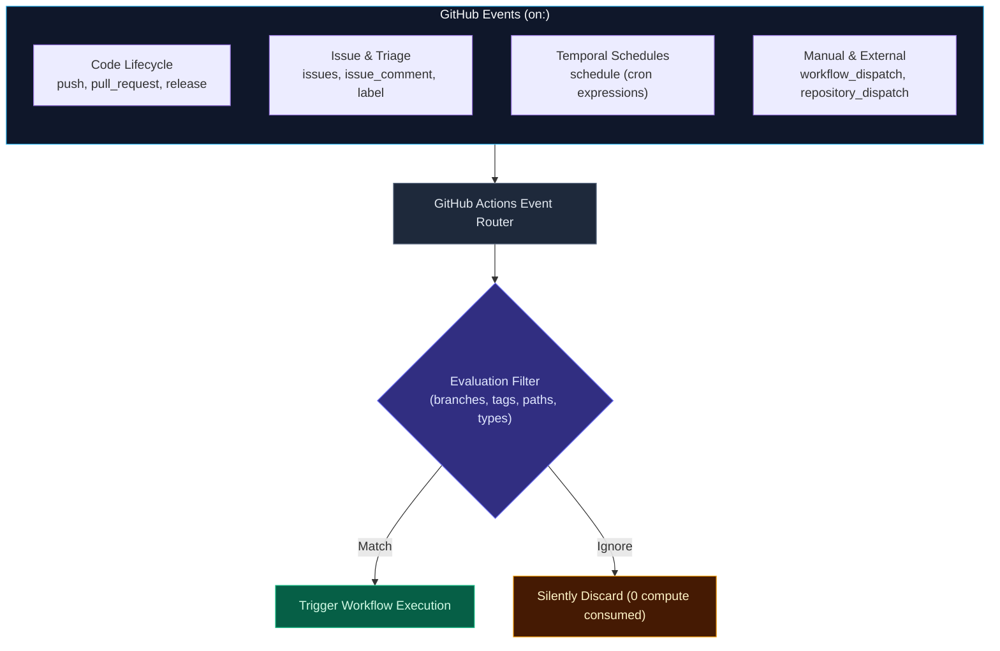
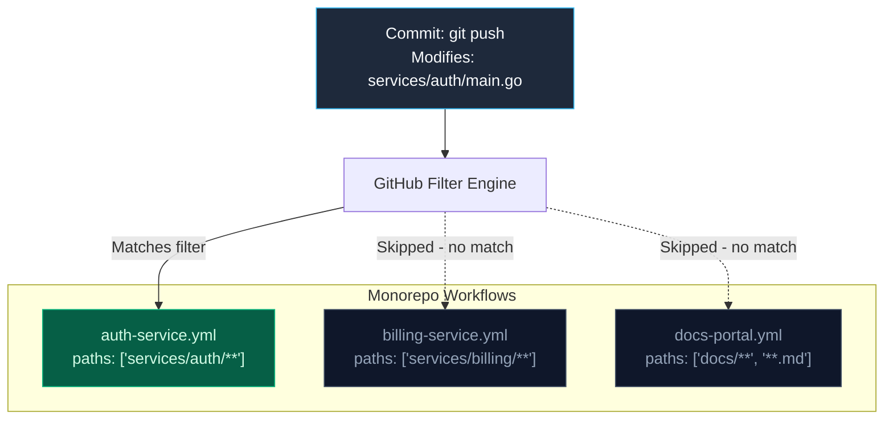

import { Callout } from 'fumadocs-ui/components/callout';
import { Steps, Step } from 'fumadocs-ui/components/steps';
import { Tabs, Tab } from 'fumadocs-ui/components/tabs';

<LessonIntro>
Workflows do not execute in a vacuum — they react to events across the GitHub ecosystem. Mastering event filtering, glob patterns, input schemas, and path filtering is the difference between an efficient, responsive CI pipeline and an expensive, wasteful nightmare that burns build minutes on README edits.
</LessonIntro>

<Concepts items={[
  'Webhook & Repository Events',
  'Branch & Tag Glob Patterns',
  'Pull Request Activity Types',
  'UTC Cron Schedules',
  'Interactive Dispatch Inputs',
  'Monorepo Path Filtering'
]} />

---

## The GitHub Event Taxonomy

GitHub generates hundreds of webhook events across repositories, issues, discussions, and releases. Every workflow begins with the top-level `on:` key:



---

## 1. Code Lifecycle Triggers (`push` & `pull_request`)

The two most common triggers respond to Git commits and pull request operations.

### Branch and Tag Pattern Matching

You can configure workflows to trigger only on specific branches or release tags using glob patterns:

```yaml
on:
  push:
    # Trigger on push to main or release branches, but ignore alpha releases
    branches:
      - main
      - 'releases/**'
      - '!releases/**-alpha'
    # Trigger when semver Git tags are pushed (e.g. v1.2.0)
    tags:
      - 'v[0-9]+.[0-9]+.[0-9]+'
```

### Supported Glob Pattern Rules:
- `*`: Matches zero or more characters, excluding the `/` directory separator.
- `**`: Matches zero or more characters across directory boundaries.
- `?`: Matches zero or one character.
- `+`: Matches one or more of the preceding character.
- `!`: At the start of a pattern, negates the match (used to exclude branches).

---

## 2. Pull Request Activity Types

By default, specifying `on: pull_request` triggers only when a PR is **opened**, **synchronize** (a new commit is pushed to the head branch), or **reopened**. 

You can explicitly customize the activity types:

```yaml
on:
  pull_request:
    types:
      - opened
      - synchronize
      - reopened
      - closed # Useful for tearing down ephemeral preview environments!
      - labeled # Trigger security review if "needs-audit" label added
```

<Callout type="warning" title="Security Alert: pull_request vs pull_request_target">
For public open-source repositories, workflows triggered by `pull_request` run in the context of the **fork**, with a read-only `GITHUB_TOKEN` and **zero access to repository secrets**. 

Do not switch to `pull_request_target` unless you understand that it runs in the context of the base repository and has access to secrets — if combined with checking out untrusted fork code, attackers can exfiltrate your organization's secrets!
</Callout>

---

## 3. Scheduled Triggers (Cron in UTC)

Workflows can run on recurring schedules using standard 5-field cron syntax:

```yaml
on:
  schedule:
    # ┌───────────── minute (0 - 59)
    # │ ┌───────────── hour (0 - 23, UTC!)
    # │ │ ┌───────────── day of the month (1 - 31)
    # │ │ │ ┌───────────── month (1 - 12)
    # │ │ │ │ ┌───────────── day of the week (0 - 6, Sunday is 0)
    # │ │ │ │ │
    - cron: '0 0 * * *'      # Nightly build: Every day at 00:00 UTC
    - cron: '30 4 * * 1-5'   # Weekday scan: 04:30 UTC Mon-Fri
```

<Callout type="info" title="Cron Queuing Latency">
All GitHub Actions cron schedules run in **UTC**. During periods of high global load (especially on the exact top of the hour like `00:00 UTC`), scheduled jobs may experience queue delays of several minutes before a runner is allocated. To avoid queues, schedule jobs at odd intervals (e.g., `17 3 * * *`).
</Callout>

---

## 4. Manual Triggers with Interactive Inputs (`workflow_dispatch`)

The `workflow_dispatch` event allows engineers to trigger jobs manually through the web UI, the GitHub REST API, or the GitHub CLI (`gh workflow run`). You can even specify typed input parameters:

```yaml
name: Deploy Service
on:
  workflow_dispatch:
    inputs:
      target_env:
        description: 'Target Deployment Environment'
        required: true
        type: choice
        options:
          - development
          - staging
          - production
        default: 'staging'

      run_migrations:
        description: 'Execute database schema migrations'
        required: true
        type: boolean
        default: false

      log_level:
        description: 'Logging verbosity'
        required: false
        type: string
        default: 'info'
```

### The Real GitHub Interface: Dispatch Input Modal

When engineers launch this workflow, GitHub renders an interactive modal prompting for these inputs:


Inside the workflow steps, you access these inputs through the `inputs` context:

```yaml
jobs:
  deploy:
    runs-on: ubuntu-24.04
    steps:
      - name: Deploy with User Inputs
        run: |
          echo "Deploying to: ${{ inputs.target_env }}"
          echo "Migrations enabled: ${{ inputs.run_migrations }}"
          echo "Log level: ${{ inputs.log_level }}"
```

---

## 5. Monorepo Path Filtering (`paths` & `paths-ignore`)

In modern monorepos where backend microservices, frontend applications, and shared libraries live in a single repository, running every test and container build on every commit is unacceptably slow and expensive.

Path filters tell GitHub Actions to evaluate the list of modified files in the commit or PR:



### Example: Path Filter Configuration

```yaml
name: Auth Service CI

on:
  push:
    branches: [main]
    paths:
      - 'services/auth/**'
      - 'packages/shared-models/**'
  pull_request:
    branches: [main]
    paths:
      - 'services/auth/**'
      - 'packages/shared-models/**'
    paths-ignore:
      - '**.md'
      - 'services/auth/README.md'
      - 'docs/**'
```

### The Path Filtering Rules:
1. If **only** `paths:` is defined, the workflow runs only if at least one changed file matches a pattern in `paths`.
2. If **only** `paths-ignore:` is defined, the workflow runs unless **all** changed files match the patterns in `paths-ignore`.
3. You cannot use both `paths` and `paths-ignore` for the same event in a single workflow. If you need both inclusions and exclusions, use the exclamation mark `!` prefix inside `paths:`:

```yaml
on:
  push:
    paths:
      - 'services/billing/**'
      - '!services/billing/**/*.md'
      - '!services/billing/test-fixtures/**'
```

---

## Real World Sidebar Status: Filter Verification

When a workflow runs against a PR, GitHub's sidebar displays each job and status check cleanly:


If a commit only modified `docs/setup.md`, jobs with `paths: ['src/**']` will not even appear in the sidebar — saving hundreds of compute hours across large engineering teams.

---

## Inspecting the Full Event Payload

Every event passes an extensive JSON metadata payload to the runner. You can inspect the entire payload by echoing the `github.event` context:

```yaml
name: Event Inspector
on: [push, pull_request, workflow_dispatch]

jobs:
  dump-payload:
    runs-on: ubuntu-24.04
    steps:
      - name: Dump GitHub Event JSON
        run: echo '${{ toJSON(github.event) }}'

      - name: Extract Key Metadata
        run: |
          echo "Triggered by: ${{ github.actor }}"
          echo "Commit SHA: ${{ github.sha }}"
          echo "Event Name: ${{ github.event_name }}"
          echo "Repository: ${{ github.repository }}"
```

---

<QuickRecall title="Self-Check: Events & Filtering">
1. If a commit modifies both `services/api/index.ts` and `README.md`, will a workflow with `paths: ['services/api/**']` trigger? Why?
2. What time zone is used by GitHub Actions scheduled cron triggers?
3. What is the fundamental difference between `branches:` and `branches-ignore:`?
</QuickRecall>
