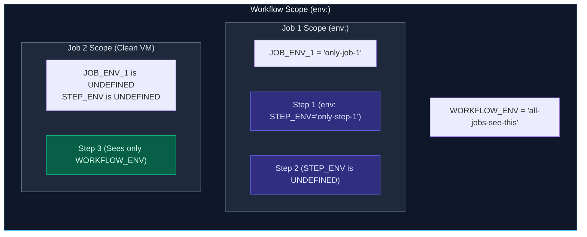
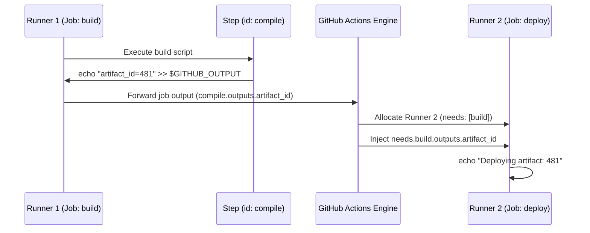

import { Callout } from 'fumadocs-ui/components/callout';
import { Steps, Step } from 'fumadocs-ui/components/steps';
import { Tabs, Tab } from 'fumadocs-ui/components/tabs';

<LessonIntro>
One of the most frequent sources of bugs in CI/CD pipelines is misunderstanding how state moves between steps and jobs. Because each job executes on a completely clean, isolated virtual machine, traditional operating system variables do not persist across jobs without deliberate output plumbing.
</LessonIntro>

<Concepts items={[
  'Variable Scoping Hierarchy',
  'Runtime Mutation with $GITHUB_ENV',
  'Step Outputs with $GITHUB_OUTPUT',
  'Inter-Job Data Passing via needs',
  'Repository vs Environment Secrets',
  'Automated Runner Log Masking'
]} />

---

## Variable Scoping Hierarchy

Environment variables can be declared at three distinct syntactic levels:



### Scoping Code Demonstration:

```yaml
name: Variable Scoping Demo
on: [workflow_dispatch]

# 1. Workflow Level: Available to all jobs and all steps
env:
  GLOBAL_CONFIG: 'production-v1'

jobs:
  job-one:
    runs-on: ubuntu-24.04
    # 2. Job Level: Available to all steps within job-one
    env:
      JOB_VAR: 'job-1-private-data'
    steps:
      - name: Step A (Defines Step-Scoped Var)
        env:
          STEP_VAR: 'step-a-temporary-token'
        run: |
          echo "GLOBAL: $GLOBAL_CONFIG"  # Prints: production-v1
          echo "JOB:    $JOB_VAR"         # Prints: job-1-private-data
          echo "STEP:   $STEP_VAR"        # Prints: step-a-temporary-token

      - name: Step B (Checks Availability)
        run: |
          echo "GLOBAL: $GLOBAL_CONFIG"  # Prints: production-v1
          echo "JOB:    $JOB_VAR"         # Prints: job-1-private-data
          echo "STEP:   $STEP_VAR"        # UNSET! Prints empty string

  job-two:
    runs-on: ubuntu-24.04
    steps:
      - name: Step in Job Two
        run: |
          echo "GLOBAL: $GLOBAL_CONFIG"  # Prints: production-v1
          echo "JOB:    $JOB_VAR"         # UNSET! Job variables do not cross machines
```

---

## Runtime State Mutation: `$GITHUB_ENV` & `$GITHUB_OUTPUT`

In standard shell scripts, running `export MY_VAR="foo"` only sets the variable in the subshell process. When that step finishes, the subshell exits, and the next step starts in a brand new subshell.

To solve this, GitHub Actions provides two special magic files whose paths are injected into the runner environment:

### 1. Persisting Variables to Subsequent Steps (`$GITHUB_ENV`)
To export an environment variable so that **future steps in the same job** can read it, append `NAME=VALUE` to the file located at `$GITHUB_ENV`:

```yaml
    steps:
      - name: Calculate Dynamic Version
        run: |
          SHORT_SHA=$(git rev-parse --short HEAD)
          # Append key-value pair to the environment descriptor
          echo "APP_VERSION=v1.4-${SHORT_SHA}" >> "$GITHUB_ENV"

      - name: Consume Environment Variable
        run: |
          # Available both as standard shell variable and context expression
          echo "Version via shell: $APP_VERSION"
          echo "Version via context: ${{ env.APP_VERSION }}"
```

### 2. Emitting Explicit Step Outputs (`$GITHUB_OUTPUT`)
To output data intended for explicit reference by other steps or other jobs, append `key=value` to `$GITHUB_OUTPUT`:

```yaml
    steps:
      - name: Generate Build Metadata
        id: build_meta # Must specify an ID to reference outputs!
        run: |
          DIGEST=$(docker inspect --format='{{index .Id}}' my-image:latest)
          echo "image_digest=${DIGEST}" >> "$GITHUB_OUTPUT"

      - name: Print Step Output
        run: |
          echo "Recorded digest: ${{ steps.build_meta.outputs.image_digest }}"
```

---

## Passing Data Across Jobs (Inter-Job Plumbing)

Because Job 1 and Job 2 run on separate virtual machines, `$GITHUB_ENV` cannot transfer data across jobs. 

To pass data between jobs, you must follow this 4-step plumbing pipeline:
1. Step in Job 1 writes to `$GITHUB_OUTPUT`.
2. Job 1 declares an `outputs:` block exposing that step's output.
3. Job 2 declares `needs: [job-1]`.
4. Job 2 references `${{ needs.job-1.outputs.<key> }}`.



### Complete Inter-Job YAML Implementation:

```yaml
name: Inter-Job Data Pipeline
on: [workflow_dispatch]

jobs:
  producer-job:
    name: Build & Generate Metadata
    runs-on: ubuntu-24.04
    # Step 2: Declare job-level outputs
    outputs:
      release_tag: ${{ steps.gen_tag.outputs.tag }}
      build_status: ${{ steps.gen_tag.outputs.status }}
    steps:
      - name: Generate Artifact Tag
        id: gen_tag
        # Step 1: Write to $GITHUB_OUTPUT
        run: |
          echo "tag=release-$(date +%s)" >> "$GITHUB_OUTPUT"
          echo "status=verified" >> "$GITHUB_OUTPUT"

  consumer-job:
    name: Deploy to Cloud
    runs-on: ubuntu-24.04
    # Step 3: Enforce DAG dependency
    needs: [producer-job]
    steps:
      - name: Consume Upstream Outputs
        run: |
          # Step 4: Access via needs context
          echo "Deploying release tag: ${{ needs.producer-job.outputs.release_tag }}"
          echo "Upstream status:       ${{ needs.producer-job.outputs.build_status }}"
```

---

## Secrets vs Variables

GitHub distinguishes between sensitive credentials (API tokens, private keys) and non-sensitive configuration (hostnames, log levels):


| Attribute | Secrets (`${{ secrets.* }}`) | Variables (`${{ vars.* }}`) |
| :--- | :--- | :--- |
| **Purpose** | Passwords, Cloud tokens, Private keys | Port numbers, URLs, Environment flags |
| **UI Visibility** | **Write-only:** Once saved, cannot be viewed | **Read/Write:** Value visible and editable |
| **Runner Logging** | **Automatically masked** with `***` | Printed in plaintext in execution logs |
| **Storage Hierarchy** | Organization, Repository, or Environment | Organization, Repository, or Environment |

---

## Target Environments & Staging vs Production

You can create distinct **Environments** in GitHub Settings (e.g. `staging`, `production`):


```yaml
jobs:
  deploy-staging:
    runs-on: ubuntu-24.04
    environment: staging
    steps:
      - run: ./deploy.sh
        env:
          DB_PASS: ${{ secrets.DATABASE_PASSWORD }} # Pulls STAGING secret

  deploy-production:
    runs-on: ubuntu-24.04
    environment: production
    needs: [deploy-staging]
    steps:
      - run: ./deploy.sh
        env:
          DB_PASS: ${{ secrets.DATABASE_PASSWORD }} # Pulls PRODUCTION secret
```

### Environment Protection Rules:
1. **Required Reviewers:** Workflows targeting `production` pause and notify designated maintainers to approve the deployment.
2. **Wait Timers:** Introduce a delay (e.g., 15 minutes) before running a deployment job.
3. **Deployment Branches:** Restrict production environments to only run from the `main` branch.

---

## Automated Runner Log Masking

When you inject a value from `${{ secrets.* }}` into a runner step, the GitHub Actions runner agent registers that literal string with its internal redaction filter:

```bash
# In your workflow:
- name: Log in to Database
  run: echo "Connecting with password: ${{ secrets.DB_PASSWORD }}"

# In the public GitHub Actions web console:
Connecting with password: ***
```

<Callout type="warning" title="Log Masking Edge Cases">
- If your secret is short (under 3 characters), GitHub Actions may not mask it to avoid redacting common single characters.
- If you transform a secret (for example, base64 encoding or URL encoding it), the runner's literal string matcher will **not** recognize the transformed string and it will leak in logs!
</Callout>

---

## Interactive Playground: Test Scoping & Masking

Test variable availability across workflow, job, and step scopes, and see how runner log masking redacts secrets:

<SecretsAndEnvSimulator />

---

<QuickRecall title="Self-Check: Variables & Secrets">
1. If Job 1 executes `echo "API_KEY=xyz" >> $GITHUB_ENV`, can Job 2 read `$API_KEY`? Why or why not?
2. What syntax do you use to access a non-sensitive configuration variable named `API_URL`?
3. How does specifying `environment: production` inside a job differ from running with repository-level secrets?
</QuickRecall>
