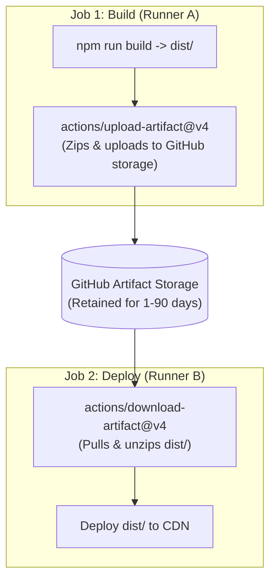
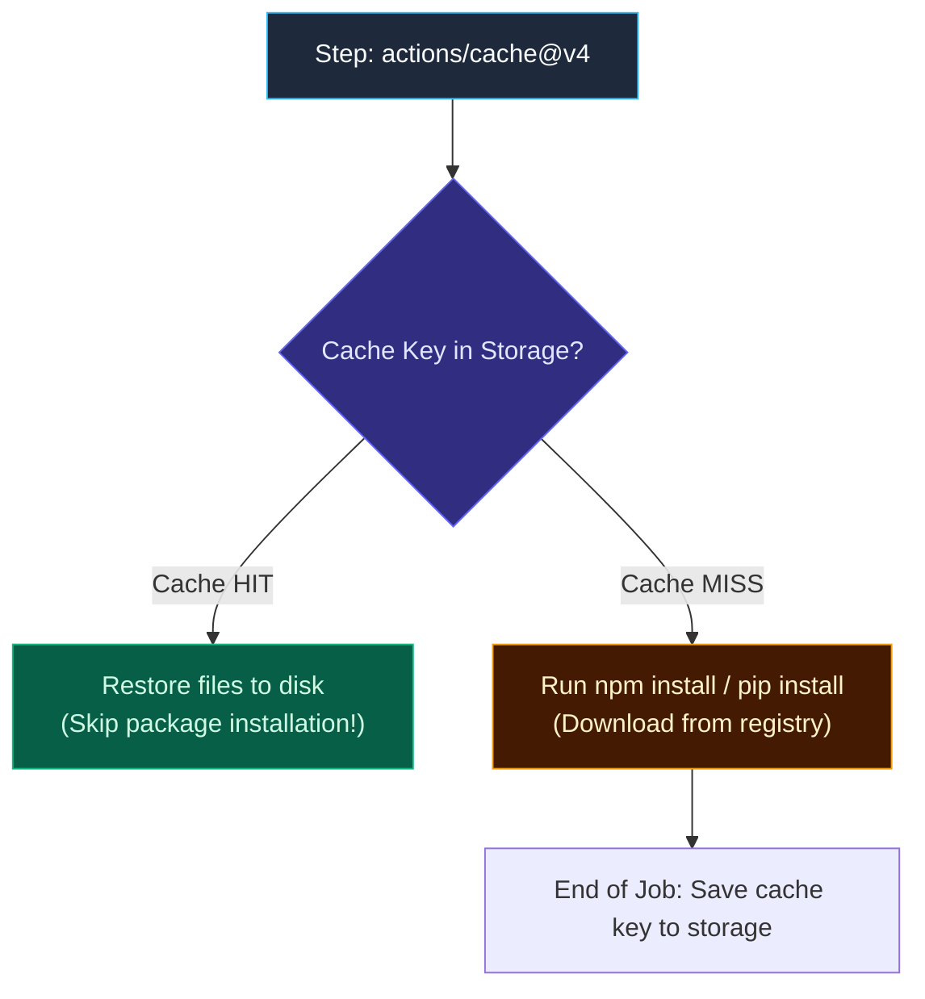

import { Callout } from 'fumadocs-ui/components/callout';
import { Steps, Step } from 'fumadocs-ui/components/steps';
import { Tabs, Tab } from 'fumadocs-ui/components/tabs';

<LessonIntro>
Every job in GitHub Actions executes within an ephemeral compute environment that is spawned when the job starts and completely erased when it finishes. Understanding how runners operate — and how to persist data across jobs using artifacts and caching — is essential for building fast, reliable pipelines.
</LessonIntro>

<Concepts items={[
  'Runner Architectures & Compute',
  'Containerized Job Execution',
  'Self-Hosted Runners & Kubernetes ARC',
  'Build Deliverables via Artifacts',
  'Dependency Caching Strategies',
  'Snapshot Volumes vs Object Stores'
]} />

---

## Runner Architectures & Compute Options

The `runs-on:` key defines the compute environment assigned to your job:


### 1. GitHub-Hosted Runners
Maintained directly by GitHub, these are clean virtual machines rebuilt from scratch for every single job run:

| Label | Operating System | Default Architecture | Cores / RAM / SSD |
| :--- | :--- | :--- | :--- |
| `ubuntu-latest` / `ubuntu-24.04` | Ubuntu 24.04 LTS | x86_64 (AMD64) | 2 vCPUs / 7 GB / 14 GB SSD |
| `windows-latest` / `windows-2022` | Windows Server 2022 | x86_64 (AMD64) | 2 vCPUs / 7 GB / 14 GB SSD |
| `macos-latest` / `macos-14` | macOS 14 Sonoma | **ARM64 (Apple Silicon M1)** | 3 vCPUs / 14 GB / 14 GB SSD |
| `macos-13` | macOS 13 Ventura | x86_64 (Intel) | 4 vCPUs / 14 GB / 14 GB SSD |

GitHub also offers **Larger Runners** for enterprise organizations with up to 64 vCPUs, 256 GB RAM, dedicated static IP ranges, and Azure VNet peering.

---

## 2. Containerized Job Execution

Instead of running steps directly on the host VM, you can instruct GitHub Actions to run the entire job inside a Docker container:

```yaml
jobs:
  alpine-build:
    runs-on: ubuntu-24.04
    # Execute all steps inside this container image
    container:
      image: node:20-alpine
      env:
        NODE_ENV: production
    steps:
      - name: Check Container Environment
        run: |
          cat /etc/os-release # Confirms Alpine Linux
          node -v
```

When you specify `container:`, the runner spins up the container, mounts the workspace directory into it, and executes all `run:` commands directly inside the container namespace.

---

## 3. Self-Hosted Runners & Kubernetes ARC

For specialized workloads (such as needing access to internal databases, GPU clusters, or custom hardware), organizations can deploy **Self-Hosted Runners**:


<Callout type="warning" title="Critical Security Danger on Public Repositories">
**Never use self-hosted runners on public repositories!** Any untrusted user on the internet can open a pull request modifying your workflow YAML to run malicious code inside your private network, access internal VPCs, or install rootkits on the host server.
</Callout>

### Autoscaling Runners with Actions Runner Controller (ARC)

Deploying static self-hosted VMs leads to idle costs. The modern enterprise standard is the **Actions Runner Controller (ARC)**, an open-source Kubernetes operator supported by GitHub:


ARC polls GitHub's webhook stream and spins up Kubernetes pods on-demand whenever a job requests a matching self-hosted runner label. When the job completes, the pod is immediately destroyed, ensuring ephemeral isolation.

---

## 4. Persisting Data with Artifacts

Because runner virtual machines are terminated the moment a job exits, any files created on disk are permanently deleted.

**Artifacts** allow you to save build deliverables (compiled binaries, zip archives, test coverage HTML reports, or container tarballs) so they can be downloaded by humans or consumed by downstream jobs:



### Complete Artifact Workflow:

```yaml
name: Artifact Sharing Pipeline
on: [push]

jobs:
  build:
    name: Compile Binary
    runs-on: ubuntu-24.04
    steps:
      - uses: actions/checkout@v4
      - run: mkdir -p build && echo "Binary release 1.0.0" > build/app.bin

      # Upload deliverable as an artifact
      - name: Save Build Artifact
        uses: actions/upload-artifact@v4
        with:
          name: release-binary
          path: build/app.bin
          retention-days: 7 # Auto-deletes after 7 days

  release:
    name: Publish Release
    runs-on: ubuntu-24.04
    needs: [build]
    steps:
      # Download deliverable from upstream job
      - name: Fetch Build Artifact
        uses: actions/download-artifact@v4
        with:
          name: release-binary
          path: downloaded-artifacts/

      - name: Verify Binary
        run: cat downloaded-artifacts/app.bin
```

---

## 5. Dependency & Layer Caching (`actions/cache@v4`)

While artifacts are intended for finished deliverables, **Caching** is designed to accelerate build speeds by restoring reusable dependencies (`node_modules`, pip wheels, Go module caches, or Docker layers) across workflow executions.

GitHub provides a **10 GB rolling cache limit** per repository. Stale caches not accessed for 7 days are automatically evicted.



### Manual Cache Implementation:

```yaml
    steps:
      - uses: actions/checkout@v4

      - name: Cache Node Modules
        id: cache-npm
        uses: actions/cache@v4
        with:
          path: ~/.npm
          key: ${{ runner.os }}-build-npm-${{ hashFiles('**/package-lock.json') }}
          restore-keys: |
            ${{ runner.os }}-build-npm-

      - name: Install Dependencies
        if: steps.cache-npm.outputs.cache-hit != 'true'
        run: npm ci
```

### Built-in Toolchain Caching (Recommended):
Official setup actions (`actions/setup-node`, `actions/setup-python`, `actions/setup-go`) include integrated caching:

```yaml
    # Automatic caching for npm, yarn, or pnpm
    - uses: actions/setup-node@v4
      with:
        node-version: 20
        cache: 'npm'
        cache-dependency-path: '**/package-lock.json'

    # Automatic caching for pip
    - uses: actions/setup-python@v5
      with:
        python-version: '3.12'
        cache: 'pip'
```

---

## Snapshot Cache Volumes vs Remote Object Stores

In traditional GitHub Actions caching, dependencies are zipped and uploaded over the internet to remote Azure Blob storage. For large dependencies (e.g. 100,000 small files in `node_modules` or Docker layers), network transfer can take 1 to 2 minutes.

Third-party providers like **Namespace** use **Snapshot Cache Volumes**:


Instead of archiving and uploading files over HTTP, the runner takes a local NVMe volume snapshot at the storage layer. Subsequent runners mount the cached volume instantly, dropping cache restore times from **28 seconds down to 3 seconds**.

---

<QuickRecall title="Self-Check: Runners & Caching">
1. What is the fundamental functional difference between an Artifact and a Cache?
2. Why is using a hash of the package lockfile (`hashFiles('**/package-lock.json')`) essential in cache keys?
3. What is the default storage limit for cached dependencies in a GitHub Actions repository?
</QuickRecall>
