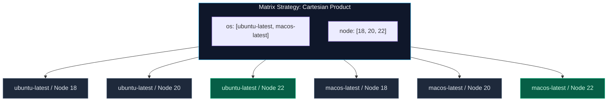

import { Callout } from 'fumadocs-ui/components/callout';
import { Steps, Step } from 'fumadocs-ui/components/steps';
import { Tabs, Tab } from 'fumadocs-ui/components/tabs';

<LessonIntro>
Modern applications must run consistently across multiple operating systems, browser engines, language runtimes, and CPU architectures. Rather than writing duplicate workflows, GitHub Actions provides powerful matrix fan-out strategies, conditional logic, and concurrency controls to prevent redundant computation.
</LessonIntro>

<Concepts items={[
  'Multi-Dimensional Matrix Strategies',
  'Fine-Grained Include & Exclude Rules',
  'Fail-Fast & Parallelism Limits',
  'Dynamic Runtime Matrices via fromJson',
  'Conditional Status Functions',
  'Concurrency Groups & Auto-Cancellation'
]} />

---

## The Matrix Strategy: Cartesian Fan-Out

A matrix strategy allows you to test your code across multiple configurations simultaneously without duplicating job definitions:




### Basic Matrix Implementation:

```yaml
jobs:
  test-matrix:
    name: Test on ${{ matrix.os }} (Node ${{ matrix.node }})
    runs-on: ${{ matrix.os }}
    strategy:
      matrix:
        os: [ubuntu-latest, windows-latest, macos-latest]
        node: [18, 20, 22]
    steps:
      - uses: actions/checkout@v4
      - uses: actions/setup-node@v4
        with:
          node-version: ${{ matrix.node }}
      - run: npm test
```
*Total Jobs Generated:* 3 Operating Systems × 3 Node Runtimes = **9 Parallel Jobs**.

---

## Fine-Tuning with `include` and `exclude`

In real-world projects, certain combinations may be incompatible or require special flags.

### 1. The `exclude:` Key
Removes specific Cartesian combinations from running:

```yaml
    strategy:
      matrix:
        os: [ubuntu-latest, windows-latest]
        python-version: ['3.10', '3.11', '3.12']
      exclude:
        # Do not run Python 3.10 on Windows
        - os: windows-latest
          python-version: '3.10'
```

### 2. The `include:` Key
Adds entirely new custom combinations or attaches extra configuration parameters to existing matrix items:

```yaml
    strategy:
      matrix:
        os: [ubuntu-latest, macos-latest]
        node: [20, 22]
      include:
        # Add a completely standalone experimental target
        - os: ubuntu-latest
          node: 23-nightly
          experimental: true
        # Attach custom compiler flags to an existing combination
        - os: macos-latest
          node: 22
          build-flags: '--target=aarch64-apple-darwin'
```

---

## Matrix Execution Controls: `fail-fast` & `max-parallel`

```yaml
    strategy:
      # If true (default), cancels all running matrix jobs the instant ONE job fails
      fail-fast: false

      # Restricts the maximum number of concurrent runners allocated to this matrix
      max-parallel: 4
```

<Callout type="tip" title="When to set fail-fast: false">
Leave `fail-fast: true` during active PR iteration to save compute minutes when an early test fails. 

Set `fail-fast: false` on nightly integration suites or release candidate validation so that maintainers can inspect failures across **all** operating systems at once.
</Callout>

---

## Interactive Playground: Matrix Fan-Out

Experiment with combinations, exclude rules, and runner concurrency limits in the interactive matrix simulator below:

<MatrixRunnerSimulator />

---

## Dynamic Runtime Matrices (`fromJson`)

What if your matrix dimensions cannot be hardcoded in YAML because you have 50 microservices and only want to run jobs for the services changed in the latest commit?

You can calculate matrix configurations dynamically in an upstream job:

```yaml
jobs:
  detect-changes:
    runs-on: ubuntu-24.04
    outputs:
      service_matrix: ${{ steps.filter.outputs.matrix }}
    steps:
      - uses: actions/checkout@v4
      - id: filter
        run: |
          # Detect changed directories in services/
          # Output dynamic JSON array: ["auth", "payments", "users"]
          SERVICES_JSON='["auth", "payments"]'
          echo "matrix=${SERVICES_JSON}" >> "$GITHUB_OUTPUT"

  test-dynamic:
    needs: [detect-changes]
    runs-on: ubuntu-24.04
    strategy:
      # Parse the JSON string from upstream job into a real matrix
      matrix:
        service: ${{ fromJson(needs.detect-changes.outputs.service_matrix) }}
    steps:
      - uses: actions/checkout@v4
      - name: Test Modified Service
        run: |
          echo "Testing service: ${{ matrix.service }}"
          cd "services/${{ matrix.service }}" && npm test
```

---

## Conditionals (`if:` Expressions)

You can conditionally skip entire jobs or individual steps based on expressions:

```yaml
    steps:
      # Execute only on the main branch
      - name: Deploy Production
        if: github.ref == 'refs/heads/main' && github.event_name == 'push'
        run: ./deploy-prod.sh

      # Execute only if an upstream step failed
      - name: Alert on Failure
        if: failure()
        run: ./send-slack-alert.sh

      # Always execute, even if workflow was cancelled by the user
      - name: Teardown Test Database
        if: always()
        run: docker compose down -v
```

### Core Status Functions:
- `success()`: Returns `true` if all previous steps succeeded (default behavior).
- `failure()`: Returns `true` if any prior step failed.
- `always()`: Forces the step to execute regardless of upstream success or failure.
- `cancelled()`: Returns `true` if the workflow run was explicitly aborted.

---

## Concurrency Groups: Canceling Outdated Runs

When a developer pushes 5 consecutive commits in quick succession, running 5 separate full CI pipelines wastes money and runner queues.

**Concurrency groups** bundle related runs together and cancel obsolete executions:

```yaml
name: Continuous Integration

on:
  push:
    branches: [main, 'feature/**']
  pull_request:
    branches: [main]

# Group by workflow name and branch reference (or PR number)
concurrency:
  group: ${{ github.workflow }}-${{ github.ref }}
  # Automatically cancel older in-progress runs when a new commit arrives!
  cancel-in-progress: true
```

### Production Serialization (Deployments)
For deployment pipelines where race conditions cannot be tolerated:

```yaml
# For deployment jobs, serialize without canceling:
concurrency:
  group: production-deployment
  cancel-in-progress: false # Queues subsequent deploys sequentially
```

---

<QuickRecall title="Self-Check: Matrix & Concurrency">
1. If a matrix defines `os: [ubuntu, windows]` and `version: [18, 20, 22]`, how many total jobs are scheduled by default?
2. Why is `cancel-in-progress: true` recommended for PR validation but dangerous for production deployment pipelines?
3. What built-in GitHub Actions function must you use to convert an upstream step output string into a dynamic matrix list?
</QuickRecall>
