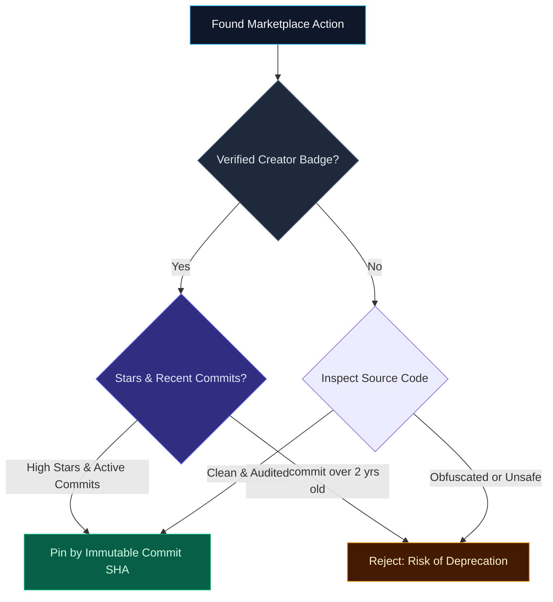

import { Callout } from 'fumadocs-ui/components/callout';
import { Steps, Step } from 'fumadocs-ui/components/steps';
import { Tabs, Tab } from 'fumadocs-ui/components/tabs';

<LessonIntro>
Consuming marketplace actions speeds up delivery, but enterprise engineering teams frequently need to author their own custom automation logic. In this module, we dissect the four mechanisms for packaging and reusing code across workflows.
</LessonIntro>

<Concepts items={[
  'Marketplace Vetting & Trust',
  'Composite Actions (action.yml)',
  'Reusable Workflows (workflow_call)',
  'TypeScript Actions with Rollup/ncc',
  'Container Actions (Python/Go/Rust)',
  'Workflow Commands & Markdown Summaries'
]} />

---

## Evaluating Marketplace Actions

The GitHub Actions Marketplace hosts over 20,000 public actions. Before adding an action to an enterprise pipeline, audit these signals:



---

## The 4 Reusability Mechanisms Compared

| Mechanism | Defining File | Unit of Execution | Best Language | Primary Use Case |
| :--- | :--- | :--- | :--- | :--- |
| **Composite Action** | `action.yml` | Step | YAML / Shell | Bundling repetitive multi-step shell commands |
| **Reusable Workflow** | `.github/workflows/*.yml` | **Job** | YAML | Standardizing company-wide compliance gates |
| **JavaScript / TypeScript** | `action.yml` + Node bundle | Step | TypeScript / JS | Complex logic with fast native Node startup |
| **Docker Container Action** | `action.yml` + `Dockerfile` | Step | Python, Go, Rust | Logic needing native Linux packages or runtimes |

---

## 1. Composite Actions (`using: "composite"`)

A Composite Action bundles multiple steps into a single reusable action without needing JavaScript compilation or Docker container overhead.

Create `.github/actions/setup-project/action.yml`:

```yaml
name: 'Setup & Warm Cache'
description: 'Configures Node, installs dependencies, and warms build cache'

inputs:
  node-version:
    description: 'Target Node version'
    required: false
    default: '20'

outputs:
  cache-hit:
    description: 'Whether package cache was restored'
    value: ${{ steps.cache.outputs.cache-hit }}

runs:
  using: 'composite'
  steps:
    - name: Setup Node Runtime
      uses: actions/setup-node@v4
      with:
        node-version: ${{ inputs.node-version }}
      shell: bash

    - name: Restore npm Cache
      id: cache
      uses: actions/cache@v4
      with:
        path: ~/.npm
        key: ${{ runner.os }}-npm-${{ hashFiles('**/package-lock.json') }}
      shell: bash

    - name: Install Dependencies
      run: npm ci
      shell: bash # Note: shell is MANDATORY on composite steps!
```

### Consuming the Composite Action:

```yaml
jobs:
  build:
    runs-on: ubuntu-24.04
    steps:
      - uses: actions/checkout@v4
      # Consume via relative path:
      - uses: ./.github/actions/setup-project
        with:
          node-version: '22'
      - run: npm test
```

---

## 2. Reusable Workflows (`workflow_call`)

Reusable workflows allow you to share entire **jobs** across repositories:


### Source Workflow (`.github/workflows/reusable-deploy.yml`):

```yaml
name: Standard Deploy Pipeline
on:
  workflow_call:
    inputs:
      target-env:
        required: true
        type: string
    secrets:
      DEPLOY_KEY:
        required: true

jobs:
  deploy:
    runs-on: ubuntu-24.04
    steps:
      - uses: actions/checkout@v4
      - run: ./deploy.sh --env "${{ inputs.target-env }}"
        env:
          KEY: ${{ secrets.DEPLOY_KEY }}
```

### Caller Workflow:

```yaml
jobs:
  run-deployment:
    # Invokes the reusable workflow as an entire job
    uses: my-org/shared-workflows/.github/workflows/reusable-deploy.yml@main
    with:
      target-env: 'staging'
    secrets: inherit # Automatically passes caller secrets to reusable workflow
```

---

## 3. TypeScript Actions with `@actions/core` & Rollup

TypeScript actions run directly on the runner's Node.js engine with zero container startup latency.

### Step 1: Install Dependencies
```bash
npm install @actions/core @actions/github
npm install --save-dev typescript @types/node rollup @rollup/plugin-typescript
```

### Step 2: Implement Logic (`src/main.ts`)
```typescript
import * as core from '@actions/core';

export async function run(): Promise<void> {
  try {
    const msInput = core.getInput('milliseconds', { required: false }) || '1000';
    const ms = parseInt(msInput, 10);

    core.info(`Waiting for ${ms} milliseconds...`);
    await new Promise((resolve) => setTimeout(resolve, ms));

    // Set step outputs
    core.setOutput('time', new Date().toTimeString());
  } catch (error) {
    if (error instanceof Error) core.setFailed(error.message);
  }
}
```

### Step 3: Bundle and Define `action.yml`
Because runners do not run TypeScript compilers dynamically, use Rollup or `@vercel/ncc` to bundle TypeScript and all `node_modules` into a single self-contained `dist/index.js`:

```yaml
name: 'Timer Action'
description: 'Pauses workflow execution and outputs finish timestamp'
inputs:
  milliseconds:
    description: 'Milliseconds to wait'
    default: '1000'
outputs:
  time:
    description: 'Completion timestamp'
runs:
  using: 'node20'
  main: 'dist/index.js'
```

---

## 4. Docker Container Actions (Python / Go / Rust)

When you need dependencies not easily bundled in JavaScript (e.g. Python numpy, Go binaries, or custom Linux packages), use a container action:

### `Dockerfile`:
```dockerfile
FROM python:3.12-slim
COPY entrypoint.py /entrypoint.py
ENTRYPOINT ["python", "/entrypoint.py"]
```

### `entrypoint.py`:
```python
import os
import sys

# Inputs are passed as INPUT_<NAME> environment variables in uppercase
who_to_greet = os.getenv("INPUT_WHO_TO_GREET", "World")
print(f"Hello, {who_to_greet} from Python!")

# Write step output
output_path = os.getenv("GITHUB_OUTPUT")
if output_path:
    with open(output_path, "a") as f:
        f.write("result=success\n")
```

### `action.yml`:
```yaml
name: 'Python Container Action'
runs:
  using: 'docker'
  image: 'Dockerfile' # Rebuilt on run, or use 'docker://ghcr.io/org/image:v1'
```

---

## Interactive Playground: Architecture Decision Engine

Answer the questions below to receive the recommended action pattern and ready-to-copy code scaffolding:

<ActionAuthoringChooser />

---

## Workflow Commands & Markdown Job Summaries

Steps can communicate back to the GitHub Actions runner agent through special stdout formatting:

```bash
# Workflow Commands:
echo "::error file=app.js,line=10::Syntax error on line 10"
echo "::warning::Deprecated configuration detected"
echo "::notice::Build completed in 12s"
```

### Generating Rich Markdown Job Summaries (`$GITHUB_STEP_SUMMARY`)
You can render formatted tables, checklists, and test metrics directly inside the GitHub Actions web UI:


```yaml
    - name: Generate Deployment Summary
      run: |
        echo "## 🚀 Deployment Results" >> $GITHUB_STEP_SUMMARY
        echo "| Environment | Commit | Status |" >> $GITHUB_STEP_SUMMARY
        echo "| :--- | :--- | :--- |" >> $GITHUB_STEP_SUMMARY
        echo "| Production | \`${{ github.sha }}\` | ✅ Success |" >> $GITHUB_STEP_SUMMARY
```

---

<QuickRecall title="Self-Check: Authoring Actions">
1. Why does a Composite Action step require an explicit `shell: bash` line, whereas standard workflow steps do not?
2. What is the key functional difference between a Composite Action and a Reusable Workflow?
3. Why must TypeScript actions be compiled and bundled into `dist/index.js` before being committed to version control?
</QuickRecall>
