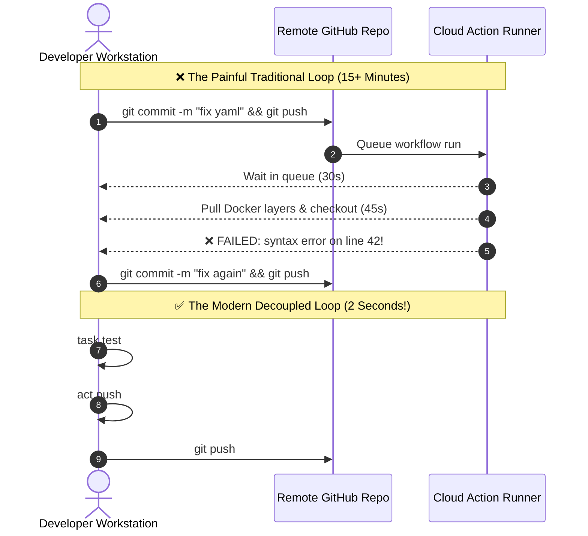

import { Callout } from 'fumadocs-ui/components/callout';
import { Steps, Step } from 'fumadocs-ui/components/steps';
import { Tabs, Tab } from 'fumadocs-ui/components/tabs';

<LessonIntro>
Every software engineer who has touched CI/CD knows the frustration of pushing fifteen consecutive commits titled "fix ci typo", "retry fix", and "please work" while waiting several minutes for each run to fail. In this module, we end the "push-and-pray" anti-pattern forever.
</LessonIntro>

<Concepts items={[
  'The Push-and-Pray Anti-Pattern',
  'Decoupled Logic via Taskfiles',
  'Local Emulation with act & Docker',
  'Interactive SSH Runner Breakpoints',
  'Step & Runner Diagnostic Flags',
  'Log Archives & Profiling'
]} />

---

## The Push-and-Pray Anti-Pattern



---

## Strategy 1: Decoupling Logic with Taskfiles

Never write complex multi-line Bash logic directly inside workflow YAML. When logic lives inside YAML, you cannot test it without committing and pushing to GitHub.

Instead, extract commands into a **Taskfile** (or `Makefile`) that can be executed both on your local laptop and inside GitHub Actions:

### `Taskfile.yml`:
```yaml
version: '3'

tasks:
  lint:
    desc: 'Run ESLint and Prettier'
    cmds:
      - npm run lint
      - npm run format:check

  test:
    desc: 'Execute unit test suite with coverage'
    cmds:
      - npm test -- --coverage

  build:
    desc: 'Compile production binary'
    cmds:
      - npm run build
```

### In Your Workflow (`.github/workflows/ci.yml`):
```yaml
jobs:
  test:
    runs-on: ubuntu-24.04
    steps:
      - uses: actions/checkout@v4
      - uses: actions/setup-node@v4
        with:
          node-version: 20
      - run: npm ci
      # Clean, simple one-line task invocation!
      - run: npx @go-task/cli test
```

Now, when a developer modifies a test or a build script, they test it locally in 2 seconds via `task test` before touching Git.

---

## Strategy 2: Local Workflow Emulation with `act`

[**`act`**](https://github.com/nektos/act) is an open-source tool that reads your `.github/workflows/` files, communicates with your local Docker daemon, and runs your GitHub Actions workflows locally on your workstation.

```bash
# Run all workflows triggered by push
act push

# Run a specific workflow triggered by workflow_dispatch
act workflow_dispatch -W .github/workflows/ci.yml

# Run only a specific job
act -j test-matrix

# Pass simulated secrets and environment variables
act push -s GITHUB_TOKEN="fake_token" -s API_KEY="local_test_key"
```

### Selecting Runner Image Fidelity (`-P`)
By default, `act` uses a lightweight micro-image (about 200MB). If your workflow relies on tools pre-installed on GitHub's official runners (like the AWS CLI or specific compilers), point `act` to a full medium or large runner image:

```bash
act push -P ubuntu-latest=catthehacker/ubuntu:act-latest
```

---

## Strategy 3: Interactive SSH Breakpoints into Live Runners

Sometimes an error only reproduces on a remote runner due to subtle differences in the operating system, kernel, or networking. Instead of adding `echo` statements and rerunning, you can **SSH directly into the live runner environment** when a step fails!

Using a breakpoint action (such as `namespace-actions/breakpoint` or `mxschmitt/action-tmate`):

```yaml
jobs:
  investigate-failure:
    runs-on: ubuntu-24.04
    steps:
      - uses: actions/checkout@v4
      - run: ./flaky-integration-test.sh

      # Only executes if the upstream test step FAILS!
      - name: Open Interactive SSH Debugger
        if: failure()
        uses: namespace-actions/breakpoint@v0
        with:
          duration: 15m
          authorized-users: 'my-github-handle'
```

### The Debugging Session:
1. When `./flaky-integration-test.sh` exits with code 1, the breakpoint step triggers.
2. The step logs print an SSH connection string:
   ```bash
   ssh -p 22 runner@ssh.namespace.so
   ```
3. You open a terminal, paste the SSH command, and you are immediately inside the running VM!
4. You can inspect the filesystem, test shell commands interactively, verify network connectivity, and diagnose the bug immediately.
5. Once diagnosed, type `breakpoint resume` to allow the job to exit cleanly.

---

## Strategy 4: Diagnostic Debug Flags

GitHub Actions includes hidden diagnostic logging flags that output deep internal runner events and step commands:


### Enabling Step and Runner Debugging:
In your repository settings (**Settings > Secrets and variables > Actions**), add these variables:

| Variable Name | Value | Effect |
| :--- | :--- | :--- |
| `ACTIONS_STEP_DEBUG` | `true` | Prints all debug-level messages (`core.debug()`) and exact shell script expansion |
| `ACTIONS_RUNNER_DEBUG` | `true` | Dumps internal runner diagnostic communication, websocket traffic, and process spawns |

### Downloading Log Bundles
When debugging intermittent failures, download the complete raw log zip archive directly from the GitHub Actions menu:


---

<QuickRecall title="Self-Check: Local Testing & Debugging">
1. Why does moving shell logic into a Taskfile or Makefile drastically shorten the feedback loop?
2. What local virtualization technology does the `act` CLI tool rely on to execute workflow jobs?
3. Which step conditional (`if:`) ensures that an interactive SSH breakpoint only pauses the runner when a failure occurs?
</QuickRecall>
