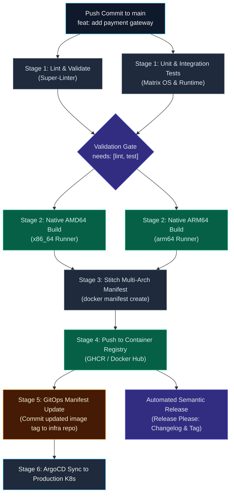
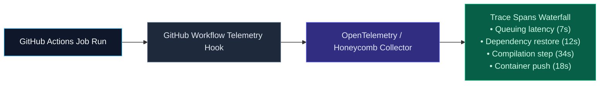

import { Callout } from 'fumadocs-ui/components/callout';
import { Steps, Step } from 'fumadocs-ui/components/steps';
import { Tabs, Tab } from 'fumadocs-ui/components/tabs';

<LessonIntro>
In this culminating module, we synthesize all concepts from the masterclass to construct an enterprise-grade CI/CD system: automated linting, multi-platform Docker container builds, GitOps deployment gates, automated semantic version releases, and distributed observability tracing.
</LessonIntro>

<Concepts items={[
  'End-to-End Capstone Architecture',
  'Multi-Arch Builds without QEMU Bottlenecks',
  'Automated Releases with Release Please',
  'GitOps Manifest Sync for ArgoCD',
  'Workflow Observability & Honeycomb Tracing',
  'Enterprise CI/CD Production Checklist'
]} />

---

## The End-to-End Production Pipeline Architecture

Here is the 6-stage architecture implemented in the course capstone:



---

## Multi-Architecture Builds Without QEMU Emulation

Building multi-platform Docker container images (supporting both AMD64 cloud servers and Apple Silicon / ARM64 servers) traditionally relies on **QEMU software emulation**. 

<Callout type="warning" title="The QEMU Performance Hit">
Emulating ARM64 instructions on an x86_64 runner often slows down container builds by **400% to 1000%**! A build that takes 45 seconds natively can take over 8 minutes under QEMU emulation.
</Callout>

### The High-Performance Alternative: Native Runner Fan-Out
Instead of emulating, run parallel native builds and stitch the manifest:

```yaml
jobs:
  build-native:
    strategy:
      matrix:
        include:
          - arch: amd64
            runner: ubuntu-24.04
          - arch: arm64
            runner: macos-14 # Native Apple Silicon ARM runner!
    runs-on: ${{ matrix.runner }}
    steps:
      - uses: actions/checkout@v4
      - name: Build Single Architecture Image
        run: |
          docker build -t ghcr.io/org/app:${{ github.sha }}-${{ matrix.arch }} .
          docker push ghcr.io/org/app:${{ github.sha }}-${{ matrix.arch }}

  stitch-manifest:
    needs: [build-native]
    runs-on: ubuntu-24.04
    steps:
      - name: Create Multi-Arch Manifest
        run: |
          docker manifest create ghcr.io/org/app:${{ github.sha }} \
            ghcr.io/org/app:${{ github.sha }}-amd64 \
            ghcr.io/org/app:${{ github.sha }}-arm64
          docker manifest push ghcr.io/org/app:${{ github.sha }}
```

---

## Automated Releases with Conventional Commits

Manually writing release notes and tagging version numbers is tedious and error-prone. By following the **Conventional Commits** specification (`feat:`, `fix:`, `chore:`, `feat!:`), you can automate your entire release lifecycle using Google's **Release Please**:

```yaml
name: Release Automation
on:
  push:
    branches: [main]

permissions:
  contents: write
  pull-requests: write

jobs:
  release-please:
    runs-on: ubuntu-24.04
    steps:
      - uses: google-github-actions/release-please-action@v4
        id: release
        with:
          release-type: node
          package-name: my-service

      # If a new release was merged, publish artifacts!
      - name: Publish NPM Package
        if: ${{ steps.release.outputs.release_created }}
        run: npm publish
        env:
          NODE_AUTH_TOKEN: ${{ secrets.NPM_TOKEN }}
```

### How Release Please Works:
1. When developers push commits with prefixes like `feat: add oauth support` or `fix: resolve race condition`, Release Please inspects commit history.
2. It automatically opens and updates a dedicated **Release PR** containing an updated `CHANGELOG.md` and bumped semver versions in `package.json`.
3. When maintainers review and click **Merge** on the Release PR, the action cuts a signed Git release tag, creates a GitHub Release, and triggers downstream deployment workflows.

---

## Automating Repository Hygiene: Stale Issues & PRs

To prevent backlog rot, automate triage with the official `actions/stale` workflow running on a daily cron schedule:

```yaml
name: Stale Issue Triage
on:
  schedule:
    - cron: '0 0 * * *' # Midnight UTC daily

permissions:
  issues: write
  pull-requests: write

jobs:
  triage:
    runs-on: ubuntu-24.04
    steps:
      - uses: actions/stale@v9
        with:
          repo-token: ${{ secrets.GITHUB_TOKEN }}
          stale-issue-message: 'This issue has been automatically marked as stale due to 60 days of inactivity.'
          stale-pr-message: 'This PR has been marked as stale due to 30 days of inactivity.'
          days-before-stale: 60
          days-before-close: 7
          stale-issue-label: 'stale'
```

---

## Workflow Observability & Profiling

Default GitHub Actions execution history is limited: you can only see a list of past runs and their total durations. You cannot easily analyze whether step latencies are trending upward over time or identify which specific microservice is bottlenecking your pipeline.

### Exporting Step Spans to Distributed Tracing (Honeycomb / Datadog)
Enterprise engineering teams export GitHub Actions timing telemetry into platforms like Honeycomb, Datadog, or OpenTelemetry:



Each step inside your job is converted into a **distributed trace span**. Over time, teams can create latency alerting dashboards that trigger whenever a test suite or container build regresses by more than 15%.

---

## Enterprise Production CI/CD Checklist

Before deploying any GitHub Actions pipeline to production, verify each requirement:

<Steps>
  <Step>
    ### 1. Security & Principle of Least Privilege
    - [ ] Global `permissions: {}` configured, granting only minimal required scopes per job.
    - [ ] Zero static cloud API keys in repository secrets; replaced with passwordless **OpenID Connect (OIDC)**.
    - [ ] All marketplace actions pinned to immutable **40-character commit SHAs**.
    - [ ] Automated Dependabot or Renovate alerts enabled for action SHA updates.
  </Step>

  <Step>
    ### 2. Performance & Resource Efficiency
    - [ ] Monorepo path filters (`paths:` and `paths-ignore:`) applied to skip unrelated service builds.
    - [ ] Concurrency groups (`cancel-in-progress: true`) enabled on pull requests to eliminate redundant runs.
    - [ ] Dependency and layer caching configured with deterministic lockfile hashes.
    - [ ] Cross-architecture emulation avoided by utilizing native ARM64 / AMD64 runner fan-outs.
  </Step>

  <Step>
    ### 3. Maintainability & Developer Experience
    - [ ] Heavy shell script logic decoupled into local Taskfiles or Makefiles.
    - [ ] Repetitive multi-step sequences packaged into Composite Actions or Reusable Workflows.
    - [ ] Automated semantic versioning and changelog updates driven by Conventional Commits.
    - [ ] Step summaries (`$GITHUB_STEP_SUMMARY`) providing formatted deployment receipts.
  </Step>
</Steps>

---

<QuickRecall title="Self-Check: Enterprise Patterns">
1. Why is building multi-architecture container images via native runner fan-out significantly faster than using QEMU emulation?
2. How does the Conventional Commits specification enable tools like Release Please to automate semver version bumping?
3. What is the key advantage of exporting GitHub Actions step execution data to an observability platform like Honeycomb?
</QuickRecall>
