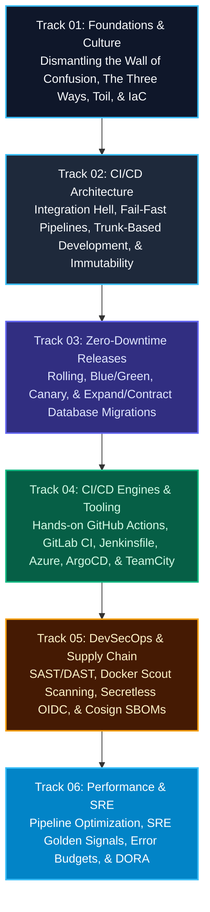

import { Callout } from 'fumadocs-ui/components/callout';
import { Cards, Card } from 'fumadocs-ui/components/card';
import { ModuleOverview } from '@/components/module-overview';

<ModuleOverview slug="devops-cicd-performance" />

<LessonIntro>
Welcome to the **DevOps, CI/CD & Performance** curriculum. This course takes you on a complete journey from the operational friction of manual deployments and "integration hell" to building automated, secure, and resilient continuous delivery systems that ship software to production with zero user downtime.
</LessonIntro>

<Concepts items={['The Three Ways', 'CALMS Framework', 'Continuous Integration', 'The Test Pyramid', 'Trunk-Based Development', 'Feature Flags', 'Blue/Green & Canary Releases', 'GitHub Actions & GitLab CI', 'Jenkins Pipelines', 'GitOps & ArgoCD', 'DevSecOps & SBOM', 'Four Golden Signals', 'DORA Metrics']} />

---

## Curriculum Roadmap

---

## Explore Curriculum Tracks

### 01. Foundations & Culture
<Cards>
  <Card
    title="01. What DevOps Is (and Isn't)"
    href="/docs/devops-cicd-performance/01-devops-foundations/01-what-is-devops"
    description="The Wall of Confusion, Gene Kim's Three Ways, and the CALMS framework."
  />
  <Card
    title="02. Culture, Toil & Incident Management"
    href="/docs/devops-cicd-performance/01-devops-foundations/02-culture-toil-and-incident-management"
    description="Westrum generative culture, Google SRE's 50% toil rule, and blameless retrospectives."
  />
  <Card
    title="03. Infrastructure as Code & Immutability"
    href="/docs/devops-cicd-performance/01-devops-foundations/03-infrastructure-as-code-and-immutability"
    description="From snowflake servers to declarative IaC, pets vs. cattle, and container isolation."
  />
  <Card
    title="04. Production-Grade Dockerfiles & Hardening"
    href="/docs/devops-cicd-performance/01-devops-foundations/04-production-grade-dockerfiles"
    description="Slashing image sizes by 90%, layer caching economics, non-root users, and PID 1 signal handling."
  />
</Cards>

### 02. CI/CD Architecture & Patterns
<Cards>
  <Card
    title="01. Integration Hell to Continuous Integration"
    href="/docs/devops-cicd-performance/02-cicd-foundations/01-integration-hell-and-the-ci-solution"
    description="The agony of long-lived branches, clean-room runner environments, and lockfiles as contracts."
  />
  <Card
    title="02. Anatomy of a Modern Pipeline"
    href="/docs/devops-cicd-performance/02-cicd-foundations/02-pipeline-anatomy-and-design"
    description="Pipeline as code, stage-by-stage execution, fail-fast ordering, parallelism, and matrix builds."
  />
  <Card
    title="03. Branching Strategies & Feature Flags"
    href="/docs/devops-cicd-performance/02-cicd-foundations/03-branching-strategies-and-feature-flags"
    description="Why GitFlow fights CI, how Trunk-Based Development thrives, and decoupling deploy from release."
  />
  <Card
    title="04. The Test Pyramid & Quality Gates"
    href="/docs/devops-cicd-performance/02-cicd-foundations/04-the-test-pyramid-and-quality-gates"
    description="Unit vs. integration vs. E2E tests, avoiding the ice cream cone, and quarantining flaky tests."
  />
  <Card
    title="05. Build Once, Deploy Everywhere"
    href="/docs/devops-cicd-performance/02-cicd-foundations/05-build-once-deploy-everywhere"
    description="Content-addressed storage, container registries, SHA-256 digests, and separating config from code."
  />
</Cards>

### 03. Zero-Downtime Deployment Strategies
<Cards>
  <Card
    title="01. Continuous Delivery vs. Deployment"
    href="/docs/devops-cicd-performance/03-deployment-strategies/01-continuous-delivery-vs-deployment"
    description="The dependency gate: when to use human approvals vs fully automated continuous deployments."
  />
  <Card
    title="02. Progressive Delivery: Rolling, Blue/Green & Canary"
    href="/docs/devops-cicd-performance/03-deployment-strategies/02-zero-downtime-deployment-patterns"
    description="Traffic splitting, health and readiness probes, and designing instant rollback decision trees."
  />
  <Card
    title="03. Zero-Downtime Database Migrations"
    href="/docs/devops-cicd-performance/03-deployment-strategies/03-zero-downtime-database-migrations"
    description="The Expand/Contract pattern: non-blocking schema evolution and parallel-run data backfills."
  />
  <Card
    title="04. Automated Canary Analysis with Argo Rollouts"
    href="/docs/devops-cicd-performance/03-deployment-strategies/04-automated-canary-analysis-argo-rollouts"
    description="Traffic routing with Istio/NGINX, Prometheus AnalysisTemplates, and self-aborting rollouts."
  />
</Cards>

### 04. CI/CD Engines & Tooling
<Cards>
  <Card
    title="01. GitHub Actions in Depth"
    href="/docs/devops-cicd-performance/04-ci-cd-engines/01-github-actions"
    description="Workflows, triggers, matrix jobs, runners, secrets, and building/pushing Docker containers."
  />
  <Card
    title="02. GitLab CI/CD & Runner Architecture"
    href="/docs/devops-cicd-performance/04-ci-cd-engines/02-gitlab-ci"
    description=".gitlab-ci.yml, stages, artifacts vs. cache, runner executors, environments, and Docker-in-Docker."
  />
  <Card
    title="03. Jenkins & The Declarative Jenkinsfile"
    href="/docs/devops-cicd-performance/04-ci-cd-engines/03-jenkins-and-jenkinsfile"
    description="Controller-agent topology, Docker agents, multibranch pipelines, and automated GitHub webhooks."
  />
  <Card
    title="04. Azure DevOps & Azure Pipelines"
    href="/docs/devops-cicd-performance/04-ci-cd-engines/04-azure-pipelines"
    description="YAML pipeline schema, hosted vs. self-hosted agents, service connections, stages, and approvals."
  />
  <Card
    title="05. GitOps Continuous Delivery with ArgoCD"
    href="/docs/devops-cicd-performance/04-ci-cd-engines/05-gitops-with-argocd"
    description="Pull-based CD for Kubernetes, the Application CRD, continuous drift detection, and self-healing."
  />
  <Card
    title="06. JetBrains TeamCity"
    href="/docs/devops-cicd-performance/04-ci-cd-engines/06-teamcity"
    description="VCS roots, build configurations, build chains, snapshot dependencies, and distributed agent pools."
  />
  <Card
    title="07. Infrastructure as Code CI/CD: Terraform & Atlantis"
    href="/docs/devops-cicd-performance/04-ci-cd-engines/07-iac-pipelines-terraform-gitops"
    description="Remote state locking, automated plan in PR comments, policy-as-code, and scheduled drift detection."
  />
</Cards>

### 05. DevSecOps & Supply Chain Security
<Cards>
  <Card
    title="01. Shifting Security Left"
    href="/docs/devops-cicd-performance/05-devsecops-and-security/01-shifting-security-left"
    description="The DevSecOps philosophy: SAST, DAST, SCA dependency scanning, and secret leak prevention."
  />
  <Card
    title="02. Container Scanning with Docker Scout"
    href="/docs/devops-cicd-performance/05-devsecops-and-security/02-container-vulnerability-scanning"
    description="Analyzing image layers, CVE severity thresholds, and gatekeeping vulnerable containers in CI."
  />
  <Card
    title="03. Secretless Pipelines with OIDC"
    href="/docs/devops-cicd-performance/05-devsecops-and-security/03-secrets-management-and-oidc"
    description="Eliminating long-lived cloud credentials using OpenID Connect (OIDC) identity federation."
  />
  <Card
    title="04. Supply Chain Security & SBOMs"
    href="/docs/devops-cicd-performance/05-devsecops-and-security/04-supply-chain-security-and-sbom"
    description="Software Bill of Materials (Syft/CycloneDX), SLSA provenance, and signing images with Cosign."
  />
</Cards>

### 06. Performance, Observability & DORA
<Cards>
  <Card
    title="01. Pipeline Performance Optimization"
    href="/docs/devops-cicd-performance/06-performance-observability-dora/01-pipeline-performance-optimization"
    description="Layer caching, Docker BuildKit cache mounts, monorepo path filtering, and test sharding."
  />
  <Card
    title="02. Observability & The Four Golden Signals"
    href="/docs/devops-cicd-performance/06-performance-observability-dora/02-observability-and-golden-signals"
    description="Metrics, logs, traces, Latency, Traffic, Errors, Saturation, SLI/SLO/SLA, and error budgets."
  />
  <Card
    title="03. DORA Metrics & Continuous Improvement"
    href="/docs/devops-cicd-performance/06-performance-observability-dora/03-dora-metrics-and-continuous-improvement"
    description="Deployment Frequency, Lead Time for Changes, Change Failure Rate, Time to Restore (MTTR), and elite benchmarks."
  />
  <Card
    title="04. Ephemeral Preview Environments per Pull Request"
    href="/docs/devops-cicd-performance/06-performance-observability-dora/04-ephemeral-preview-environments"
    description="Eliminating the staging bottleneck with dynamic ingress URLs and automated teardown lifecycles."
  />
</Cards>
