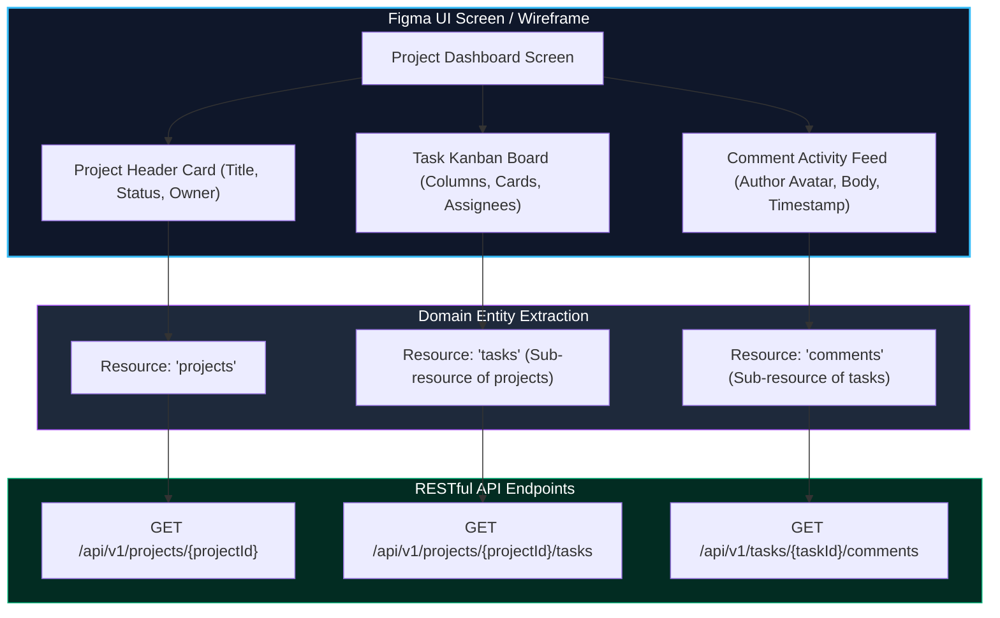
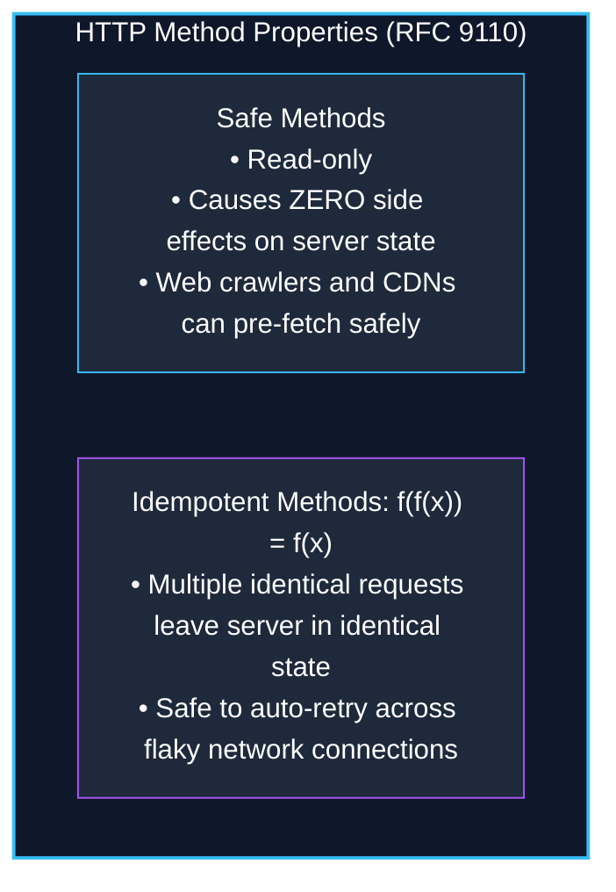
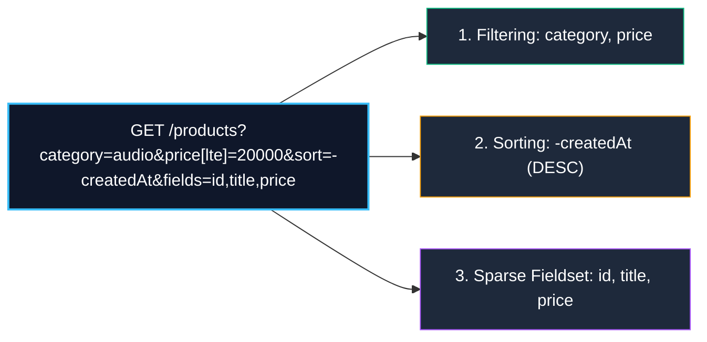

import { Callout } from 'fumadocs-ui/components/callout';
import { Tabs, Tab } from 'fumadocs-ui/components/tabs';
import { Steps, Step } from 'fumadocs-ui/components/steps';
import { Cards, Card } from 'fumadocs-ui/components/card';

Application Programming Interfaces (APIs) form the contractual bridge between client user interfaces and backend data systems. 

While arbitrary Remote Procedure Call (RPC) patterns allow developers to invent custom endpoints on the fly (`/doCreateUser`, `/fetchOrders`), **REST (Representational State Transfer)** establishes a standardized, resource-oriented architecture that leverages the native strengths of HTTP: caching, idempotency, content negotiation, and uniform interfaces.

Great APIs do not begin in database migration files—they begin with user journeys and interface requirements. This guide teaches you how to translate visual UI wireframes directly into clean, scalable RESTful resource models.

---

## 1. Figma-Driven API Design: Extracting Nouns from UI Wireframes

When starting a new feature or product, junior engineers often jump straight into database modeling (`CREATE TABLE users...`). Senior engineers start with the **user experience**: they open the Figma wireframes or design prototypes and extract the domain resources.



### The 4-Step Figma-to-API Extraction Process

<Steps>
  <Step>
    ### Step 1: Identify Root Collections (Primary Nouns)
    Examine the top-level navigation and primary screens. Each major view corresponds to a root collection resource:
    - User settings screen $\rightarrow$ `/users`
    - Products catalog screen $\rightarrow$ `/products`
    - Invoices dashboard $\rightarrow$ `/invoices`
  </Step>

  <Step>
    ### Step 2: Identify Ownership and Sub-Resources
    Look at nested lists, cards, and relationship panels within a screen:
    - An article displays comments $\rightarrow$ `/articles/{articleId}/comments`
    - A team contains members $\rightarrow$ `/teams/{teamId}/members`
    - An order contains line items $\rightarrow$ `/orders/{orderId}/items`
  </Step>

  <Step>
    ### Step 3: Determine UI Interaction Verbs
    Observe buttons, modals, and user actions on the wireframe:
    - "Create Task" button $\rightarrow$ `POST /api/v1/projects/{projectId}/tasks`
    - "Edit Description" inline input $\rightarrow$ `PATCH /api/v1/tasks/{taskId}`
    - "Delete Project" modal confirm $\rightarrow$ `DELETE /api/v1/projects/{projectId}`
  </Step>

  <Step>
    ### Step 4: Extract Query Parameters from Filters and Controls
    Inspect search bars, tab filters, dropdown sorters, and pagination bars:
    - Search input $\rightarrow$ `?q=kubernetes`
    - Status tabs (Active, Completed) $\rightarrow$ `?status=active`
    - Sort dropdown $\rightarrow$ `?sort=-createdAt`
    - Infinite scroll / pagination $\rightarrow$ `?limit=20&cursor=...`
  </Step>
</Steps>

---

## 2. Resource-Oriented URI Conventions

A clean REST URI represents a **noun (a resource or collection of resources)**, never a verb or procedural action.

```
URI Grammar:
[Scheme]://[Domain]/[API-Version]/[Resource-Collection]/[Resource-ID]/[Sub-Collection]
https://  api.store.com /v1           /user-profiles      /usr_102     /shipping-addresses
```

### Core URI Rules

1. **Always Use Plural Nouns for Collections**:
   - `/users` (collection of users)
   - `/orders` (collection of orders)
   - `/products` (collection of products)
   - ❌ *Never use singular*: `/user`, `/order`
2. **Strict `kebab-case` for Multi-Word URIs**:
   - `/user-profiles`, `/order-items`, `/payment-methods`
   - ❌ *Avoid camelCase or snake_case in URIs*: `/userProfiles`, `/user_profiles`
3. **No Verbs in the URI**:
   - Verbs belong in the **HTTP method**, not the path:

| Anti-Pattern (RPC Style) | RESTful Pattern (Resource Style) | Description |
| :--- | :--- | :--- |
| `POST /api/getAllUsers` | `GET /api/v1/users` | List all items in the collection |
| `POST /api/createUser` | `POST /api/v1/users` | Create a new user in the collection |
| `GET /api/getUserById?id=42` | `GET /api/v1/users/42` | Identify specific resource by ID |
| `POST /api/updateUser?id=42` | `PATCH /api/v1/users/42` | Modify fields on a specific resource |
| `POST /api/deleteUser` | `DELETE /api/v1/users/42` | Delete the resource |

---

## 3. Sub-Resources & The Shallow Nesting Boundary

Hierarchical relationships should reflect natural domain ownership:

```http
# Fetch all comments belonging to article 102
GET /api/v1/articles/102/comments

# Post a new comment to article 102
POST /api/v1/articles/102/comments
```

However, developers frequently fall into the **Deep Nesting Trap**:

```http
# ❌ ANTI-PATTERN: Deeply nested URI path (Fragile, unwieldy, redundant)
GET /api/v1/organizations/3/teams/7/projects/10/tasks/55/comments/102
```

<Callout type="warn" title="The 2-Level Shallow Nesting Rule">
Limit URI nesting to a maximum of **two levels** (`/parents/{parentId}/children`). If an entity possesses a globally unique identifier (UUID or autoincrement ID), address it directly at the top level:

- To list comments within an article: `GET /articles/{articleId}/comments`
- To update or delete a specific comment: `PATCH /comments/{commentId}` or `DELETE /comments/{commentId}`

Deep nesting forces frontend clients to know and pass every ancestor ID just to edit a single record.
</Callout>

---

## 4. Safe vs Idempotent HTTP Methods

Understanding the mathematical definitions of **Safety** and **Idempotency** is essential for proper resource manipulation:



### The Method Matrix

| HTTP Method | Safe? | Idempotent? | RFC 9110 Semantic Meaning |
| :--- | :--- | :--- | :--- |
| **`GET`** | **Yes** | **Yes** | Read-only retrieval of a resource representation. |
| **`HEAD`** | **Yes** | **Yes** | Identical to `GET`, but server returns headers only (0 body bytes). |
| **`OPTIONS`**| **Yes** | **Yes** | Discovers supported methods and CORS preflight capabilities. |
| **`POST`** | **No** | **No** | Submits entity for processing / creation. Duplicate calls create duplicate records. |
| **`PUT`** | **No** | **Yes** | **Complete replacement** of the target resource. |
| **`PATCH`** | **No** | **Conditionally** | **Partial modification**. Idempotent if setting fixed values; non-idempotent if performing relative operations (e.g. `$inc: 1`). |
| **`DELETE`** | **No** | **Yes** | Deletes the resource. First call removes; subsequent calls return 404/204, but state remains deleted. |

### The Critical Difference: `PUT` vs `PATCH`

<Tabs items={["PUT (Full Replacement)", "PATCH (Partial Modification)"]}>
  <Tab value="PUT (Full Replacement)">
    `PUT` replaces the **entire resource**. Any field omitted from the payload is assumed to be cleared or reset to null:

    ```http
    PUT /api/v1/users/42 HTTP/1.1
    Content-Type: application/json

    {
      "name": "Jane Doe",
      "email": "jane@example.com"
      // ⚠️ Notice: If "bio" and "avatarUrl" exist on user 42, they are CLEARED!
    }
    ```
  </Tab>

  <Tab value="PATCH (Partial Modification)">
    `PATCH` updates **only the fields explicitly provided** in the payload. Omitted fields remain completely untouched:

    ```http
    PATCH /api/v1/users/42 HTTP/1.1
    Content-Type: application/json

    {
      "bio": "Senior distributed systems architect"
      // ✅ "name", "email", and "avatarUrl" remain intact!
    }
    ```
  </Tab>
</Tabs>

---

## 5. Query Ergonomics: Filtering, Sorting & Projection

When collections grow large, clients must query subsets of records without altering the base resource URI:



### 1. Filtering Syntax

Use LHS (Left-Hand Side) Bracket syntax or RHS Colon syntax:

```http
# LHS Bracket syntax (Stripe / Strapi standard)
GET /api/v1/products?price[gte]=5000&price[lte]=15000&category[in]=keyboards,mice

# RHS Colon syntax (Google Cloud standard)
GET /api/v1/products?price=gte:5000&price=lte:15000
```

### 2. Multi-Attribute Sorting Syntax

Adopt the negation prefix (`-`) standard:
```http
# Sort primarily by createdAt (descending), tie-break by price (ascending)
GET /api/v1/products?sort=-createdAt,price
```
- Prefix `-`: Descending (`DESC`) order.
- No prefix: Ascending (`ASC`) order.

### 3. Sparse Fieldsets (Projection)

Allow clients to request specific columns to save network bandwidth and JSON serialization overhead:
```http
GET /api/v1/users?fields=id,fullName,email
```

---

## 6. Pagination Overview & Deep-Dive Link

Paginating large collections is critical to prevent database memory exhaustion and UI freezing.

Production REST APIs use either:
1. **Offset-Based Pagination** (`?limit=20&page=2`): Simple, supports jumping to arbitrary page numbers, but suffers from $O(N)$ database scans and "Page Drift" under concurrent writes.
2. **Cursor-Based (Keyset) Pagination** (`?limit=20&cursor=ZXlKa...`): Powered by $O(\log N)$ B-Tree index seeks, immune to page drift, ideal for infinite feeds and high-scale APIs.

<Callout type="info" title="Master Pagination Architectures">
For an exhaustive architectural deep dive into database B-Tree index traversal, eliminating expensive `COUNT(*)` queries with the **Limit + 1 Pattern**, and constructing opaque Base64 tokens, see our dedicated guide:

👉 **[Pagination Architecture: Offset vs Cursor & The Limit + 1 Pattern](/docs/full-stack-development/api-design/08-pagination-offset-vs-cursor)**
</Callout>

---

## 7. Next Steps: Status Codes, Custom Actions & Envelopes

Once you have modeled your domain entities, URIs, and verbs, the next phase is mastering runtime protocol execution:
- How to model non-CRUD actions (e.g. `/archive`, `/clone`, `/cancel`) without violating REST.
- Guarding non-idempotent operations with `Idempotency-Key` headers.
- Building extensible JSON response envelopes.
- **The Empty Collection 404 Anti-Pattern** and the exhaustive HTTP status codes guide.

👉 Proceed to **[REST API Design, Custom Actions & Status Code Architecture](/docs/full-stack-development/api-design/07-rest-api-design-and-status-codes)**.
