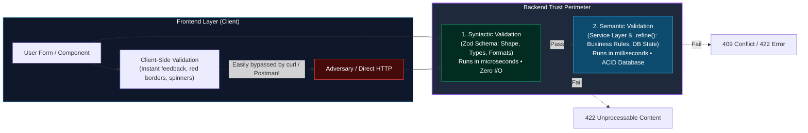
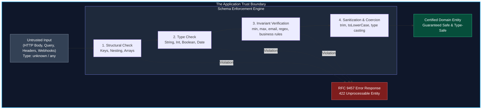
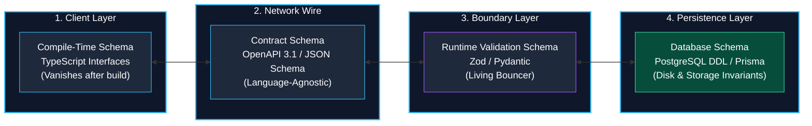
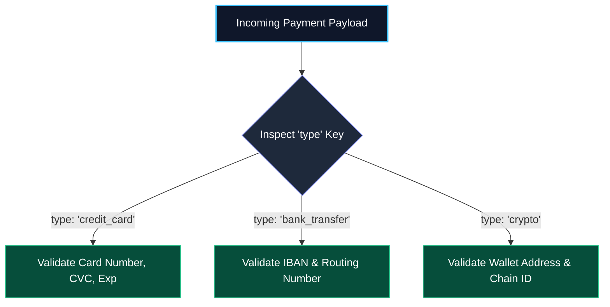

import { Callout } from 'fumadocs-ui/components/callout';
import { Tabs, Tab } from 'fumadocs-ui/components/tabs';
import { Steps, Step } from 'fumadocs-ui/components/steps';
import { Cards, Card } from 'fumadocs-ui/components/card';

TypeScript provides compile-time type safety. However, once your code is transpiled to JavaScript and deployed, **every TypeScript type disappears completely**.

When untrusted data enters your application—from an HTTP request body, URL query parameters, HTTP headers, cookies, webhook payloads, third-party API responses, or database records—the JavaScript engine sees raw, untyped memory.

To secure a modern system, you need a formal **schema architecture** and a runtime engine that enforces Alexis King's software engineering doctrine: **Parse, Don't Validate**.

---

## 1. The Core Philosophy: Syntactic vs. Semantic Validation

Before writing a single line of schema code, every full-stack engineer must internalize the core law of input validation:

> **"Frontend validation is for UX (instant feedback); Backend validation is for Security and Data Integrity."**



### Why Frontend Validation Alone is Zero Security
A client device (browser tab, iOS app, Android binary) operates entirely in untrusted territory. An attacker can:
- Open terminal and send a raw payload via `curl -X POST https://api.site.com/orders -d '{"price": -100}'`.
- Open Chrome DevTools, set a breakpoint before form submission, and mutate object properties.
- Decompile a mobile APK and patch out client-side validation logic.

Therefore, frontend validation exists solely to give legitimate users immediate, responsive UI feedback so they don't wait 200ms for a network round-trip just to learn they forgot an `@` sign in an email field. **The backend is the sovereign gatekeeper where data validation is mandatory.**

---

### The Two Validation Spheres: Syntactic vs. Semantic

Every input undergoes validation in two fundamentally distinct phases:

| Dimension | Syntactic Validation | Semantic Validation |
| :--- | :--- | :--- |
| **Definition** | Verifies the **form, shape, and structure** of the data. | Verifies the **meaning, business logic, and real-world truth** of the data. |
| **Questions Asked** | • Is `age` a number?<br/>• Is `email` a valid RFC format?<br/>• Is `tags` an array of strings?<br/>• Is `password` at least 12 characters? | • Does this email already exist in the database?<br/>• Does the bank account have sufficient balance?<br/>• Is the requested hotel room available on those dates?<br/>• Is the user authorized to invite members to this workspace? |
| **Execution Layer** | Application perimeter (Zod, Pydantic, route middleware). | Domain / Service Layer, Database transactions, and Zod `.refine()` / `.superRefine()`. |
| **Performance** | **Microseconds** (CPU memory check only, zero network or disk I/O). | **Milliseconds** (Queries database, acquires row locks, evaluates external APIs). |
| **HTTP Response** | `422 Unprocessable Content` (or `400 Bad Request`). | `409 Conflict`, `422 Unprocessable Content`, or `403 Forbidden`. |

By handling **Syntactic Validation** at the perimeter with Zod, you guarantee that malicious, malformed, or oversized payloads are rejected immediately before they ever consume database connection pool slots or trigger expensive SQL queries.

---

## 2. What is a Schema? The Blueprint of Modern Systems

The word **schema** originates from the Greek *skhēma* (σχῆμα), meaning "form, shape, or plan." 

In computer science and software architecture:

> **A Schema is an authoritative, formal specification that defines the structure, data types, constraints, relationships, and invariants that valid data must satisfy.**

Think of a schema as:
1. **An Architectural Blueprint**: Before constructing a skyscraper, engineers draw exact schematics. You cannot pour concrete where a window is scheduled to exist.
2. **A Legal Contract**: A binding agreement between two sovereign systems (e.g., frontend client and backend microservice) declaring what data is acceptable and what will be rejected.
3. **A Customs Border Inspection**: Raw inputs arriving from external networks must be declared, inspected, stripped of contraband, and certified before being granted access to your internal domain memory.



### The 4 Pillars of Every Schema

Every robust schema performs four distinct responsibilities:

| Pillar | Responsibility | Example |
| :--- | :--- | :--- |
| **1. Shape** | Declares the structural topology of the data: object keys, array lengths, and nested hierarchies. | A user must have an `address` object with `street`, `city`, and `zipCode`. |
| **2. Types** | Enforces the primitive or composite memory type. | `age` must be an integer; `isActive` must be a boolean; `tags` must be an array of strings. |
| **3. Invariants** | Enforces domain-specific boundary constraints and business rules that types alone cannot express. | `age >= 18`, `email` must match RFC 5322 regex, `confirmPassword === password`. |
| **4. Sanitization** | Normalizes and transforms messy external inputs into canonical internal representations. | Stripping whitespace (`trim()`), normalizing emails (`toLowerCase()`), casting query strings (`coerce.number()`). |

---

## 3. The 4 Schemas in Full-Stack Architecture

A common misconception among early-career engineers is conflating database schemas, API schemas, and validation schemas. In enterprise software, data moves across four distinct schema layers:



### Comparative Breakdown: The 4 Schema Layers

| Schema Layer | Technology | When It Executes | Primary Duty | What Happens When Violated |
| :--- | :--- | :--- | :--- | :--- |
| **1. Compile-Time Static Schema** | TypeScript (`interface`, `type`), Rust structs | During developer edit/build time | IDE auto-complete, compile-time safety, developer DX | Build fails; zero impact on running server |
| **2. API Wire Contract** | OpenAPI 3.1, JSON Schema, GraphQL SDL, Protobuf | Design & documentation time | Inter-team contract, SDK generation, API gateways | Client calls wrong URL or sends malformed payloads |
| **3. Runtime Validation Schema** | **Zod**, Pydantic, Yup, Joi | At runtime inside CPU memory | Inspects untrusted bytes, enforces rules, sanitizes data | Returns HTTP 422 Unprocessable Entity with error details |
| **4. Persistence Schema** | PostgreSQL DDL, MySQL, Prisma, Drizzle | Disk write & transaction execution | Enforces primary/foreign keys, uniqueness, storage constraints | Throws DB error; causes transaction rollback |

### The "Transpilation Amnesia" Problem

Why can't we rely solely on TypeScript interfaces for API validation?

Consider this TypeScript handler:

```typescript
// ❌ FALSE SENSE OF SECURITY: TypeScript types vanish at runtime!
interface CreateUserInput {
  email: string;
  age: number;
}

app.post('/users', (req, res) => {
  // Developer thinks req.body is CreateUserInput:
  const user: CreateUserInput = req.body; 

  // In reality, an attacker sends: { "email": 12345, "isAdmin": true }
  // When transpiled to JS, "interface CreateUserInput" is DELETED.
  // JavaScript executes:
  db.insert(user.email.toLowerCase()); // CRASH: TypeError: user.email.toLowerCase is not a function!
});
```

Because TypeScript undergoes **type erasure**, the compiled JavaScript code contains zero type checks. Without a runtime schema, untrusted input will either crash your process or cause security vulnerabilities such as SQL injection, prototype pollution, or mass-assignment escalation.

---

## 4. "Parse, Don't Validate": Alexis King's Doctrine

In traditional software design, developers write validation functions:

```typescript
// ❌ TRADITIONAL VALIDATION: Returns boolean, forces unsafe type assertion
function isValidUser(input: unknown): boolean {
  if (typeof input !== 'object' || input === null) return false;
  // Tedious manual checks...
  return true;
}

if (isValidUser(req.body)) {
  // Fragile type cast: compiler takes your word for it, but types can drift!
  const user = req.body as User; 
}
```

In 2019, type theorist Alexis King formalized the paradigm **Parse, Don't Validate**:

1. **Validation**: Inspects data, returns a boolean flag (`true`/`false`), and throws the knowledge away. The developer must manually cast the type.
2. **Parsing**: Takes raw, unstructured input (`unknown`), verifies its shape, transforms it into a canonical representation, and returns an authentic, strongly-typed domain model. You cannot access the data without proving it passed through the parser.

Zod is the de facto implementation of this philosophy in the TypeScript ecosystem.

---

## 5. Why Zod? The TypeScript-First Revolution

Before Zod, libraries like **Joi** and **Yup** dominated the Node.js ecosystem. However, they were engineered for vanilla JavaScript. Using them in TypeScript required declaring both a TypeScript interface and a validation schema, causing painful code duplication and type drift:

```typescript
// ❌ PRE-ZOD ERA: Duplication & Drift
interface User {
  name: string;
  age: number;
}

const userSchema = yup.object({
  name: yup.string().required(),
  age: yup.number().required(), // If you change User without changing yup, bugs emerge!
});
```

### Zod's Core Innovations

1. **TypeScript-First**: You write the schema once. TypeScript automatically infers the static type using `z.infer<typeof Schema>`.
2. **Zero Dependencies**: Pure TypeScript with no external dependencies; safe for edge runtimes (Cloudflare Workers, Vercel Edge).
3. **Composable & Immutable**: Every method returns a fresh schema; schemas can be extended, merged, picked, omitted, or piped.
4. **Comprehensive Coercion & Transformations**: Seamlessly cleans up query parameters, form data, and HTTP payloads.
5. **Ecosystem Standard**: The default validation layer for tRPC, React Hook Form, Next.js Server Actions, Drizzle ORM, and AI LLM tool-calling.

---

## 6. Zod Primitives & The Core Type System

Zod can model almost any JavaScript value. Below is the complete primitive type landscape:

```typescript
import { z } from 'zod';

// ==========================================
// 1. Primitive Types
// ==========================================
const stringSchema    = z.string();     // string
const numberSchema    = z.number();     // number
const booleanSchema   = z.boolean();    // boolean
const bigintSchema    = z.bigint();     // bigint
const dateSchema      = z.date();       // Date instance
const symbolSchema    = z.symbol();     // symbol

// ==========================================
// 2. Empty & Nullable Values
// ==========================================
const undefinedSchema = z.undefined();  // undefined
const nullSchema      = z.null();       // null
const voidSchema      = z.void();       // undefined (for function return values)

// ==========================================
// 3. Wildcards & Bottom Types
// ==========================================
const anySchema       = z.any();        // any (disables type checking)
const unknownSchema   = z.unknown();    // unknown (requires narrowing)
const neverSchema     = z.never();      // never (represents impossible states)

// ==========================================
// 4. Literal Types (Exact Value Matching)
// ==========================================
const methodPost      = z.literal('POST');
const httpOk          = z.literal(200);
const flagActive      = z.literal(true);

// ==========================================
// 5. Enums (String Enums vs Native Enums)
// ==========================================
// Preferred: String Array Enum (Zero runtime overhead, native types)
export const RoleEnum = z.enum(['admin', 'member', 'guest']);
export type Role = z.infer<typeof RoleEnum>; // 'admin' | 'member' | 'guest'

// Access enum options programmatically:
console.log(RoleEnum.options); // ['admin', 'member', 'guest']
console.log(RoleEnum.enum.admin); // 'admin'

// Native TypeScript Enum support (when integrating legacy codebases)
enum LegacyStatus {
  Draft = 'DRAFT',
  Published = 'PUBLISHED',
  Archived = 'ARCHIVED',
}
const StatusSchema = z.nativeEnum(LegacyStatus);
```

---

## 7. The Validation Engine: String & Number Rules

Zod provides an expressive fluent API for validating string formats, numbers, and boundary limits:

### String Constraint Arsenal

```typescript
const ComprehensiveStringSchema = z
  .string({
    required_error: "String field is required",
    invalid_type_error: "Expected string, received other type",
  })
  // Length validations
  .min(5, { message: "Must be at least 5 characters long" })
  .max(100, { message: "Cannot exceed 100 characters" })
  .length(10, { message: "Must be exactly 10 characters" })

  // Common internet formats
  .email({ message: "Invalid email address format" })
  .url({ message: "Must be a valid HTTP/HTTPS URL" })
  .emoji({ message: "Must contain only emoji characters" })
  
  // Unique identifiers
  .uuid({ message: "Must be a valid RFC 4122 UUID" })
  .nanoid({ message: "Must be a valid NanoID" })
  .cuid({ message: "Must be a valid CUID" })
  .cuid2({ message: "Must be a valid CUID2" })
  .ulid({ message: "Must be a valid ULID" })

  // Patterns & Substrings
  .regex(/^[A-Z0-9]+$/, { message: "Alphanumeric uppercase only" })
  .startsWith("usr_", { message: "User prefix 'usr_' required" })
  .endsWith(".pdf", { message: "File must be a PDF" })
  .includes("@company.com", { message: "Internal company emails only" })

  // Dates & Networking
  .datetime({ message: "Must be an ISO 8601 UTC datetime string" })
  .ip({ version: "v4", message: "Must be an IPv4 address" })
  .base64({ message: "Must be a valid Base64 string" })

  // Built-in String Transformations (Sanitization)
  .trim()          // Removes leading and trailing whitespace
  .toLowerCase()   // Normalizes string to lowercase
  .toUpperCase();  // Normalizes string to uppercase
```

### Number Constraint Arsenal

```typescript
const ComprehensiveNumberSchema = z
  .number({ invalid_type_error: "Must be a numeric value" })
  // Comparison constraints
  .gt(0, { message: "Must be greater than 0" })
  .gte(18, { message: "Must be 18 or older" })
  .lt(100, { message: "Must be strictly less than 100" })
  .lte(99, { message: "Must be 99 or less" })
  
  // Characteristics
  .int({ message: "Must be an integer, no floats allowed" })
  .positive({ message: "Must be strictly positive (> 0)" })
  .nonnegative({ message: "Must be >= 0" })
  .negative({ message: "Must be strictly negative (< 0)" })
  .nonpositive({ message: "Must be <= 0" })
  
  // Mathematical properties
  .multipleOf(5, { message: "Must be a multiple of 5 (e.g., 5, 10, 15)" })
  .finite({ message: "Must be a finite number (no Infinity)" })
  .safe({ message: "Must fit within Number.MIN_SAFE_INTEGER and MAX_SAFE_INTEGER" });
```

---

## 8. Structural Schemas: Objects, Arrays, Tuples & Maps

### 1. Objects & Defense Modes

In JavaScript APIs, **mass-assignment vulnerabilities** happen when malicious clients send extra properties (e.g. `{ "isAdmin": true }`) that get written directly to the database.

Zod gives you three distinct modes to control unexpected keys:

```typescript
const BaseUserSchema = z.object({
  username: z.string().min(3),
  email: z.string().email(),
});

// MODE 1: .strip() (DEFAULT)
// Silently drops unlisted keys. Input: { username: "alex", email: "a@a.com", isAdmin: true }
// Output: { username: "alex", email: "a@a.com" }
const StripSchema = BaseUserSchema; 

// MODE 2: .strict() (RECOMMENDED FOR REST APIs)
// Fails validation with an error if ANY unrecognized key is sent!
const StrictSchema = BaseUserSchema.strict();

// MODE 3: .passthrough()
// Retains unlisted keys without validating them.
const PassthroughSchema = BaseUserSchema.passthrough();

// MODE 4: .catchall()
// Validates all unexpected keys against a dedicated schema.
const DynamicMetadataSchema = BaseUserSchema.catchall(z.string());
// Any unexpected key must have a string value!
```

### 2. Object Schema Manipulation Matrix

Never duplicate schemas. Compose, extend, and slice existing schemas:

```typescript
const ProductSchema = z.object({
  id: z.string().uuid(),
  title: z.string().min(1),
  price: z.number().positive(),
  description: z.string().optional(),
  createdAt: z.date(),
});

// 1. .extend() - Add new fields or override existing ones
const PhysicalProductSchema = ProductSchema.extend({
  weightKg: z.number().positive(),
  dimensions: z.object({ length: z.number(), width: z.number(), height: z.number() }),
});

// 2. .merge() - Combine two independent schemas
const AuditSchema = z.object({ updatedBy: z.string(), version: z.number() });
const AuditedProductSchema = ProductSchema.merge(AuditSchema);

// 3. .pick() - Keep ONLY specified keys (great for GET list projections)
const ProductSummarySchema = ProductSchema.pick({ id: true, title: true, price: true });

// 4. .omit() - Exclude sensitive or auto-generated keys (great for POST creation)
const CreateProductSchema = ProductSchema.omit({ id: true, createdAt: true });

// 5. .partial() - Make all top-level keys optional (perfect for HTTP PATCH)
const UpdateProductSchema = CreateProductSchema.partial();

// 6. .deepPartial() - Recursively makes all nested objects optional
const DeepUpdateSchema = PhysicalProductSchema.deepPartial();

// 7. .required() - Reverses .partial(), making all optional keys required
const StrictProductSchema = UpdateProductSchema.required();
```

### 3. Arrays, Tuples, Records, Sets & Maps

```typescript
// ARRAYS
const TagListSchema = z.array(z.string().min(1))
  .nonempty({ message: "Must provide at least one tag" })
  .min(1)
  .max(10);
// Equivalent shorthand: z.string().array()

// TUPLES: Fixed-length arrays with position-specific types (e.g., GeoJSON [longitude, latitude])
const CoordinatesSchema = z.tuple([
  z.number().min(-180).max(180), // Longitude
  z.number().min(-90).max(90),   // Latitude
]).rest(z.number()); // Optional rest elements (e.g. altitude)

// RECORDS: Dynamic key-value pairs (TypeScript: Record<string, number>)
const InventoryCounts = z.record(z.string(), z.number().int().nonnegative());
// Constrained keys:
const RegionalSales = z.record(z.enum(['NA', 'EU', 'APAC']), z.number());

// SETS & MAPS
const UniqueIdSet = z.set(z.string().uuid()).min(1);
const CacheStore = z.map(z.string(), z.date());
```

---

## 9. Nullability, Optionals, Defaults & Fallbacks

Handling absent, missing, or null data requires precise semantics:

| Method | Accepts | Inferred TypeScript Type |
| :--- | :--- | :--- |
| `z.string()` | `"hello"` | `string` |
| `z.string().optional()` | `"hello"`, `undefined` | `string \| undefined` |
| `z.string().nullable()` | `"hello"`, `null` | `string \| null` |
| `z.string().nullish()` | `"hello"`, `null`, `undefined` | `string \| null \| undefined` |
| `z.string().default("draft")` | `"hello"`, `undefined` | `string` (defaults to `"draft"`) |
| `z.string().catch("fallback")` | *Anything* (catches errors) | `string` (returns `"fallback"`) |

### `.default()` vs `.catch()`

```typescript
// .default() ONLY fires when the input is undefined
const RoleWithDefault = z.enum(['admin', 'member']).default('member');
RoleWithDefault.parse(undefined); // => 'member'
RoleWithDefault.parse('invalid');   // ❌ Throws ZodError!

// .catch() NEVER throws an error! If validation fails, it catches and returns fallback:
const ResilientThemeSchema = z.enum(['light', 'dark']).catch('light');
ResilientThemeSchema.parse('invalid_string'); // => 'light' (Zero exceptions thrown!)
```

<Callout type="tip" title="When to Use .catch()">
Use `.catch()` when parsing third-party analytics webhooks, user preferences from corrupted cookies, or feature flags where you prefer falling back to a safe default over failing the entire HTTP request.
</Callout>

---

## 10. Coercion, Preprocessing & Schema Pipelines (`.pipe()`)

### 1. `z.coerce` for HTTP Query Strings & Forms

HTTP is a text-based protocol. When receiving data from HTML `FormData`, URL query parameters (`req.query`), or route parameters (`req.params`), **every value arrives as a string**:

```typescript
const QueryFilterSchema = z.object({
  page: z.coerce.number().int().positive().default(1),
  limit: z.coerce.number().int().min(1).max(100).default(20),
  includeArchived: z.coerce.boolean().default(false),
  startDate: z.coerce.date().optional(),
});

// URL: /api/orders?page=2&limit=50&includeArchived=false&startDate=2026-01-01
const query = QueryFilterSchema.parse(req.query);
// query.page -> 2 (number)
// query.startDate -> Date object
```

<Callout type="error" title="The JavaScript Boolean Coercion Trap">
In vanilla JavaScript, `Boolean("false")` evaluates to `true` because any non-empty string is truthy! 
`z.coerce.boolean()` evaluates `Boolean(val)`. Therefore, `z.coerce.boolean().parse("false")` yields **`true`**!

To safely parse boolean query strings, use `z.preprocess`:
```typescript
const SafeQueryBoolean = z.preprocess((val) => {
  if (typeof val === 'string') {
    if (val.toLowerCase() === 'true' || val === '1') return true;
    if (val.toLowerCase() === 'false' || val === '0') return false;
  }
  return val;
}, z.boolean());
```
</Callout>

### 2. Schema Pipelines (`.pipe()`)

A pipeline chains two schemas: the output of Schema A is piped into the input of Schema B:

```typescript
// Step 1: Parse string into JSON object
// Step 2: Pipe the resulting object through a strict User schema
const JsonStringUserSchema = z
  .string()
  .transform((str, ctx) => {
    try {
      return JSON.parse(str);
    } catch {
      ctx.addIssue({ code: z.ZodIssueCode.custom, message: "Invalid JSON format" });
      return z.NEVER;
    }
  })
  .pipe(
    z.object({
      userId: z.string().uuid(),
      preferences: z.record(z.string(), z.boolean()),
    })
  );

// Input is a raw JSON string (e.g. from a cookie or header):
const result = JsonStringUserSchema.parse('{"userId":"123e4567-e89b-12d3-a456-426614174000","preferences":{"darkMode":true}}');
```

---

## 11. Advanced Polymorphism: Unions & Discriminated Unions

When handling polymorphic entities (such as multi-vendor payment gateways, event logs, or webhook payloads), the data schema depends on a discriminator key.



### Standard Union vs Discriminated Union

```typescript
// ❌ SLOW & CONFUSING ERRORS: z.union() is O(N) trial-and-error
// Zod tests Option 1. Fails. Tests Option 2. Fails. Produces merged, confusing error messages.
const SlowPaymentUnion = z.union([CreditCardSchema, BankSchema, CryptoSchema]);

//  LIGHTNING FAST & PRECISE: z.discriminatedUnion() is O(1)
// Zod reads the "type" key directly and validates ONLY against that branch.
export const PaymentPayloadSchema = z.discriminatedUnion("type", [
  z.object({
    type: z.literal("credit_card"),
    cardNumber: z.string().regex(/^\d{16}$/, "Must be 16 digits"),
    cvc: z.string().regex(/^\d{3,4}$/),
    expMonth: z.number().int().min(1).max(12),
    expYear: z.number().int().min(2026),
  }),
  z.object({
    type: z.literal("bank_transfer"),
    iban: z.string().min(15).max(34),
    routingNumber: z.string().length(9),
  }),
  z.object({
    type: z.literal("crypto"),
    walletAddress: z.string().startsWith("0x"),
    chainId: z.number().int().positive(),
  }),
]);

export type PaymentPayload = z.infer<typeof PaymentPayloadSchema>;
```

---

## 12. Recursive & Hierarchical Schemas (`z.lazy()`)

In document databases and tree-structured applications (such as nested comments, organizational trees, or file system directories), a schema must refer to itself. 

Because TypeScript cannot infer recursive types automatically, you must define the TypeScript interface explicitly and wrap the recursive schema in `z.lazy()`:

```typescript
// 1. Declare explicit recursive TypeScript interface
interface CategoryNode {
  id: string;
  name: string;
  subcategories?: CategoryNode[];
}

// 2. Define recursive Zod schema using z.lazy()
export const CategoryNodeSchema: z.ZodType<CategoryNode> = z.object({
  id: z.string().uuid(),
  name: z.string().min(1),
  subcategories: z.lazy(() => CategoryNodeSchema.array()).optional(),
});

// Example JSON tree:
const rootCategory = CategoryNodeSchema.parse({
  id: "e4eaaaf2-d142-11e1-b3e4-080027620cdd",
  name: "Electronics",
  subcategories: [
    {
      id: "e4eaaaf2-d142-11e1-b3e4-080027620cde",
      name: "Computers",
      subcategories: [
        { id: "e4eaaaf2-d142-11e1-b3e4-080027620cdf", name: "Laptops" },
      ],
    },
  ],
});
```

---

## 13. Custom Refinements & Contextual Issue Generation

When rules require cross-field validation or dynamic business logic:

### 1. Simple Refinement (`.refine()`)

```typescript
export const PasswordResetSchema = z.object({
  password: z.string().min(12, "Must be at least 12 characters"),
  confirmPassword: z.string(),
}).refine((data) => data.password === data.confirmPassword, {
  message: "Passwords do not match",
  path: ["confirmPassword"], // Attaches the error directly to confirmPassword!
});
```

### 2. Deep Contextual Issues (`.superRefine()`)

When a single validation check can produce multiple issues at different paths:

```typescript
export const DateRangeBookingSchema = z.object({
  checkIn: z.coerce.date(),
  checkOut: z.coerce.date(),
  guests: z.number().int().positive(),
}).superRefine((val, ctx) => {
  const now = new Date();
  
  if (val.checkIn < now) {
    ctx.addIssue({
      code: z.ZodIssueCode.custom,
      message: "Check-in date cannot be in the past",
      path: ["checkIn"],
    });
  }

  if (val.checkOut <= val.checkIn) {
    ctx.addIssue({
      code: z.ZodIssueCode.custom,
      message: "Check-out must be at least one day after check-in",
      path: ["checkOut"],
    });
  }

  const durationNights = (val.checkOut.getTime() - val.checkIn.getTime()) / (1000 * 3600 * 24);
  if (durationNights > 30) {
    ctx.addIssue({
      code: z.ZodIssueCode.custom,
      message: "Maximum stay duration is 30 nights",
      path: ["checkOut"],
    });
  }
});
```

### 3. Asynchronous Refinements (Database Uniqueness)

When validation requires querying an external database or microservice:

```typescript
export function makeRegistrationSchema(db: { isEmailTaken: (email: string) => Promise<boolean> }) {
  return z.object({
    username: z.string().min(3),
    email: z.string().email(),
  }).superRefine(async (data, ctx) => {
    const isTaken = await db.isEmailTaken(data.email);
    if (isTaken) {
      ctx.addIssue({
        code: z.ZodIssueCode.custom,
        message: "This email address is already registered",
        path: ["email"],
      });
    }
  });
}

// MUST invoke with .safeParseAsync() or .parseAsync()!
const result = await makeRegistrationSchema(db).safeParseAsync(req.body);
```

---

## 14. Error Engineering & RFC 9457 Standardization

When `.safeParse()` fails, `result.error` returns a `ZodError` containing an array of `ZodIssue` objects.

### 1. Navigating ZodError Formats

```typescript
const result = UserSchema.safeParse(invalidPayload);

if (!result.success) {
  // Option A: Raw array of issues
  console.log(result.error.issues);
  // [{ code: "too_small", minimum: 18, path: ["age"], message: "Too small" }]

  // Option B: Flattened field errors (Great for UI forms)
  console.log(result.error.flatten().fieldErrors);
  // { age: ["Too small"], email: ["Invalid email"] }

  // Option C: Formatted nested structure (Mirrors object hierarchy)
  console.log(result.error.format());
  // { age: { _errors: ["Too small"] } }
}
```

### 2. RFC 9457 Standard Error Formatter

Format Zod errors into RFC 9457 `application/problem+json` format for clean API consumption:

```typescript
import { ZodError } from 'zod';

export interface RFC9457ProblemDetails {
  type: string;
  title: string;
  status: number;
  detail: string;
  invalidParams: Array<{
    name: string;
    reason: string;
  }>;
}

export function formatZodToRFC9457(error: ZodError): RFC9457ProblemDetails {
  return {
    type: "https://api.example.com/errors/validation-failed",
    title: "Unprocessable Entity",
    status: 422,
    detail: "Your request parameters failed schema validation constraints.",
    invalidParams: error.issues.map((issue) => ({
      name: issue.path.join('.'),
      reason: issue.message,
    })),
  };
}
```

```json
// Formatted HTTP 422 Response Payload:
{
  "type": "https://api.example.com/errors/validation-failed",
  "title": "Unprocessable Entity",
  "status": 422,
  "detail": "Your request parameters failed schema validation constraints.",
  "invalidParams": [
    { "name": "email", "reason": "Invalid email address format" },
    { "name": "age", "reason": "Must be 18 or older" },
    { "name": "address.zipCode", "reason": "Must be a 5-digit ZIP code" }
  ]
}
```

### 3. Global Error Customization (`z.setErrorMap`)

Override default English Zod error messages globally (useful for internationalization or friendlier copy):

```typescript
const customErrorMap: z.ZodErrorMap = (issue, ctx) => {
  if (issue.code === z.ZodIssueCode.invalid_type) {
    if (issue.received === 'undefined') {
      return { message: 'This field is required and cannot be omitted.' };
    }
  }
  if (issue.code === z.ZodIssueCode.too_small && issue.type === 'string') {
    return { message: `Must contain at least ${issue.minimum} characters.` };
  }
  return { message: ctx.defaultError };
};

// Set globally across the entire application runtime
z.setErrorMap(customErrorMap);
```

---

## 15. Full-Stack Production Integration Patterns

<Tabs items={["Next.js Server Action", "Express Middleware", "React Hook Form", "AI / LLM Structured Output"]}>
  <Tab value="Next.js Server Action">
```typescript
'use server';

import { z } from 'zod';

const SubscribeSchema = z.object({
  email: z.string().email("Please provide a valid email address"),
});

export type ActionState = {
  success: boolean;
  errors?: Record<string, string[]>;
  message?: string;
};

export async function subscribeUser(
  prevState: ActionState,
  formData: FormData
): Promise<ActionState> {
  const rawData = Object.fromEntries(formData.entries());
  const parsed = SubscribeSchema.safeParse(rawData);

  if (!parsed.success) {
    return {
      success: false,
      errors: parsed.error.flatten().fieldErrors,
    };
  }

  // Safe, typed domain execution
  await db.newsletter.create({ data: { email: parsed.data.email } });

  return { success: true, message: "Subscribed successfully!" };
}
```
  </Tab>

  <Tab value="Express Middleware">
```typescript
import { Request, Response, NextFunction } from 'express';
import { AnyZodObject, ZodError } from 'zod';

export const validate = (schema: AnyZodObject) => {
  return async (req: Request, res: Response, next: NextFunction) => {
    try {
      const parsed = await schema.parseAsync({
        body: req.body,
        query: req.query,
        params: req.params,
      });

      // Replace untrusted inputs with parsed, coerced, sanitized values
      req.body = parsed.body;
      req.query = parsed.query;
      req.params = parsed.params;

      return next();
    } catch (err) {
      if (err instanceof ZodError) {
        return res.status(422).json(formatZodToRFC9457(err));
      }
      return next(err);
    }
  };
};

// Usage on routes:
// router.post('/orders', validate(CreateOrderSchema), handleCreateOrder);
```
  </Tab>

  <Tab value="React Hook Form">
```tsx
import React from 'react';
import { useForm } from 'react-hook-form';
import { zodResolver } from '@hookform/resolvers/zod';
import { z } from 'zod';

const ContactSchema = z.object({
  fullName: z.string().min(2, "Name must be at least 2 characters"),
  email: z.string().email("Invalid email address"),
  message: z.string().min(10, "Message must be at least 10 characters"),
});

type ContactFormData = z.infer<typeof ContactSchema>;

export function ContactForm() {
  const {
    register,
    handleSubmit,
    formState: { errors, isSubmitting },
  } = useForm<ContactFormData>({
    resolver: zodResolver(ContactSchema),
  });

  const onSubmit = async (data: ContactFormData) => {
    await fetch('/api/contact', {
      method: 'POST',
      headers: { 'Content-Type': 'application/json' },
      body: JSON.stringify(data),
    });
  };

  return (
    <form onSubmit={handleSubmit(onSubmit)} className="space-y-4">
      <div>
        <input {...register("fullName")} placeholder="Full Name" className="border p-2 rounded w-full" />
        {errors.fullName && <p className="text-red-500 text-sm">{errors.fullName.message}</p>}
      </div>

      <div>
        <input {...register("email")} placeholder="Email" className="border p-2 rounded w-full" />
        {errors.email && <p className="text-red-500 text-sm">{errors.email.message}</p>}
      </div>

      <div>
        <textarea {...register("message")} placeholder="Message" className="border p-2 rounded w-full" />
        {errors.message && <p className="text-red-500 text-sm">{errors.message.message}</p>}
      </div>

      <button type="submit" disabled={isSubmitting} className="bg-blue-600 text-white px-4 py-2 rounded">
        {isSubmitting ? "Submitting..." : "Send Message"}
      </button>
    </form>
  );
}
```
  </Tab>

  <Tab value="AI / LLM Structured Output">
```typescript
import { GoogleGenAI, Type } from '@google/genai';
import { z } from 'zod';
import { zodToJsonSchema } from 'zod-to-json-schema';

// 1. Define strict Zod schema for LLM structured extraction
export const RecipeSchema = z.object({
  title: z.string(),
  cookingMinutes: z.number().int().positive(),
  difficulty: z.enum(['easy', 'medium', 'hard']),
  ingredients: z.array(z.object({
    name: z.string(),
    amount: z.string(),
  })),
  instructions: z.array(z.string().min(5)),
});

// 2. Convert to standard JSON Schema for the AI model:
const jsonSchema = zodToJsonSchema(RecipeSchema);

// 3. Guarantee 100% deterministic, structured JSON output from Gemini / OpenAI:
// The LLM guarantees its output complies directly with your Zod schema!
```
  </Tab>
</Tabs>

---

## 16. The Cross-Language Schema Pipeline: OpenAPI 3.1, Pydantic V2 & Zod

In multi-language microservice architectures, runtime validation does not exist in isolation. High-velocity engineering teams define **single-source-of-truth contracts** that synchronize frontend, backend, and documentation across language boundaries:

```mermaid
flowchart TD
    subgraph Ecosystem["The Cross-Language Schema Pipeline"]
        direction TB
        OpenAPI["1. OpenAPI 3.1 Specification<br/>Language-Agnostic JSON Schema Contract (RFC 0000)"]
        
        Pydantic["2. Python: Pydantic V2<br/>FastAPI reads type hints &rarr; Auto-generates OpenAPI docs"]
        Zod["3. TypeScript: Zod<br/>Frontend & Next.js validate forms & API route payloads"]
        
        OpenAPI -->|Code Generation| Zod
        Pydantic -->|Export Spec| OpenAPI
        Zod -->|@asteasolutions/zod-to-openapi| OpenAPI
    end

    style Ecosystem fill:#0f172a,stroke:#38bdf8,stroke-width:2px,color:#ffffff
    style OpenAPI fill:#1e293b,stroke:#38bdf8,stroke-width:1px,color:#ffffff
    style Pydantic fill:#064e3b,stroke:#34d399,stroke-width:1px,color:#ffffff
    style Zod fill:#1e293b,stroke:#a855f7,stroke-width:1px,color:#ffffff
```

### The "Rosetta Stone": Defining the Same Resource Across Tools

Examine how the exact same `UserRegistration` schema (UUID, lowercased email, age $\ge 18$, role enum) is declared across all three dominant standards:

<Tabs items={["TypeScript (Zod)", "Python (Pydantic V2)", "Language-Agnostic (OpenAPI 3.1 YAML)"]}>
  <Tab value="TypeScript (Zod)">
```typescript
import { z } from 'zod';

export const UserRegistrationSchema = z.object({
  id: z.string().uuid(),
  email: z.string().email().toLowerCase().trim(),
  age: z.number().int().min(18),
  role: z.enum(['admin', 'member', 'viewer']).default('member'),
});

// Inferred compile-time type
export type UserRegistration = z.infer<typeof UserRegistrationSchema>;
```
  </Tab>

  <Tab value="Python (Pydantic V2)">
```python
from pydantic import BaseModel, EmailStr, Field
from enum import Enum
from uuid import UUID

class RoleEnum(str, Enum):
    ADMIN = "admin"
    MEMBER = "member"
    VIEWER = "viewer"

class UserRegistration(BaseModel):
    id: UUID
    email: EmailStr
    age: int = Field(ge=18, description="Must be an adult")
    role: RoleEnum = RoleEnum.MEMBER

    model_config = {
        "str_strip_whitespace": True,
        "str_to_lower": True
    }
```
  </Tab>

  <Tab value="Language-Agnostic (OpenAPI 3.1 YAML)">
```yaml
components:
  schemas:
    UserRegistration:
      type: object
      required:
        - id
        - email
        - age
      properties:
        id:
          type: string
          format: uuid
        email:
          type: string
          format: email
        age:
          type: integer
          minimum: 18
        role:
          type: string
          enum: [admin, member, viewer]
          default: member
```
  </Tab>
</Tabs>

#### Comparative Architectural Matrix

| Dimension | OpenAPI 3.1 | Pydantic V2 (Python) | Zod (TypeScript) |
| :--- | :--- | :--- | :--- |
| **Primary Role** | Language-neutral API contract & docs | Runtime Python data parsing & validation | Runtime JavaScript/TypeScript validation |
| **Execution Engine** | Specification only (No runtime) | C-speed Rust Core (`pydantic-core`) | Native V8 JavaScript runtime |
| **Static Types** | N/A (generates types via CLI) | Native Python type annotations | Inferred TypeScript types (`z.infer`) |
| **Frameworks** | Swagger UI, Redoc, Postman | FastAPI, Django Ninja, LangChain | Next.js, tRPC, React Hook Form |
| **Ecosystem Bridge** | The universal central hub | Automatically outputs OpenAPI `/openapi.json` | Exports to OpenAPI via `zod-to-openapi` |

---

## 17. Performance Best Practices in Production

1. **Instantiate Schemas Outside Request Handlers**: Creating a Zod schema allocates internal parser functions. Define schemas as top-level module constants, never inside `app.post(...)` or component render bodies.
2. **Favor `.safeParse()` Over `.parse()`**: Catching JavaScript exceptions incurs expensive V8 stack trace generation. `.safeParse()` returns a lightweight discriminated union (`{ success: true, data } | { success: false, error }`) with zero runtime exception overhead.
3. **Prefer `z.discriminatedUnion()` Over `z.union()`**: Standard unions evaluate all possibilities in $O(N)$ time. Discriminated unions index directly on the discriminator key in $O(1)$ time.
4. **Use `.strict()` on Public Write Endpoints**: Defend against mass-assignment attacks by rejecting unrecognized parameters outright on public mutation endpoints.

---

## 18. Summary & Next Steps

Runtime schema enforcement bridges the gap between TypeScript's compile-time guarantees and the raw, untrusted reality of incoming HTTP network requests. By mastering Zod's primitives, object compositions, refinements, and error formatters, you ensure that invalid inputs are stopped at the perimeter before reaching internal business logic.

Next, learn how to safeguard server secrets and enforce environment variable integrity at build time:
Proceed to **[Environment Variable Validation with @t3-oss/env-core & Zod](/docs/full-stack-development/api-design/03-environment-configuration)**.
