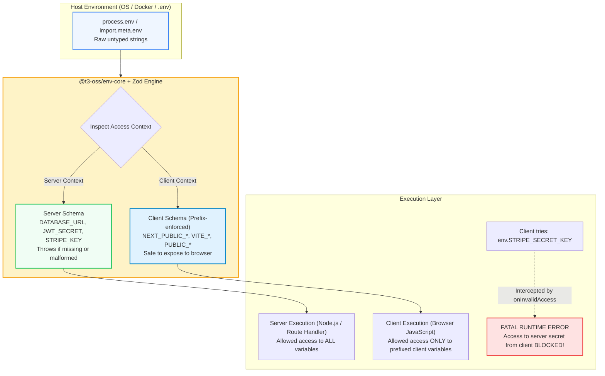

import { Callout } from 'fumadocs-ui/components/callout';
import { Tabs, Tab } from 'fumadocs-ui/components/tabs';
import { Steps, Step } from 'fumadocs-ui/components/steps';
import { Cards, Card } from 'fumadocs-ui/components/card';

According to the third rule of the **Twelve-Factor App methodology**, application configuration must be decoupled from code and injected dynamically via environment variables (`process.env`).

However, standard Node.js and browser runtimes treat environment variables as untyped global strings (`Record<string, string | undefined>`). In unhardened codebases, this creates two catastrophic failure modes:

1. **The Silent Runtime Crash**: An engineer deploys to production having forgotten to configure `DATABASE_URL`. The build succeeds, the server boots, and 20 minutes later the application crashes when the first customer triggers a database query.
2. **The Client Secret Leak**: A developer references `process.env.STRIPE_SECRET_KEY` or `process.env.AWS_SECRET_ACCESS_KEY` inside a client-side component. Modern bundlers (Webpack, Vite, Turbopack) inadvertently inline the secret into the public JavaScript bundle, exposing root infrastructure credentials in browser DevTools.

Using **`@t3-oss/env-core`** paired with **Zod**, you can achieve **fail-fast build validation** and **strict cryptographic separation between server secrets and client variables**.

---

## 1. Architectural Architecture: The T3 Env Model

Developed by the open-source T3 OSS team, `@t3-oss/env-core` introduces a compile-time and runtime firewall between server-only and client-exposed variables:



---

## 2. Installation & Setup

Install `@t3-oss/env-core` and `zod` as production dependencies:

```bash
npm install @t3-oss/env-core zod
```

If you are using Next.js specifically, you can alternatively install the Next.js wrapper:

```bash
npm install @t3-oss/env-nextjs zod
```

---

## 3. Core Configuration: The `env.ts` Contract

Create a dedicated environment definition file (e.g. `src/env.ts` or `env.mjs`). This file acts as the single authoritative source of truth for all configuration in your application:

```typescript
// src/env.ts
import { createEnv } from '@t3-oss/env-core';
import { z } from 'zod';

export const env = createEnv({
  /*
   * 1. Server-Only Environment Variables
   * Accessible only in Node.js / server runtimes. Never exposed to browsers.
   */
  server: {
    NODE_ENV: z.enum(['development', 'test', 'staging', 'production']).default('development'),
    PORT: z.coerce.number().int().positive().default(3000),
    DATABASE_URL: z.string().url({ message: "DATABASE_URL must be a valid PostgreSQL connection URI" }),
    JWT_SECRET: z.string().min(32, { message: "JWT_SECRET must be at least 32 characters long" }),
    REDIS_URL: z.string().url().default("redis://localhost:6379"),
    CORS_ALLOWED_ORIGINS: z
      .string()
      .default("http://localhost:3000")
      .transform((val) => val.split(',').map((origin) => origin.trim())),
  },

  /*
   * 2. Client-Exposed Environment Variables
   * Must begin with your configured clientPrefix (e.g. PUBLIC_, NEXT_PUBLIC_, VITE_)
   */
  clientPrefix: 'PUBLIC_',
  client: {
    PUBLIC_API_URL: z.string().url(),
    PUBLIC_APP_NAME: z.string().min(1).default("TravelBuddy"),
  },

  /*
   * 3. Runtime Environment Mapping
   * The actual dictionary containing your process environment variables.
   */
  runtimeEnv: process.env,

  /*
   * 4. Empty Strings as Undefined
   * Transforms empty strings ("") into undefined before validation.
   */
  emptyStringAsUndefined: true,

  /*
   * 5. Skip Validation in CI/CD Builds
   * Bypasses validation during Docker builds when production credentials are not injected.
   */
  skipValidation: !!process.env.SKIP_ENV_VALIDATION,
});
```

---

## 4. Deep-Dive: Core Configuration Options

### 1. `emptyStringAsUndefined: true`
Hosting providers and container orchestrators (such as Vercel, Docker, Render, and Kubernetes) frequently inject empty strings (`""`) into `process.env` when an optional environment variable is left blank.

By default, Zod does not treat `""` as `undefined`, which means:
- `z.string().optional().parse("")` results in `""` instead of `undefined`.
- `z.string().default("3000").parse("")` keeps `""` rather than applying `"3000"`.

Setting `emptyStringAsUndefined: true` automatically converts any empty string into `undefined`, allowing Zod defaults and optional constraints to trigger correctly.

### 2. `skipValidation: !!process.env.SKIP_ENV_VALIDATION`
During automated CI/CD pipeline steps—such as running `docker build .` or running unit tests in GitHub Actions—your build container may not have access to production database credentials or third-party API keys.

By binding `skipValidation` to `process.env.SKIP_ENV_VALIDATION`, your build steps can complete compilation without crashing, while actual runtime startups still strictly enforce valid credentials.

### 3. Client Secret Leak Prevention
If code executing in a client-side context attempts to read a server variable:

```typescript
// Inside a client-side React component:
import { env } from '@/env';

export function UserBadge() {
  // CRITICAL ATTEMPT: Reading server secret on client
  console.log(env.JWT_SECRET); 
}
```

`@t3-oss/env-core` intercepts this access via a Proxy and immediately throws a fatal runtime exception:

```text
Error: ❌ Attempted to access a server-side environment variable on the client: JWT_SECRET
```

---

## 5. Multi-Framework Production Recipes

<Tabs items={["Node.js / Express Backend", "Vite Frontend (SPA)", "Next.js App Router"]}>
  <Tab value="Node.js / Express Backend">
```typescript
// server/src/env.ts
import { createEnv } from '@t3-oss/env-core';
import { z } from 'zod';
import dotenv from 'dotenv';

// Load .env file into process.env before validation
dotenv.config();

export const env = createEnv({
  server: {
    NODE_ENV: z.enum(['development', 'production', 'test']).default('development'),
    PORT: z.coerce.number().default(4000),
    DATABASE_URL: z.string().url(),
    SESSION_SECRET: z.string().min(32),
  },
  runtimeEnv: process.env,
  emptyStringAsUndefined: true,
  onValidationError: (error) => {
    console.error('❌ Invalid environment variables:');
    console.error(JSON.stringify(error.flatten().fieldErrors, null, 2));
    process.exit(1); // Terminate process immediately on boot failure
  },
});

// server/src/index.ts
import express from 'express';
import { env } from './env'; // Boot validation runs immediately on import!

const app = express();

app.listen(env.PORT, () => {
  console.log(`🚀 Server listening on port ${env.PORT} in ${env.NODE_ENV} mode`);
});
```
  </Tab>

  <Tab value="Vite Frontend (SPA)">
```typescript
// src/env.ts
import { createEnv } from '@t3-oss/env-core';
import { z } from 'zod';

export const env = createEnv({
  clientPrefix: 'VITE_',
  client: {
    VITE_API_BASE_URL: z.string().url(),
    VITE_ANALYTICS_ID: z.string().min(1).optional(),
    VITE_ENABLE_DEBUG_LOGS: z
      .enum(['true', 'false'])
      .default('false')
      .transform((v) => v === 'true'),
  },
  // In Vite, environment variables reside on import.meta.env
  runtimeEnv: import.meta.env,
  emptyStringAsUndefined: true,
});

// src/api/client.ts
import { env } from '../env';

export async function fetchUsers() {
  const response = await fetch(`${env.VITE_API_BASE_URL}/v1/users`);
  return await response.json();
}
```
  </Tab>

  <Tab value="Next.js App Router">
```typescript
// src/env.mjs
import { createEnv } from '@t3-oss/env-nextjs';
import { z } from 'zod';

export const env = createEnv({
  server: {
    DATABASE_URL: z.string().url(),
    STRIPE_SECRET_KEY: z.string().startsWith('sk_'),
    AUTH_SECRET: z.string().min(32),
  },
  client: {
    NEXT_PUBLIC_STRIPE_PUBLISHABLE_KEY: z.string().startsWith('pk_'),
    NEXT_PUBLIC_APP_URL: z.string().url(),
  },
  // For Next.js >= 13.4.4, you only need to specify experimental__runtimeEnv for client vars
  experimental__runtimeEnv: {
    NEXT_PUBLIC_STRIPE_PUBLISHABLE_KEY: process.env.NEXT_PUBLIC_STRIPE_PUBLISHABLE_KEY,
    NEXT_PUBLIC_APP_URL: process.env.NEXT_PUBLIC_APP_URL,
  },
  emptyStringAsUndefined: true,
});
```
  </Tab>
</Tabs>

---

## 6. Advanced Zod Environment Schemas

Environment variables are always injected as strings. Use Zod transforms and coercions to produce rich, typed configuration values:

```typescript
import { z } from 'zod';

export const AdvancedEnvSchemas = {
  // 1. Port with Coercion
  PORT: z.coerce.number().int().min(1024).max(65535).default(3000),

  // 2. Comma-Separated String to Array of URLs (CORS)
  ALLOWED_ORIGINS: z
    .string()
    .default("http://localhost:3000")
    .transform((str) => str.split(',').map((item) => item.trim())),

  // 3. String to Boolean Flag
  ENABLE_FEATURE_FLAGS: z
    .enum(["true", "false", "1", "0"])
    .default("false")
    .transform((val) => val === "true" || val === "1"),

  // 4. Embedded JSON String Configuration
  SERVICE_MAP: z
    .string()
    .default('{"auth":"http://localhost:4001","billing":"http://localhost:4002"}')
    .transform((jsonStr, ctx) => {
      try {
        return JSON.parse(jsonStr) as Record<string, string>;
      } catch {
        ctx.addIssue({
          code: z.ZodIssueCode.custom,
          message: "SERVICE_MAP must be a valid JSON string",
        });
        return z.NEVER;
      }
    }),
};
```

---

## 7. Custom Error Reporting & Terminal DX

When environment validation fails during boot, providing a clear visual diagnostic table drastically accelerates developer troubleshooting:

```typescript
import { createEnv } from '@t3-oss/env-core';
import { z } from 'zod';

export const env = createEnv({
  server: {
    DATABASE_URL: z.string().url(),
    REDIS_URL: z.string().url(),
  },
  runtimeEnv: process.env,
  onValidationError: (error) => {
    console.error('\n' + '='.repeat(60));
    console.error('🛑 FATAL: Environment Variable Validation Failed!');
    console.error('='.repeat(60));

    const issues = error.flatten().fieldErrors;
    for (const [variable, messages] of Object.entries(issues)) {
      console.error(`  ❌ [${variable}]: ${messages?.join(', ')}`);
    }

    console.error('='.repeat(60));
    console.error('👉 Please check your .env or deployment configuration.\n');
    process.exit(1);
  },
});
```

---

## 8. Production Deployment & Secret Management Checklist

<Cards>
  <Card
    title="1. .gitignore Discipline"
    description="Ensure .env, .env.local, and .env.production are in .gitignore. Never commit real credentials to source control."
  />
  <Card
    title="2. Maintain .env.example"
    description="Keep an up-to-date .env.example with dummy values that mirrors every required key in your Zod schema."
  />
  <Card
    title="3. Build-Time vs Runtime Separation"
    description="Use skipValidation for Docker image compilation stages, and inject authoritative secrets strictly at runtime."
  />
  <Card
    title="4. Prefix Auditing"
    description="Audit client prefixes (PUBLIC_, VITE_, NEXT_PUBLIC_) to guarantee no private credentials carry a public prefix."
  />
</Cards>

---

## 9. Related Resources & Next Steps

- **[Input Validation & Schema Architecture with Zod](/docs/full-stack-development/api-design/02-input-validation-zod)**: Deep dive into Zod schema design, refinements, and error handling.
- **[Zod Cheatsheet](/docs/cheatsheets/zod)**: Fast reference for all Zod validators and coercion methods.
- **[Authentication, Authorization & Production Security](/docs/full-stack-development/authentication/01-auth-architecture-sessions-jwt)**: Learn how to manage session security and JWT token lifecycles.
