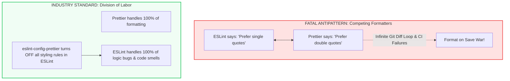
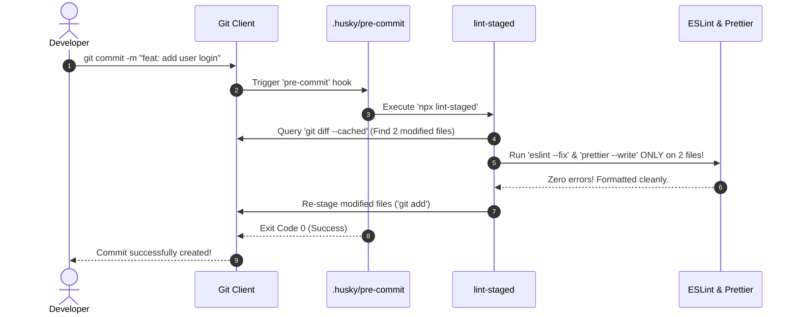

import { Callout } from 'fumadocs-ui/components/callout';
import { Tabs, Tab } from 'fumadocs-ui/components/tabs';
import { Steps, Step } from 'fumadocs-ui/components/steps';
import { Cards, Card } from 'fumadocs-ui/components/card';

When software engineering teams grow, maintaining consistent code quality and formatting becomes a critical challenge. 

Without automated guardrails, Pull Request code reviews devolve into unproductive debates over semicolons, trailing commas, indentation, and import sorting. More critically, subtle JavaScript runtime bugs—such as unhandled promises, missing React hook dependencies, and accidental global variable mutations—slip past human reviewers directly into production.

The modern industry solution is an **automated, multi-tier code quality pipeline**:


---

## 1. The Division of Labor: Linter vs Formatter

A foundational mistake made by many teams is trying to use a single tool for both formatting and bug detection. Understanding the exact boundary between **ESLint** and **Prettier** is crucial:

| Dimension | ESLint (The Static Analyzer) | Prettier (The Code Formatter) |
| :--- | :--- | :--- |
| **Primary Goal** | **Catch logic errors & bug patterns** (code quality). | **Enforce visual consistency** (code style). |
| **Analyzes** | Abstract Syntax Tree (AST) semantics & data flow. | Plain characters, line wraps, whitespace, and layout. |
| **Example Issues** | `no-unused-vars`, `no-undef`, React Hook dependency errors, unhandled async promises. | `printWidth: 100`, single vs double quotes, tabs vs spaces, trailing commas. |
| **Philosophy** | Highly configurable; offers hundreds of custom rules. | **Opinionated** with few settings; deliberately limits stylistic arguments. |
| **Handling Conflicts** | Formatting rules in ESLint must be **disabled** via `eslint-config-prettier`. | Handles 100% of formatting without interference from ESLint. |



---

## 2. Comprehensive Dependency Installation

To set up an enterprise-grade pipeline for a **TypeScript + React** or **Node.js** project, install the required development tools:

```bash
# 1. Core Linter & Formatter
npm install -D eslint prettier eslint-config-prettier

# 2. TypeScript & React ESLint Ecosystem
npm install -D typescript-eslint @eslint/js eslint-plugin-react eslint-plugin-react-hooks eslint-plugin-react-refresh

# 3. Git Hook Automation & Incremental Staging
npm install -D husky lint-staged

# 4. Semantic Commit Verification
npm install -D @commitlint/cli @commitlint/config-conventional
```

<Callout type="tip" title="Always Save Exact for Prettier">
When installing Prettier, it is recommended to use `--save-exact`:
```bash
npm install -D --save-exact prettier
```
Because Prettier minor releases can introduce slight formatting adjustments, saving the exact version ensures that all team members and CI runners generate bit-identical output.
</Callout>

---

## 3. Modern ESLint 9 Setup: Flat Config Architecture

ESLint 9 replaced the legacy `.eslintrc.js` / `.eslintrc.json` system with the **Flat Config** standard (`eslint.config.js` or `eslint.config.mjs`).

Flat Config replaces complex string-based plugin resolution with standard JavaScript/ESM module imports, drastically improving configuration clarity and execution speed.

### Production `eslint.config.mjs` for TypeScript & React

Create `eslint.config.mjs` in your project root:

```javascript
// eslint.config.mjs
import js from '@eslint/js';
import tseslint from 'typescript-eslint';
import reactPlugin from 'eslint-plugin-react';
import reactHooksPlugin from 'eslint-plugin-react-hooks';
import reactRefreshPlugin from 'eslint-plugin-react-refresh';
import eslintConfigPrettier from 'eslint-config-prettier';

export default tseslint.config(
  // 1. Globally Ignored Folders
  {
    ignores: [
      'dist',
      'build',
      '.next',
      'node_modules',
      'coverage',
      '*.config.js',
      '*.config.mjs',
    ],
  },

  // 2. Base JavaScript & TypeScript Recommended Rules
  js.configs.recommended,
  ...tseslint.configs.recommended,

  // 3. React & TypeScript Application Configuration
  {
    files: ['**/*.{ts,tsx,js,jsx}'],
    languageOptions: {
      ecmaVersion: 'latest',
      sourceType: 'module',
      parserOptions: {
        ecmaFeatures: {
          jsx: true,
        },
      },
    },
    plugins: {
      react: reactPlugin,
      'react-hooks': reactHooksPlugin,
      'react-refresh': reactRefreshPlugin,
    },
    rules: {
      // Logic & Bug Detection Rules
      'no-console': ['warn', { allow: ['warn', 'error', 'info'] }],
      'no-debugger': 'error',
      'no-duplicate-imports': 'error',
      
      // TypeScript-Specific Rules
      '@typescript-eslint/no-unused-vars': [
        'error',
        { argsIgnorePattern: '^_', varsIgnorePattern: '^_' },
      ],
      '@typescript-eslint/no-explicit-any': 'warn',
      '@typescript-eslint/explicit-module-boundary-types': 'off',

      // React & Hook Rules
      ...reactHooksPlugin.configs.recommended.rules,
      'react-refresh/only-export-components': [
        'warn',
        { allowConstantExport: true },
      ],
      'react/react-in-jsx-scope': 'off', // Not needed in React 17+ / Next.js
      'react/prop-types': 'off',          // TypeScript handles type checking
    },
    settings: {
      react: {
        version: 'detect',
      },
    },
  },

  // 4. CRITICAL: Prettier Config MUST be the last entry!
  // Disables every ESLint rule that could conflict with Prettier.
  eslintConfigPrettier
);
```

<Callout type="error" title="Rule #1 of ESLint + Prettier Integration">
Always place `eslintConfigPrettier` as the **very last item** in your configuration array. This guarantees it can override and disable any formatting rules introduced by earlier plugin presets.
</Callout>

---

## 4. Prettier Configuration & Formatting Rules

Create a `.prettierrc.json` file in your project root to define your team's visual formatting preferences:

```json
{
  "printWidth": 100,
  "tabWidth": 2,
  "useTabs": false,
  "semi": true,
  "singleQuote": true,
  "quoteProps": "as-needed",
  "jsxSingleQuote": false,
  "trailingComma": "es5",
  "bracketSpacing": true,
  "bracketSameLine": false,
  "arrowParens": "always",
  "endOfLine": "lf"
}
```

### Prettier Ignore File (`.prettierignore`)

To keep formatting fast, prevent Prettier from scanning build artifacts, package manager assets, or generated documentation:

```text
# .prettierignore
node_modules
dist
build
.next
coverage
package-lock.json
pnpm-lock.yaml
yarn.lock
*.svg
*.ico
```

---

## 5. Editor DX: VS Code Auto-Fix on Save

To provide a seamless developer experience, configure Visual Studio Code so that every file is automatically formatted with Prettier and fixed with ESLint whenever an engineer presses `Cmd+S` or `Ctrl+S`.

Create `.vscode/settings.json` in your repository:

```json
{
  "editor.formatOnSave": true,
  "editor.defaultFormatter": "esbenp.prettier-vscode",
  "editor.codeActionsOnSave": {
    "source.fixAll.eslint": "explicit"
  },
  "[javascript]": {
    "editor.defaultFormatter": "esbenp.prettier-vscode"
  },
  "[typescript]": {
    "editor.defaultFormatter": "esbenp.prettier-vscode"
  },
  "[typescriptreact]": {
    "editor.defaultFormatter": "esbenp.prettier-vscode"
  },
  "[json]": {
    "editor.defaultFormatter": "esbenp.prettier-vscode"
  }
}
```

---

## 6. Incremental Git Hooks: Husky & `lint-staged`

Running `eslint .` across an entire repository with hundreds of files can take 30 to 60 seconds. If an engineer must wait a minute on every `git commit`, they will inevitably bypass the checks using `git commit --no-verify`.

The solution combines two tools:
1. **Husky**: Initializes Git hooks natively within the repository.
2. **`lint-staged`**: Runs ESLint and Prettier **strictly on the files staged for the current commit** ($<1\text{ second}$).



### Initializing Husky

Run the Husky initialization script:

```bash
npx husky init
```

This command performs three automated setup tasks:
1. Creates a `.husky/` directory in your project root.
2. Generates a default `.husky/pre-commit` hook file.
3. Appends `"prepare": "husky"` to your `package.json` scripts.

<Callout type="info" title="Why the prepare Script is Essential">
The `"prepare": "husky"` script in `package.json` guarantees that whenever another engineer clones the repository and runs `npm install`, Husky automatically registers the Git hooks in their local `.git/hooks` path. Zero manual setup required!
</Callout>

### Configuring `lint-staged`

Add the `lint-staged` configuration to your `package.json` (or create a dedicated `.lintstagedrc.json`):

```json
{
  "lint-staged": {
    "*.{ts,tsx,js,jsx}": [
      "eslint --fix",
      "prettier --write"
    ],
    "*.{json,css,scss,md,yaml,yml}": [
      "prettier --write"
    ]
  }
}
```

### Configuring the Pre-Commit Hook

Edit `.husky/pre-commit` to execute `lint-staged`:

```bash
#!/usr/bin/env sh
. "$(dirname -- "$0")/_/husky.sh"

npx lint-staged
```

---

## 7. Semantic Commit History with Commitlint

To enforce clear, machine-readable Git commit logs across the team, implement **Commitlint** with the **Conventional Commits** specification.

### Why Conventional Commits?
- Standardizes commit messages: `type(scope)?: description`.
- Enables automated semantic versioning (`major.minor.patch`).
- Powers automated `CHANGELOG.md` generation.

### Commitlint Configuration (`commitlint.config.mjs`)

Create `commitlint.config.mjs` in your project root:

```javascript
// commitlint.config.mjs
export default {
  extends: ['@commitlint/config-conventional'],
  rules: {
    'type-enum': [
      2,
      'always',
      [
        'feat',     // A new feature
        'fix',      // A bug fix
        'docs',     // Documentation changes
        'style',    // Formatting, missing semicolons, etc.
        'refactor', // Code change that neither fixes a bug nor adds a feature
        'perf',     // Performance improvement
        'test',     // Adding or updating tests
        'build',    // Changes affecting build system or dependencies
        'ci',       // Changes to CI configuration files and scripts
        'chore',    // Other changes that don't modify src or test files
        'revert',   // Reverting a previous commit
      ],
    ],
    'subject-case': [2, 'never', ['upper-case', 'pascal-case']],
    'subject-empty': [2, 'never'],
    'type-empty': [2, 'never'],
  },
};
```

### Adding the Commit Message Hook (`commit-msg`)

Create `.husky/commit-msg` to inspect incoming commit messages:

```bash
echo "npx --no -- commitlint --edit \$1" > .husky/commit-msg
```

Ensure the hook contains:

```bash
#!/usr/bin/env sh
. "$(dirname -- "$0")/_/husky.sh"

npx --no -- commitlint --edit "$1"
```

### Commit Validation Examples

| Commit Message | Valid? | Reason |
| :--- | :--- | :--- |
| `feat(auth): implement argon2id password hashing` | **Yes** | Valid `feat` type, scope, and lowercase summary. |
| `fix(api): handle null response in payment gateway` | **Yes** | Valid `fix` type and description. |
| `docs: update foundations readme` | **Yes** | Valid `docs` type without optional scope. |
| `fixed some bugs` | **No** | Missing valid conventional type (`fix:`). |
| `Feat: Add User Authentication` | **No** | Capitalized type and uppercase summary. |
| `WIP` | **No** | Rejected: fails length and type rules. |

---

## 8. Complete `package.json` Integration

Consolidate all commands into clean, declarative scripts inside `package.json`:

```json
{
  "name": "my-app",
  "version": "1.0.0",
  "scripts": {
    "dev": "next dev",
    "build": "next build",
    "lint": "eslint .",
    "lint:fix": "eslint . --fix",
    "format": "prettier --check .",
    "format:fix": "prettier --write .",
    "typecheck": "tsc --noEmit",
    "validate": "npm run typecheck && npm run lint && npm run format",
    "prepare": "husky"
  },
  "lint-staged": {
    "*.{ts,tsx,js,jsx}": [
      "eslint --fix",
      "prettier --write"
    ],
    "*.{json,css,md,yaml,yml}": [
      "prettier --write"
    ]
  }
}
```

---

## 9. The GitHub Actions CI/CD Safety Net

While Husky and Git hooks prevent errors locally, malicious or hurried contributors can bypass local hooks using:

```bash
git commit -m "quick fix" --no-verify
```

To maintain an uncompromised codebase, **always enforce the validation pipeline in your remote CI/CD system**.

Create `.github/workflows/code-quality.yml`:

```yaml
name: Code Quality & Static Analysis

on:
  push:
    branches: [main, develop]
  pull_request:
    branches: [main, develop]

jobs:
  quality-audit:
    name: Lint, Format & Typecheck
    runs-on: ubuntu-latest

    steps:
      - name: Checkout Source Code
        uses: actions/checkout@v4

      - name: Setup Node.js Runtime
        uses: actions/setup-node@v4
        with:
          node-version: 20
          cache: 'npm'

      - name: Install Dependencies
        run: npm ci

      - name: Static Typecheck
        run: npm run typecheck

      - name: ESLint Static Analysis
        run: npm run lint

      - name: Prettier Code Style Check
        run: npm run format
```

---

## 10. Summary Checklist: Enterprise Code Quality

<Cards>
  <Card
    title="1. Division of Labor"
    description="ESLint handles AST logic bugs; Prettier handles visual formatting. eslint-config-prettier placed last to disable formatting conflicts."
  />
  <Card
    title="2. Flat Config (ESLint 9)"
    description="Modern eslint.config.mjs with explicit ESM imports, recommended TypeScript rules, and React Hooks inspection."
  />
  <Card
    title="3. Exact Prettier Versioning"
    description="Prettier installed with --save-exact. .prettierrc.json and .prettierignore maintained in root."
  />
  <Card
    title="4. Fast Commits with lint-staged"
    description="Pre-commit hook checks only staged files, formatting and fixing code in under 1 second without stalling the developer."
  />
  <Card
    title="5. Conventional Commits"
    description="Commitlint verifies commit titles in .husky/commit-msg for automated semver and clean git histories."
  />
  <Card
    title="6. CI/CD Remote Enforcement"
    description="GitHub Actions quality workflow validates PRs independently to protect main branches against --no-verify bypasses."
  />
</Cards>
