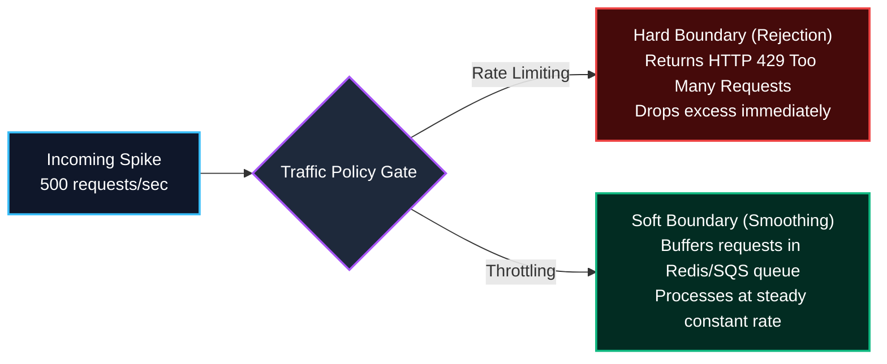
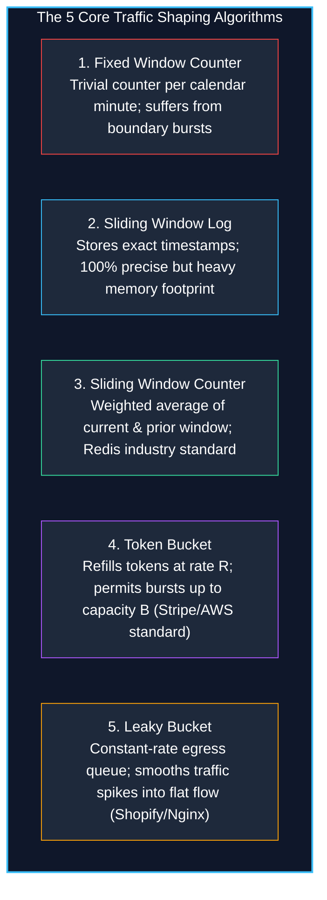
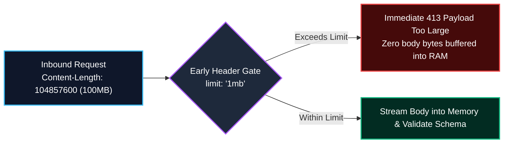
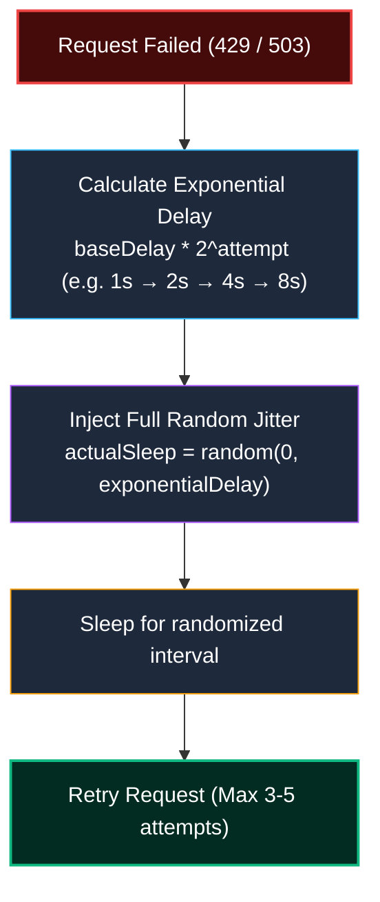

import { Callout } from 'fumadocs-ui/components/callout';
import { Tabs, Tab } from 'fumadocs-ui/components/tabs';
import { Steps, Step } from 'fumadocs-ui/components/steps';
import { Cards, Card } from 'fumadocs-ui/components/card';

No backend system has infinite compute, database memory, or network bandwidth. Without guardrails, a rogue customer script, automated credential stuffing bot, or viral surge can trigger cascading failures across your entire infrastructure.

**Rate Limiting, Throttling, and Request Size Limits** establish non-negotiable boundaries that protect system availability, ensure tenant fairness, and defend against malicious attacks.

---

## 1. Rate Limiting vs. Throttling: Key Differences

While frequently used interchangeably, **Rate Limiting** and **Throttling** apply different traffic-shaping mechanics:



- **Rate Limiting (Hard Rejection)**: Limits the maximum number of requests a client can make in a given timeframe (e.g. 100 requests per minute). Any request exceeding the quota is rejected instantly with **`HTTP 429 Too Many Requests`**.
- **Throttling (Traffic Shaping & Buffering)**: Controls the *rate of consumption*. Rather than rejecting requests, the system buffers them into a queue (or artificially delays responses) to ensure downstream databases never experience sudden traffic spikes.

---

## 2. The 5 Rate Limiting Algorithms

Choosing the right algorithm depends on whether your system prioritizes mathematical precision, memory efficiency, or burst tolerance:



---

### Algorithm 1: Fixed Window Counter (The Naive Approach)
- **How It Works**: Divides time into fixed intervals (e.g., 01:00 to 01:01). A counter increments on each request. When the window ends, the counter resets to zero.
- **The Fatal Flaw (The Boundary Burst Trap)**:
  Suppose the limit is 100 requests/minute. A client sends **100 requests at 01:00:59**, and then sends **another 100 requests at 01:01:01**. Both windows permit 100 requests, but the server received **200 requests within a 2-second interval**—effectively doubling the allowable load!

---

### Algorithm 2: Sliding Window Log (Exact Precision)
- **How It Works**: Records the microsecond timestamp of every request in a sorted set (e.g. Redis `ZSET`). On each request, all entries older than `now - 60s` are pruned. If `ZSET.cardinality() < limit`, the request is approved.
- **Pros**: 100% mathematically exact; completely eliminates the boundary burst problem.
- **Cons**: High memory consumption ($O(N)$ memory per active client). A burst of 10,000 requests requires storing 10,000 integer timestamps in memory.

---

### Algorithm 3: Sliding Window Counter (The Redis Production Standard)
- **How It Works**: Blends the low memory usage of the Fixed Window with the accuracy of the Sliding Log by calculating a **weighted average** of the previous window and the current window:

$$\text{Estimated Count} = \text{Count}_{\text{prev}} \times \left(1 - \frac{\text{timeElapsedInCurrentWindow}}{\text{windowDuration}}\right) + \text{Count}_{\text{curr}}$$

- **Example**: If the client made 100 requests in the previous minute, made 20 requests in the current minute, and we are 30% through the current minute:
  $$\text{Estimated Count} = 100 \times (1 - 0.30) + 20 = 70 + 20 = 90 \text{ requests}$$
- **Why It Wins**: Requires storing only **two integer counters** per client in Redis ($O(1)$ memory) while delivering 99.5% accuracy.

---

### Algorithm 4: Token Bucket (Burst-Tolerant)
Used by **Stripe, AWS, and GitHub**:
- The bucket holds a maximum capacity of $B$ tokens.
- Tokens replenish automatically at a constant refill rate of $R$ tokens per second.
- Every incoming request consumes 1 token. If the bucket is empty, the request is rejected.
- **Major Advantage**: Allows **legitimate burst traffic** (e.g., an app startup making 20 simultaneous requests) up to bucket capacity $B$, while enforcing a steady-state average rate $R$.

---

### Algorithm 5: Leaky Bucket (Constant Rate Smoothing)
Used by **Shopify API and Nginx `limit_req`**:
- Requests enter a queue (the bucket) of capacity $B$.
- Requests leak out of the bottom of the bucket to the application handler at a **strictly constant rate** $R$, regardless of how fast they enter.
- If the incoming traffic exceeds bucket capacity, the bucket overflows and excess requests are dropped.
- **Major Advantage**: Completely eliminates traffic spikes, creating a flat, predictable load on downstream databases.

---

## 3. Standard HTTP Rate Limiting Headers & RFC Compliance

When an API enforces rate limits, it must inform clients of their current quota status using standardized HTTP headers:

```http
HTTP/1.1 429 Too Many Requests
Content-Type: application/problem+json
Retry-After: 30
RateLimit-Limit: 100
RateLimit-Remaining: 0
RateLimit-Reset: 30

{
  "type": "https://api.example.com/errors/rate-limit-exceeded",
  "title": "Too Many Requests",
  "status": 429,
  "detail": "Quota of 100 requests per minute exceeded. Try again in 30 seconds."
}
```

### The IETF Standard Headers vs. Legacy Headers:

| Standard (IETF RFC Draft) | Legacy De-Facto Header | Description |
| :--- | :--- | :--- |
| **`RateLimit-Limit`** | `X-RateLimit-Limit` | The maximum number of requests allowed in the window (e.g. `100`). |
| **`RateLimit-Remaining`** | `X-RateLimit-Remaining` | How many requests remain before quota exhaustion (e.g. `12`). |
| **`RateLimit-Reset`** | `X-RateLimit-Reset` | Number of seconds until the window resets (or a UTC Unix epoch). |
| **`Retry-After`** | `Retry-After` | **Mandatory on 429**: Number of seconds the client must sleep before retrying. |

---

## 4. Distributed Rate Limiting with Redis & Lua Scripting

In multi-node environments (Kubernetes, AWS ECS, Vercel serverless), rate limits cannot be stored in Node.js process memory. Separate server instances do not share RAM, allowing clients to bypass limits by cycling across server pods.

All instances must synchronize against a centralized **Redis cluster**.

<Callout type="warn" title="The Concurrency Race Condition">
Never run separate `GET` and `INCR` commands from your application code! Between the time your server reads the count and increments it, ten other concurrent requests will pass the check. **Rate limiting operations must be executed atomically inside Redis via a Lua script.**
</Callout>

### Production Sliding Window Counter in Redis (Lua Script):

```lua
-- KEYS[1]: Rate limit key (e.g. ratelimit:usr_42)
-- ARGV[1]: Current timestamp in milliseconds
-- ARGV[2]: Window size in milliseconds (e.g. 60000 for 1 minute)
-- ARGV[3]: Maximum allowed requests in window (e.g. 100)

local key = KEYS[1]
local now = tonumber(ARGV[1])
local window = tonumber(ARGV[2])
local limit = tonumber(ARGV[3])
local clearBefore = now - window

-- 1. Remove all logs older than current sliding window
redis.call('ZREMRANGEBYSCORE', key, 0, clearBefore)

-- 2. Count requests remaining in current window
local currentRequests = redis.call('ZCARD', key)

if currentRequests < limit then
    -- 3. Add current request timestamp to sorted set
    redis.call('ZADD', key, now, now)
    -- Set TTL so idle keys expire automatically
    redis.call('PEXPIRE', key, window)
    return { 1, limit - currentRequests - 1 } -- { Allowed, Remaining }
else
    return { 0, 0 } -- { Blocked, Remaining }
end
```

---

## 5. Request Size Limits: Defending Against DoS & Memory Exhaustion

Rate limiting counts *the number of requests*. But what if an attacker sends a **single 2-Gigabyte JSON payload**?

If your Node.js or Python backend attempts to parse a 2GB JSON string in memory, the server will trigger an Out-Of-Memory (OOM) crash, taking down the entire process.



### Production Safeguards:
1. **Early Header Rejection**: Check the `Content-Length` header before streaming request bytes. If `Content-Length > MAX_SIZE`, return **`HTTP 413 Payload Too Large`** immediately.
2. **Body Parser Limits**:
   ```typescript
   import express from 'express';

   const app = express();

   // Enforce strict 1MB limit on JSON bodies
   app.use(express.json({ limit: '1mb' }));

   // Enforce strict 10MB limit on file uploads
   app.use(express.urlencoded({ extended: true, limit: '10mb' }));
   ```
3. **Next.js Route Handler Body Streaming**:
   In Next.js App Router, configure maximum body limits in `next.config.mjs` or inspect payload byte sizes directly from the `ReadableStream` before buffering:
   ```typescript
   export async function POST(req: Request) {
     const contentLength = req.headers.get('content-length');
     if (contentLength && parseInt(contentLength, 10) > 1024 * 1024) {
       return new Response(
         JSON.stringify({ error: "Payload exceeds 1MB limit" }),
         { status: 413, headers: { 'Content-Type': 'application/json' } }
       );
     }
     const data = await req.json();
     // Process payload...
   }
   ```

---

## 6. Client-Side Resilience: Exponential Backoff with Jitter

When a client receives a `429 Too Many Requests` or `503 Service Unavailable`, simply retrying every 1 second causes a **Thundering Herd** problem—thousands of failed clients retry simultaneously, re-crashing the recovering server.

Production clients implement **Full Jitter Exponential Backoff**:



### TypeScript Production Retry Client:

```typescript
export async function fetchWithJitterBackoff(
  url: string,
  options: RequestInit = {},
  maxRetries = 4,
  baseDelayMs = 1000,
  maxDelayMs = 16000
): Promise<Response> {
  let attempt = 0;

  while (attempt <= maxRetries) {
    const response = await fetch(url, options);

    // If successful or client error (not 429), return immediately
    if (response.status !== 429 && response.status < 500) {
      return response;
    }

    if (attempt === maxRetries) {
      return response; // Exhausted all retries
    }

    // Check if server specified exact Retry-After in seconds
    const retryAfterHeader = response.headers.get('retry-after');
    let sleepTimeMs: number;

    if (retryAfterHeader) {
      sleepTimeMs = parseInt(retryAfterHeader, 10) * 1000;
    } else {
      // Calculate Exponential Delay: min(maxDelay, baseDelay * 2^attempt)
      const expDelay = Math.min(maxDelayMs, baseDelayMs * Math.pow(2, attempt));
      // Apply Full Jitter: random between 0 and expDelay
      sleepTimeMs = Math.random() * expDelay;
    }

    console.warn(`[Retry Warning] Status ${response.status}. Sleeping ${Math.round(sleepTimeMs)}ms before attempt ${attempt + 1}`);
    await new Promise((resolve) => setTimeout(resolve, sleepTimeMs));
    attempt++;
  }

  throw new Error("Maximum retry attempts exceeded");
}
```

---

## 7. Architecture Summary & Key Takeaways

<Cards>
  <Card
    title="Algorithm Selection"
    description="Use Sliding Window Counter in Redis for standard APIs; use Token Bucket for burst-tolerant platforms (Stripe/AWS); use Leaky Bucket to smooth egress queues (Shopify)."
  />
  <Card
    title="Status 429 & Headers"
    description="Always return HTTP 429 with Retry-After and IETF RateLimit-Limit, RateLimit-Remaining, RateLimit-Reset headers."
  />
  <Card
    title="Payload Size Security"
    description="Protect backend servers from memory exhaustion DoS attacks by inspecting Content-Length and rejecting payloads exceeding 1MB with HTTP 413."
  />
  <Card
    title="Full Jitter Client Defense"
    description="Clients must avoid synchronous retry loops by randomizing backoff intervals to prevent thundering herd crashes."
  />
</Cards>
